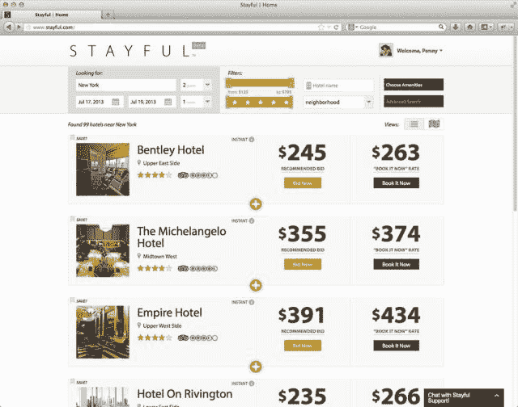

# Stayful 将 Priceline 模式引入精品酒店，让你实时竞价住宿地点 TechCrunch

> 原文：<https://web.archive.org/web/https://techcrunch.com/2013/07/17/stayful-brings-the-priceline-model-to-boutique-hotels-letting-you-bid-on-places-to-stay-in-realtime/>

# Stayful 将 Priceline 模式引入精品酒店，让你可以实时竞价住宿地点

推出了一个新的旅游网站，专注于将实时竞价引入精品酒店市场。该网站名为 [Stayful](https://web.archive.org/web/20221006120155/https://stayful.com/) ，由来自 Expedia 和 Hotels.com 的旅游业资深人士创建，已经筹集了 240 万美元的种子资金来攻击市场。

Stayful 背后的想法是让用户在独立酒店或精品酒店谈判未售出库存的房价。因此，它创建了一个平台，提供可用酒店和建议出价的列表，然后让消费者进行投标。

为了实现这一点，Stayful 正在与各种独立或精品酒店合作，扫描可用的景点，试图确定库存。一旦完成，它通过算法确定每个房间的公平市场价格，然后提供建议的投标价格。用户不必接受这个建议，嘿，他们可以提出一个低报价。

当然，酒店不一定要接受那个出价。它可以自己定价，用户可以接受。或者它可以完全否决出价。但是，一旦投标最终被接受，游客就可以享受折扣价，酒店可以预订原本会空着的房间，每个人都会很开心。(耶！)

 对于尚未加入该系统的酒店，用户可以提交请求或出价，并尝试让它们加入进来。这是 Stayful 展示平台上有人对他们感兴趣的一种方式。

所以不管怎样，当一个旅行者今晚可以去一个打折的旅游网站或酒店或其他什么地方时，为什么她要经历投标的麻烦呢？因为 Stayful 为想要入住某类酒店的旅客提供了更多的透明度。此外，开个价，让酒店屈从于他们的意愿，这让他们感觉很棒。

酒店呢？嗯，他们找到了另一种方式来填充房间，同时还保持对价格的控制。它们还显著降低了获得新客户的成本。

Stayful 由旅游业资深人士 Cheryl Rosner 和 Shariq Minhas 创立。罗斯纳是首席执行官，此前他曾担任 Expedia 公司旅游和 Hotels.com 的总裁，而米哈斯在 Jigsaw 领导工程，并为旅游网站 Expedia 和 Hotwire 工作。该公司已经筹集了 240 万美元的种子资金，由迦南合伙公司(Canaan Partners)牵头，Joie de 薇薇尔创始人奇普康利(Chip Conley)和 Room 77 首席执行官德鲁帕特森(Drew Patterson)担任顾问。