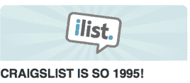

# 秘密创业公司 iList 筹集了 150 万美元来收购 Craigslist。祝你好运。TechCrunch

> 原文：<https://web.archive.org/web/https://techcrunch.com/2008/08/21/stealth-startup-ilist-raises-15-million-to-take-on-craigslist-good-luck/>

# 秘密创业公司 iList 筹集了 150 万美元来收购 Craigslist。祝你好运。

 如果你现在要从零开始创办一家公司来挑战 Craigslist，你会有什么不同的做法？无论你做什么，都会有所不同吗？一家名为 [iList](https://web.archive.org/web/20230329023604/http://ilist.com/) 的秘密公司认为它有一个答案:让卖你的垃圾更像一个社交应用。

除了一般想法，细节在这一点上是不够的。但该公司已经从 Draper Fisher Jurvetson 以及天使投资人 Dmitry Shapiro(Veoh 的创始人)和 Alex Bard(Goowy 的创始人，最近被出售给 AOL)那里筹集了 150 万美元。夏皮罗和巴德也是 iList 的董事会成员。

iList 不会是第一个进入社交分类广告领域的服务。仅在脸书，就已经有大量的[市场应用程序](https://web.archive.org/web/20230329023604/http://www.facebook.com/apps/index.php?category=4&type=0&l=en_US#/apps/index.php?q=marketplace)接入你的社交网络，包括一个来自脸书(叫做 marketplace)和一个来自易贝(易贝市场)。还有街区和 ShopIt。因此，这个领域相当拥挤，但这并不是说有人已经破解了社交分类广告的坚果。(有趣的是，Craigslist 并未出现)。