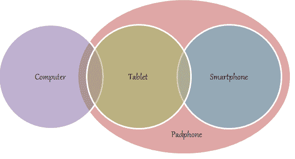

# Padfone，史上最搞笑的产品发布会 

> 原文：<https://web.archive.org/web/http://techcrunch.com/2011/10/14/steve-has-to-wait/>

# Padfone，史上最搞笑的产品发布会

当然这个 Padfone 的事情(是的[它是真实的](https://web.archive.org/web/20230205004720/https://techcrunch.com/2011/05/30/padfone-asus-officially-announces-its-android-tabletphone-combo-videos/))发生在五月，但是我刚刚看到它，无法停止大笑，无法专注于我正在写的其他事情，所以我把它贴在这里，让它离开我的系统，[阿灵顿](https://web.archive.org/web/20230205004720/http://www.uncrunched.com/)风格。

[华硕](https://web.archive.org/web/20230205004720/http://www.asus.com/)试图规避[创新者的困境](https://web.archive.org/web/20230205004720/http://www.amazon.com/Innovators-Dilemma-Revolutionary-Business-Essentials/dp/0060521996)通过弗兰肯斯坦的两个苹果产品，不时被“打破规则”和“创新超出预期”的图形打断，让我笑得前仰后合。

华硕，在“这是 Pad 还是 Pad 中的手机？”和“谁在叫我？哇哇，”我无言以对。

【YouTube = http://www . YouTube . com/watch？v=Z2ANnpHnUrc&w=630]

《连线》杂志高级编辑比尔·瓦西克早些时候沉思道:“我们需要一个术语来描述(a)不是开玩笑的，但(b)参与创作的人显然是在开玩笑的文化产品。”好吧，华硕对此负责的瘾君子能在评论里坦白吗？

**更新:**如果有人对 Padfone 在大计划中的位置感到困惑，Digital Inspiration 的工作人员制作了[这张方便的维恩图。](https://web.archive.org/web/20230205004720/http://www.labnol.org/gadgets/asus-padphone/19460/)

