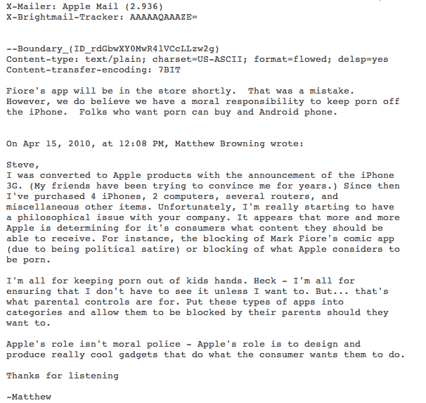

# 史蒂夫·乔布斯重申:“想要色情的人可以买一部安卓手机”

> 原文：<https://web.archive.org/web/https://techcrunch.com/2010/04/19/steve-jobs-android-porn/>

苹果公司首席执行官史蒂夫·乔布斯势如破竹。虽然他可能有过比今天更好的日子[，但他最近一直在四处发送电子邮件，回应客户的关切。我们刚刚收到了一封类似的乔布斯回复，是上周围绕马克·菲奥雷事件发出的。这是个好主意。](https://web.archive.org/web/20230209123828/https://techcrunch.com/2010/04/19/iphone-hd-4g/)

当被问及苹果在 App Store 中作为道德警察的角色时，乔布斯回应道“*我们确实认为我们有道德责任让色情远离 iPhone* ”更好的是，他接下来说:“*想要色情的人可以买安卓手机。*”

上周，另一封乔布斯关于菲奥雷情况的邮件被公开，其中乔布斯称这种情况是一个“错误”他在这封邮件中提到了同样的事情，但色情/安卓链接是这里的关键。假设这封电子邮件是合法的，这不是乔布斯第一次建议用户如果想看色情片，可以尝试安卓系统。本月早些时候，在 iPhone 4.0 操作系统发布会后的问答环节中，乔布斯说:

> 你知道，有一个安卓色情商店。除了黄片什么都不能下载。你可以下载色情，你的孩子也可以下载色情。那是一个我们不想去的地方——所以我们不会去那里。

这是值得注意的，因为这很有趣，也因为苹果和谷歌正处于 iPhone 和谷歌 Android 平台之间酝酿的战争的早期阶段。乔布斯显然会继续从他认为的道德制高点上接受这些抨击。

阅读以下完整的来回:

苹果的一位客户马修·布劳因给乔布斯写了以下内容:

> 史蒂夫，随着 iPhone 3G 的发布，我开始使用苹果产品。(我的朋友多年来一直试图说服我。)从那以后，我买了 4 部 iPhones、2 台电脑、几个路由器和其他各种各样的东西。不幸的是，我真的开始对你的公司产生了哲学问题。似乎越来越多的苹果公司正在为它的消费者决定他们应该能够接收什么内容。例如，屏蔽马克·菲奥雷的漫画应用程序(因为是政治讽刺)或屏蔽苹果认为是色情的内容。
> 
> 我完全赞成让儿童远离色情。见鬼——我完全赞成确保除非我想看，否则不必看。但是……这就是家长控制的作用。将这些类型的应用程序分类，并允许他们的父母阻止他们。
> 
> 苹果的角色不是道德警察——苹果的角色是设计和生产真正酷的小玩意，做消费者想让它们做的事情。
> 
> 感谢您的倾听
> 
> 马修

对此，乔布斯回答道:

> 菲奥雷的应用程序将很快在商店里。那是个错误。然而，我们确实认为我们有道德责任让 iPhone 远离色情内容。想要色情的人可以购买安卓手机。

是的，乔布斯显然犯了一个错别字(和->安)，但我们检查了电子邮件的 IP 地址，它们是合法的。当然，这些都是可以伪造的，但很难相信有人会费尽心思给我们发电子邮件，他们改变了所有的 IP 地址或操纵了所有的时间元素，只为了附上他们的真实姓名和真实的电子邮件地址来发送给我们。

不，这封邮件没有以通常的“从我的 iPhone 发送”或新的最爱“从我的 iPad 发送”结尾，但再一次，看看标题信息，那是因为它是使用苹果邮件发送的。众所周知，乔布斯过去也是这样做的([和最近的](https://web.archive.org/web/20230209123828/http://www.9to5mac.com/steve-jobs-pad-trademark-app-3450386433?utm_source=feedburner&utm_medium=feed&utm_campaign=Feed:+9To5Mac-MacAllDay+(9+to+5+Mac+-+Apple+Intelligence)))。

