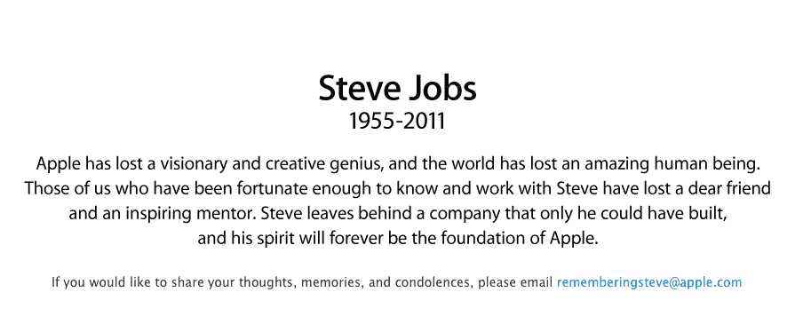

# 史蒂夫·乔布斯去世 

> 原文：<https://web.archive.org/web/https://techcrunch.com/2011/10/05/steve-jobs-has-passed-away/>

根据苹果董事会刚刚发布的声明，公司联合创始人兼长期首席执行官史蒂夫·乔布斯已经去世。

苹果公司还建立了[以下网站作为纪念](https://web.archive.org/web/20230204231118/http://www.apple.com/stevejobs/)。他们请求通过以下电子邮件地址分享“想法、回忆和哀悼:【rememberingsteve@apple.com

就在[一个多月前](https://web.archive.org/web/20230204231118/https://techcrunch.com/2011/08/24/steve-jobs-resigns-from-apple/)乔布斯辞去首席执行官一职，当时他说:“我总是说，如果有一天我不再能满足作为苹果首席执行官的职责和期望，我会第一个让你们知道。不幸的是，这一天已经到来。”

乔布斯仍然是公司董事会主席、董事和苹果员工。他推荐首席运营官·蒂姆·库克接替他的 CEO 职位。昨天，库克发表了他作为首席执行官的第一次主题演讲，推出了新的 iPhone 4S。

虽然这款设备在过去 24 小时里一直是苹果网站的焦点，但[Apple.com](https://web.archive.org/web/20230204231118/http://apple.com/)现在仅仅是献给乔布斯的，使用了他的一张著名照片(见上图),这张照片也将作为沃尔特·伊萨克森下个月出版的传记的封面。

乔布斯曾与癌症抗争，并于 2004 年做了一次与癌症相关的手术。近年来，疾病迫使他在不同场合辞去苹果首席执行官的职务。他还在 2009 年的一次病假中进行了肝脏移植。

但每次战斗之后，他都会回来，继续他在苹果的惊人工作。2007 年，他推出了 iPhone。2010 年，iPad。他最后一次出现在舞台上是在苹果公司 2011 年在旧金山举行的 WWDC 活动上。在那里，他为苹果的最新创新奠定了基础，包括 iOS 5、OS X 狮子和 iCloud。

这一表现以及他宣布将最后一次辞去苹果公司首席执行官一职，引发了我写过的两篇最喜欢的帖子。两者都是关于工作的:

[“就是管用。”](https://web.archive.org/web/20230204231118/https://techcrunch.com/2011/06/08/apple-icloud-google-cloud/)

[还有一件事……](https://web.archive.org/web/20230204231118/https://techcrunch.com/2011/08/26/one-more-thing/)

史蒂夫·乔布斯 56 岁。安息吧，史蒂夫。

苹果发布的消息:

> 苹果董事会的声明
> 
> 加州库比蒂诺——我们非常悲痛地宣布，史蒂夫·乔布斯今天去世了。
> 
> 史蒂夫的才华、激情和精力是无数创新的源泉，丰富和改善了我们所有人的生活。因为史蒂夫，这个世界变得无比美好。
> 
> 他最大的爱是他的妻子劳伦和他的家庭。我们同情他们和所有被他非凡的天赋感动的人。

乔布斯家人的声明:

> 史蒂夫今天在家人的陪伴下平静地去世了。
> 
> 在公众生活中，史蒂夫被认为是一个有远见的人；在私人生活中，他珍惜家庭。我们感谢许多人在史蒂夫患病的最后一年里分享他们的愿望和祈祷；将为那些希望表达敬意和回忆的人提供一个网站。
> 
> 我们感谢那些和我们一样对史蒂夫感同身受的人的支持和善意。我们知道你们许多人会和我们一起哀悼，我们请求你们在我们悲痛的时候尊重我们的隐私。

蒂姆·库克给苹果员工的邮件:

> 团队，
> 
> 我有一些非常悲伤的消息要和大家分享。史蒂夫今天早些时候去世了。
> 
> 苹果失去了一位富有远见和创造力的天才，世界失去了一位了不起的人。我们这些有幸认识史蒂夫并与之共事的人失去了一位亲爱的朋友和一位鼓舞人心的导师。史蒂夫留下了一个只有他才能创建的公司，他的精神将永远是苹果的基础。
> 
> 我们计划不久后为苹果员工举办一场庆祝史蒂夫非凡一生的活动。如果你想在此期间分享你的想法、回忆和哀悼，你可以简单地发电子邮件给 rememberingsteve@apple.com。
> 
> 没有任何语言能充分表达我们对史蒂夫去世的悲伤和对有机会和他一起工作的感激之情。我们将继续致力于他热爱的工作，以此来纪念他。
> 
> 定时（timing 的缩写）

苹果网站上的信息是:

