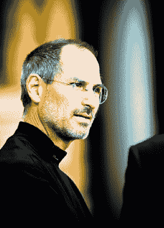

# 史蒂夫·乔布斯:“开放系统并不总是赢家”

> 原文：<https://web.archive.org/web/https://techcrunch.com/2010/10/18/steve-jobs-open-dont-win/>

# 史蒂夫·乔布斯:“开放系统并不总是赢家”

苹果经常被批评制造的产品不够开放，谷歌等竞争对手认为安卓手机比 iPhones 开放得多。但是史蒂夫·乔布斯对苹果的做法毫无歉意，这种做法是严格控制从芯片到软件到工业设计的一切整合方式。在今天苹果公司[的收益电话会议](https://web.archive.org/web/20221217174232/https://techcrunch.com/2010/10/18/apple-q4-2010-earnings/)上，乔布斯指出“开放系统并不总是赢家。”

但他也试图重新定义这场辩论。“开放对封闭是一个烟幕，”他认为。“谷歌喜欢将 Android 描述为开放的，而将 iOS 描述为封闭的。我们认为这是没有诚意的。”他说，iPhone 和 Android 的真正区别在于“一体化和分散化”根据运营商和制造商的不同，不同的 Android 手机运行不同版本的 Android。开发人员不得不创建多个版本的应用程序，以便在不同的 Android 设备上运行。“让用户自己想办法，”乔布斯说，“相比之下，iPhone 的每个应用程序都是一样的。”

乔布斯说，真正的问题是:“对客户来说，什么是最好的——整合的还是分散的？我们认为这是我们的系统相对于谷歌的巨大优势。在向希望自己的设备能够正常工作的人销售产品时，我们认为集成产品总能胜出。我们致力于综合方法。我们相信，它将战胜谷歌的分散策略。”

乔布斯认为 Android 是 iPhone 最大的，也是唯一真正的竞争对手。在电话的开始，他立即拒绝了 RIM(黑莓手机的制造商):“我们现在已经超过了 RIM，我认为他们在不久的将来不会赶上我们。”

就与安卓的竞争而言，他承认，在苹果向 iPhone 4 过渡期间，安卓在 6 月份的季度中领先。但他在预测本季度的统计数据时，听起来几乎很高兴。他抱怨说“没有可靠的数据显示每个季度有多少安卓手机出货。”虽然我们仍在等待来自 Gartner 等分析公司的数据，但他指出，每天有 275，000 部 iPhones 和其他 iOS 设备(iPods 和 iPads)被激活，相比之下，谷歌最近一次更新是每天 200，000 次 Android 激活。从字里行间，乔布斯似乎相当有信心，Gartner 对本季度的估计将显示 iPhone 出货量再次领先。否则，为什么要提起他们？

**更**: