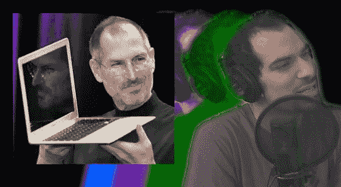

# 必听之歌:史蒂夫·乔布斯的歌

> 原文：<https://web.archive.org/web/http://techcrunch.com/2010/07/24/steve-jobs-song/>

# 必听之歌:史蒂夫·乔布斯的歌[视频]

我以为[我是](https://web.archive.org/web/20230203070236/https://techcrunch.com/2010/06/14/fanboy/)的粉丝。我没有乔纳森·曼的任何资料。

普通读者可能还记得，曼恩是必应广告歌(我们不喜欢——但学生喜欢，或者[被迫](https://web.archive.org/web/20230203070236/https://techcrunch.com/2009/10/30/microsoft-tortures-littles-kids-with-bing-jingle/))、关于我的歌曲(我们喜欢)以及最近的 [iPhone 4 天线歌曲](https://web.archive.org/web/20230203070236/https://techcrunch.com/2010/07/16/iphone-4-antenna-song/)(我们不仅喜欢，而且显然[苹果也喜欢](https://web.archive.org/web/20230203070236/https://techcrunch.com/2010/07/16/apple-kicks-of-iphone-4-press-conference-with-antenna-song/))的幕后推手。上周五，苹果公司决定在新闻发布会上播放他的歌曲，这让曼恩深受感动，他决定为首席执行官史蒂夫·乔布斯唱首小夜曲。

警告:如果我的一些关于苹果的帖子让你抓狂，这首歌会让你脑袋爆炸。

我们有这样的歌词:

*   “如果那听起来像摩西，那不是偶然的。对麦金塔的崇拜是一种宗教。”
*   “我们向让我们流泪的产品低头。简约之美。牧羊人和他的羊。”
*   “在他守卫森严的寺庙里，有一面敲鼓。它是由玻璃和铝制成的。”

但这首歌最疯狂的地方在于它很好听。说真的。太他妈上口了。曼恩继续给人留下深刻印象。

【YouTube = http://www . YouTube . com/watch？v = I _ qWXTuzVxE & HL = en _ US & fs = 1 & w = 630]