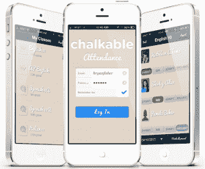

# STI 以 1000 万美元收购 Chalkable，将其教育应用商店和学习平台引入 K-12 学校 

> 原文：<https://web.archive.org/web/https://techcrunch.com/2013/12/06/sti-buys-chalkable-for-10m-to-bring-its-educational-app-store-and-learning-platform-to-k-12-schools/>

随着企业家开始意识到对更好的学习工具的巨大需求，以及技术消除系统内一些长期存在的障碍的机会，初创公司开始涌入教育市场。因此，风险投资开始流入教育领域，随着一批新的企业家和工程人才的涌现，老牌企业开始转变为买家。

10 月份，[亚马逊第一次涉足教育](https://web.archive.org/web/20230128100518/https://techcrunch.com/2013/10/10/amazon-snaps-up-online-math-instruction-company-tenmarks-to-help-it-make-education-apps/)，收购了数学教学公司 TenMarks，新的一个月带来了另一个首次买家和另一笔 EdTech 收购， [STI 收购了专注于教育的应用商店 Chalkable](https://web.archive.org/web/20230128100518/http://www.sti-k12.com/press/Chalkable092513.pdf) 。

STI 是一家拥有 30 年历史的 K-12 学校教育数据管理解决方案制造商，其产品集中在学生信息系统、家长-教师沟通和报告等领域。通过收购 Chalkable，STI 成为了一家老牌教育公司的又一个例子，该公司希望通过向其队伍中注入新的人才和技术，来满足对更容易获得和用户友好的学习工具的需求。

由于这笔交易，Chalkable 团队的所有九名成员都将加入 STI，该初创公司的首席执行官迈克尔·利维和首席运营官·佐利·霍尼格将分别继续担任 STI 新 Chalkable 团队的董事。与一些初创公司的收购不同，Chalkable 的产品将保持活跃，据了解该交易的消息人士称，该产品将与其他收购渠道的技术和 STI 的 SIS 产品 iNow 相结合，为该公司提供一种改进的现代产品。

作为 STI 成为一家更现代(更引人注目)的教育科技公司的举措的一部分，它聘请了一位新的首席执行官和首席运营官，两人都在 K-12 教育和科技公司有几十年的经验，来帮助领导这项工作。这也意味着 STI 似乎准备投入一些资本来注入新的人才，因为我们从消息来源获悉，该公司支付了约 1000 万美元收购 Chalkable。

500 Startups grad [于去年 9 月推出，其平台旨在作为应用商店和学习管理系统为学校服务，在被收购前为 50 多家机构服务。这家初创公司从 500 Startups，Expansion Venture Capital，前脸书首席隐私官 Chris Kelley 和前脸书移动平台负责人 Luke Shepard 等人那里获得了 130 万美元的资金。](https://web.archive.org/web/20230128100518/https://techcrunch.com/2012/09/04/chalkable-launch-and-funding/)

 Chalkable 旨在解决一个困扰学校、家长和学生的问题:“我在哪里可以找到网络学习工具？”网络和移动设备上的应用程序、内容和数字学习工具的数量正在快速增长，并且分散在一系列不同的来源中。Chalkable 的使命是为教师和家长提供一个聚合资源来找到这些工具，直到最近谷歌(Google Play for Education)的加入，在线教育内容才出现。

app store 从网络上的一系列资源中列出了顶级教育应用，使搜索和发现优质内容并点击购买变得容易。在其基本学习管理系统的支持下，它允许教师从 Khan Academy、Dropbox 和谷歌等平台和服务中获取学生数据和账户，将通过商店下载的应用程序和班级数据放在一个地方。

虽然这个想法很有吸引力，但对于在 K-12 市场运营的初创公司来说，道路可能很艰难，因为学校的大部分支出传统上由地区或州一级的管理人员控制。销售过程可能会很长，并且经常陷入官僚主义的泥潭，正是因为这个原因，增长被认为是可记录的(大多数情况都是如此)。

自然，有了像 Chalkable 这样的模式，教师在预算决策过程中的控制权越大，他们选择和购买应用程序的自由度就越大，结果 Chalkable 看到的收入也就越多。Chalkable 最初与 STI 合作，但鉴于 STI 的足迹更大，其服务现已被全美 5000 所学校使用，并为超过 150 万名学生提供服务，最终收购更有意义。

随着 STI 在阿拉巴马州的合同，Chalkable 现在有机会向该州的每所学校销售产品，对于一家提供有用服务的初创公司来说，这是一个不容错过的机会。

对于 STI 来说，Chalkable 现在允许他们的机构客户将更现代、消费者友好和高科技的工具——学生每天在课外使用的那种工具——带入学习过程。反过来，它允许教师和学生一起创建个性化的学习内容“播放列表”和为班级每个成员量身定制的个性化应用体验。

“STI 正在不断寻找方法，将最先进的教育工具带给我们的学生、教师和家长，”STI 新任首席执行官德里克·达纳韦在公司的声明中说。“通过粉笔平台提供的工具将增加我们的学生对高度相关的教育内容的访问，并允许教师通过针对每个学生的学习水平推荐的定制应用程序进行个性化教学。”