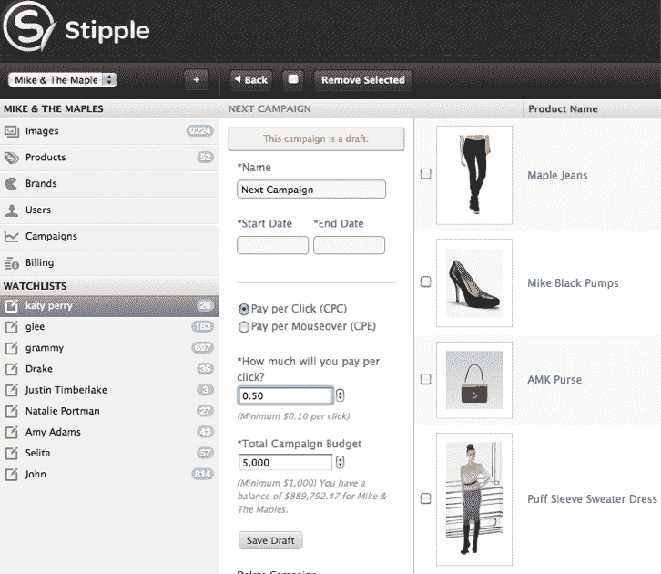

# 点画首次为出版商和品牌推出新的自助式“图像广告词”广告平台 

> 原文：<https://web.archive.org/web/http://techcrunch.com/2011/08/22/stipple-debuts-new-self-serve-adsense-for-images-ad-platform-for-publishers-and-brands/>

# 点画首次为出版商和品牌推出新的自助式“图像广告词”广告平台

[点画](https://web.archive.org/web/20230203084659/http://stippleit.com/)，一项[可以让你在图像中给人](https://web.archive.org/web/20230203084659/https://techcrunch.com/2010/09/15/stipple-people-dots/)加标签的技术，不管他们在网上的什么地方，今天已经发布了一个平台，作为“图像的广告词”

作为背景，点画的技术[允许出版商](https://web.archive.org/web/20230203084659/https://techcrunch.com/2011/05/03/stipple/)在网上的照片中标记一个人，输入上下文信息，如 Twitter 名字或脸书名字，然后任何人都可以在照片上看到他们最近的社交更新。但 Stipple 也与电子商务网站合作，为每张照片提供一种方法，以显示照片中的人穿的是什么衣服——向你展示谁制作的，多少钱，在哪里买的。它允许你“想要”它(保存起来以后看)或者通过图片上的两个叠加按钮“购买”它。

现在，Stipple 为品牌提供了一种识别照片的方式，并围绕他们想在照片中销售的产品开展广告活动。当人们将鼠标悬停在照片中的产品上时，图像会显示品牌、定价信息和购买链接。

在广告客户方面，品牌在照片上贴上产品信息标签，Stipple 的技术会自动将这些信息整合到该图片在网络上的所有在线副本中。然后，品牌围绕他们希望赚钱的产品开展点击付费(PPC)或互动付费(PPE)活动。点画提供了每个活动的实时数据和分析。

Stipple 的创始人兼首席执行官 Rey Flemings 解释说，初创公司试图解决的问题是提供照片中物体的准确信息。他说，“基本上，我们希望像谷歌在文本搜索中所做的那样，让网络上的图像可以被机器发现并被编入索引。”

新平台通过提供一个自助式平台来连接出版商和品牌，对这些图像进行货币化和分类，从而帮助实现这一目标。事实上，服装设计师 BCBG 已经在使用点画的平台。

Stipple 之前[从 Kleiner Perkins cau field&Byers、Mike Maples' FLOODGATE、Justin Timberlake、Naval Ravikant、Eghosa Omoigui、Global Brain Corporation、Quest Venture Partners、Parkview Ventures、John Ferber 和 Rick Marini 那里筹集了 200 万美元。](https://web.archive.org/web/20230203084659/https://techcrunch.com/2010/11/18/stipple-raises-2m-from-kleiner-perkins-mike-maples-and-justin-timberlake/)

