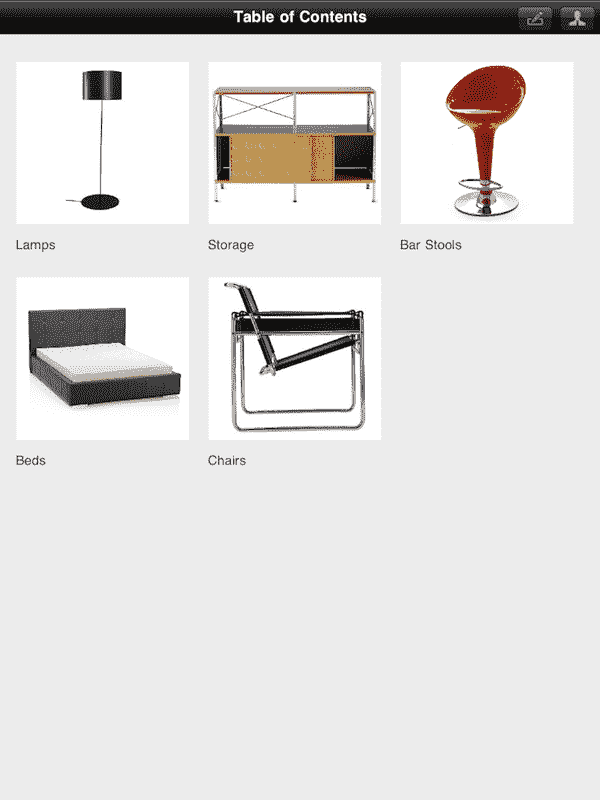
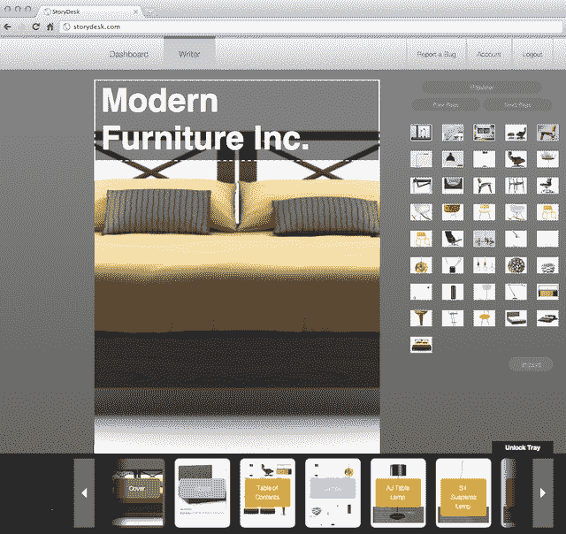
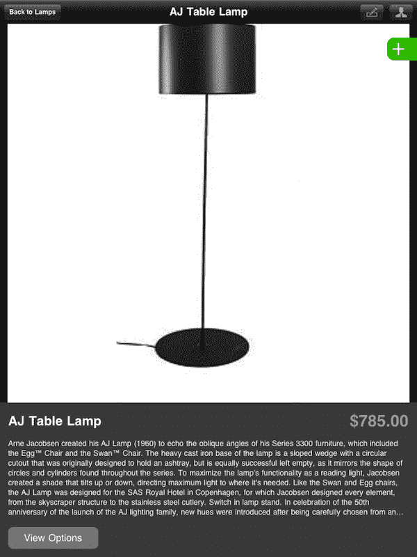

# StoryDesk 将销售目录引入 iPad TechCrunch

> 原文：<https://web.archive.org/web/http://techcrunch.com/2011/09/29/storydesk-brings-sales-catalogs-to-the-ipad/>

面向企业的平板电脑出版平台 StoryDesk 今天发布了其首款名为 [CatalogApp](https://web.archive.org/web/20230205031738/http://storydesk.com/get-started/) 的产品，这是一款 iPad 应用，可以让企业将其销售目录带到平板电脑上。

该应用程序旨在易于使用，即使对于那些没有技术专长的人。借助 StoryDesk 基于网络的内容管理系统，CatalogApp 用户可以在 StoryDesk 在线界面中输入甚至拖放产品信息、照片和价格。所做的更改会立即同步到最终用户设备上的 iPad 应用程序。

要在 iPad 上使用该应用程序，销售人员需要使用他们的用户名和密码登录以访问目录。登录后，如果有挂起的更改，目录将被更新，其全部内容将缓存在设备上以供离线使用。

StoryDesk 联合创始人乔丹·斯托尔珀(Jordan Stolper)是旅游研究工具 gli ider 的前首席执行官，该公司的资产后来在 2010 年被旅游广告网络收购。斯托尔珀说，他也有新闻背景，他最初的想法是建立一个类似于当前 StoryDesk 产品的系统，允许记者以很少的费用出售他们未使用的内容(例如，他们未发表的照片或视频)。但今年早些时候，当他开始在博客上谈论将 iPad 用作销售工具时，他开始收到电子邮件。

“市场找到了我们，”斯托尔珀解释道。在 1 月至 6 月期间，他收到了 400 多条入站线索，这促使他创建了 [CatalogApp](https://web.archive.org/web/20230205031738/http://storydesk.com/get-started/) ，这是许多 StoryDesk 产品中的第一款，将使企业能够使用平板电脑外形销售产品和服务。斯托尔珀说，今后，该公司将推出另一款专注于面向服务的业务领域的产品。

StoryDesk 于今年 6 月推出了私人测试版，目前拥有 300 名客户，涉及制药、制造、礼品、金融服务和农业等行业。从今天开始， [CatalogApp](https://web.archive.org/web/20230205031738/http://storydesk.com/get-started/) 可用于任何业务，每位用户每月 39 美元。企业客户可以选择白标选项以及与后端系统的集成，包括 SAP、Peachtree 和 QuickBooks。

CatalogApp 还包括一个可定制的销售表格选项，允许无限数量的产品变化和 SKU。从目录页面向订单添加商品就像点击产品列表旁边的绿色加号(+)按钮一样简单。应用程序中创建的销售订单可以通过电子邮件发送出去，并以 PDF 格式接收。

对于 Stolper 来说，StoryDesk 不仅仅是为企业构建工具，而是重新想象将想法带入生活的过程。他说，对于纸质书籍和目录，你必须翻很多页才能从一个章节跳到下一个章节。但是有了 iPad，导航是交互式的——上下左右——这就改变了。“我们有能力以更像人类思维的方式构建思想，”他说。“在 3D 中。”

斯托尔珀与联合创始人兼产品副总裁迈克尔·罗曼诺维奇(Michael Romanowicz)和另一位联合创始人在一起，这位联合创始人的名字无法透露，因为此人可能仍在工作，也可能不在工作。该公司已经吸收了一笔数额虽小但未披露的外部资金。现在有 10 名[员工](https://web.archive.org/web/20230205031738/http://storydesk.com/team/)在纽约，公司正在招聘。

 

[维梅奥·http://www.vimeo.com/24873630 w = 400 & h = 225]