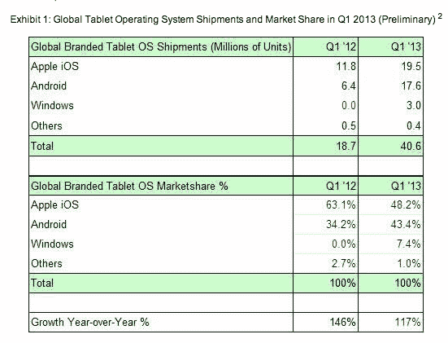

# Windows 8 在 Q1 赢得全球平板电脑操作系统市场 7.4%的份额——“利基”市场份额仍超过 Windows Phone 的智能手机份额

> 原文：<https://web.archive.org/web/https://techcrunch.com/2013/04/25/strategy-analytics-q1-tablet-stats/>

# Windows 8 在 Q1 赢得全球平板操作系统市场 7.4%的份额——“利基”市场份额仍然超过 Windows Phone 的智能手机份额

现在还不要放弃微软在移动领域的机会。它可能仍在努力让自己在智能手机领域占据一席之地，但 Windows plus 平板电脑的早期迹象更有希望。根据[Strategy Analytics](https://web.archive.org/web/20230405174354/http://www.strategyanalytics.com/default.aspx?mod=pressreleaseviewer&a0=5351)*全球平板电脑操作系统市场份额:Q1 2013* [报告](https://web.archive.org/web/20230405174354/http://www.strategyanalytics.com/default.aspx?mod=saservice&a0=306&m=5)的初步数据，微软去年在 Q1 的全球平板电脑操作系统市场份额为零，一年后达到 7.4%，2013 年 Q1 出货 300 万台 Windows 8 平板电脑。

该分析师指出，本季度平板电脑出货量创下纪录，全球品牌平板电脑出货量在 Q1 达到 4060 万台的“历史新高”，同比增长 117%(2012 年 Q1 为 146%)。

去年秋天，微软发布了 Windows 8，这是其桌面操作系统的触摸屏友好的重新启动，因此在不到半年的时间里，它的市场份额从零上升到了 7.4%。相比之下，Windows Phone 操作系统于 2010 年秋季[于两年多前推出:根据 Kantar](https://web.archive.org/web/20230405174354/https://techcrunch.com/2010/10/11/the-windows-phone-7-launch-our-take/) 的数据，在截至 2 月份的三个月中，Windows Phone 在美国智能手机操作系统市场仅占 4.1%的份额。从全球来看，其份额甚至更小。今年早些时候，ABI 研究公司预测 Windows Phone 将在 2013 年底占据全球市场的 3%。

回到平板电脑，与平板电脑操作系统市场的主导者——iOS 和 Android——相比，微软的份额仍然非常有限。Strategy Analytics 将其称为“利基”部分，指出“非常有限的分销、顶级应用的短缺以及市场的混乱，都在抑制出货量”。微软遵循了其 Windows Phone 战略，即付费给开发者为 Windows 8 开发应用，但在质量和数量的较量中，它仍有工作要做。而“市场混乱”可能指的是微软决定提供两种风格的平板电脑操作系统(Windows RT/Windows 8)。

根据 Strategy Analytics 的数据，苹果在平板电脑操作系统领域保持着领先地位，在 Q1 的份额为 48.2%，而安卓的份额为 43.4%，出货量分别为 1950 万台和 1760 万台。苹果平板电脑对安卓的领先优势正在大幅缩小，从去年第一季度的 63.1%下降到不足一半，当时安卓仅占三分之一多一点(34.2%)。

该分析师将苹果的表现描述为“稳健”，这得益于其平板电脑组合中 iPad mini 的第一个完整季度。但 Android 增长最快，全球品牌 Android 平板电脑出货量在本季度同比增长 177%。加上预算白盒平板电脑，Android 成为市场领导者，占据整个平板电脑市场 52%的份额，而 iOS 下滑至 41%。

【T2