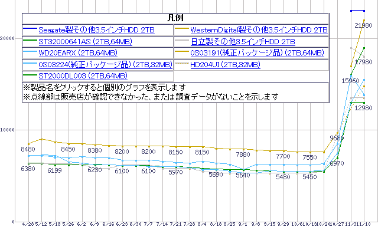

# 随着供应合同的签订，硬盘市场价飙升 TechCrunch

> 原文：<https://web.archive.org/web/http://techcrunch.com/2011/11/10/street-prices-for-hard-drives-spike-as-supply-contracts/>

# 随着供应收缩，硬盘价格飙升

到现在为止，你一定听说过泰国洪水造成的持续大破坏。它声称已经发布了一些产品；尼康和索尼都不得不推迟新相机的发货。但是受打击最大的单一技术行业似乎是硬盘制造商。许多工厂被洪水淹没，驱动器的生产受到严重阻碍。

由于大多数零售商都有大量库存，洪水对像硬盘这样的商品的影响肯定会推迟。现在，我们开始看到希捷 2TB 等普通硬盘的价格大幅上涨。据某些数据显示，仅在过去几周，日本的街头价格就上涨了 200%或更多。

上图，来自秋叶的[，显示了 2TB 硬盘最便宜的选项自十月下旬以来已经上涨了 400%。事实上，在美国零售商那里，许多廉价硬盘已经售罄，或者售价远远高于几个月前的价格。](https://web.archive.org/web/20230203085400/http://akiba-pc.watch.impress.co.jp/hotline/20111112/p_hdd.html)

价格可能会像上涨时一样迅速回落(你可以看到，一些价格已经反弹，已经超过了最佳价格)，但进入这个行业肯定是一个可怕的时期。例如，一家生产定制服务器的公司被置于一个不舒服的境地，要么承受销售损失，要么将成本转嫁给客户。

本质上，这与你在任何商品库存大幅减少时看到的危机是一样的:液晶面板、打印机墨水或香蕉都会产生类似的连锁反应。尽管如此，存储仍然是个人电脑和消费电子产品世界的重要组成部分，所有相关人员都希望泰国能尽快恢复。由于洪水才刚刚开始退去，损失又大又严重，一些人估计工厂需要一年或更长时间才能恢复到洪水前的生产力水平。

顺便说一句，你可以在这里为泰国红十字会的恢复工作捐款。