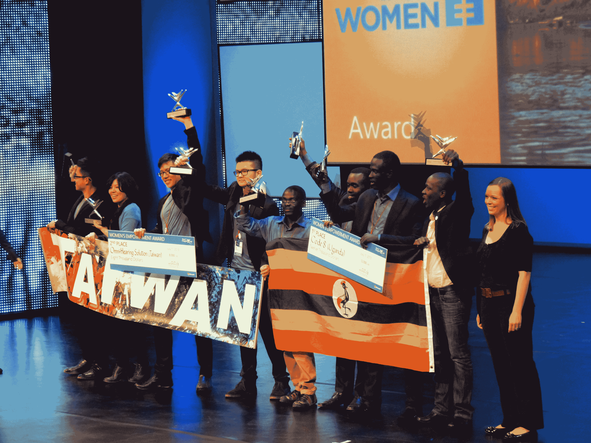

# 来自英国、葡萄牙和奥地利的学生团队赢得微软 2013 年创新杯，每人获得 5 万美元

> 原文：<https://web.archive.org/web/https://techcrunch.com/2013/07/11/student-teams-from-the-uk-portugal-and-austria-win-microsofts-imagine-cup-2013-and-50k-each/>

# 来自英国、葡萄牙和奥地利的学生团队赢得了微软 2013 年创新杯，每人获得 5 万美元奖金

微软在俄罗斯圣彼得堡举办的 [Imagine Cup 2013](https://web.archive.org/web/20230325002940/http://www.imaginecup.com/) 学生科技大赛刚刚以由神秘博士马特·史密斯主持的高能颁奖晚会落幕。今年，微软向世界公民、游戏和创新类别的获胜者颁发了三个主要奖项，每个奖项 5 万美元，分别由英国、葡萄牙和奥地利的团队获得。这两个类别的第二名和第三名分别赢得 10，000 美元和 5，000 美元。

世界公民奖授予了葡萄牙的安娜·费拉兹(T4)，她发明了一种快速而廉价地确定病人血型的系统。而台湾的[全听解决方案](https://web.archive.org/web/20230325002940/http://www.imaginecup.com/ic13/team/omnihearingsolution)位居第二，澳大利亚的[皇家孔夫鱼](https://web.archive.org/web/20230325002940/http://www.imaginecup.com/ic13/team/confufishroyale)位居第三。

在游戏类别中，奥地利的 Zeppelin 工作室赢得了解谜平台游戏 Schein 的最高奖项。印尼的 [Solite Studios](https://web.archive.org/web/20230325002940/http://www.imaginecup.com/ic13/team/solitestudio) 位居第二，法国的 [Banzai Lightning](https://web.archive.org/web/20230325002940/http://www.imaginecup.com/ic13/team/banzailightning) 位居第三。

英国的 Colinked 公司凭借 SoundSYNK 获得了创新类的最高奖项，这款手机应用旨在通过蓝牙/Wi-Fi 连接手机，建立一个“即兴社交网络”。斯洛文尼亚的多拉获得第二名，泰国的 MYRA 获得第三名。

微软还赞助了其他三个关注其技术的小奖项。来自新加坡的 vSoft Studio 获得了 Windows Phone 挑战奖，该公司为 Windows Phone 开发了一款语音驱动提醒应用。印度的 [Y-Nots](https://web.archive.org/web/20230325002940/http://imaginecup.com/ic13/team/y-nots) 赢得了 Windows Azure 挑战赛(以及 Mail.ru 奖)，意大利的 [TeamNameException](https://web.archive.org/web/20230325002940/http://imaginecup.com/ic13/team/teamnameexception) 赢得了 Windows 8 应用挑战赛。

另一个值得一提的奖项是联合国妇女奖，该奖项旨在突出增强妇女权能和保护妇女的项目。该类别的奖项由台湾的[全听力解决方案](https://web.archive.org/web/20230325002940/http://www.imaginecup.com/ic13/team/omnihearingsolution)和乌干达的 [Code 8](https://web.archive.org/web/20230325002940/http://imaginecup.com/ic13/team/code8) 疟疾检测解决方案获得。

总的来说，微软和一系列活动赞助商，如肯德基、三星、脸书和 Mail.ru，为今年比赛中的最佳项目提供了超过 100 万美元的奖励。超过 25，000 名学生参加了他们当地的比赛，来自 71 个国家的 87 支队伍的 309 名学生受邀于本周在俄罗斯展示他们的创作。这是微软连续第 11 年举办这项活动。明年，创新杯将在微软位于华盛顿州雷蒙德市的园区举办。

在过去的几年中，该活动主要集中在世界公民和游戏类别作为重点比赛。然而，今年，微软增加了“创新”类别，以允许更广泛的学生参与使用非常先进的技术但与“改善人类”没有直接关系的产品和服务。

