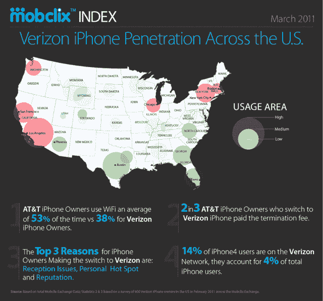

# 研究显示美国电话电报公司 iPhone 用户比威瑞森 iPhone 用户更依赖 WiFi

> 原文：<https://web.archive.org/web/http://techcrunch.com/2011/03/23/study-shows-att-iphone-owners-rely-on-wifi-more-than-verizon-iphone-users/>

# 研究显示美国电话电报公司 iPhone 用户比威瑞森 iPhone 用户更依赖 WiFi

移动广告交易所 [Mobclix](https://web.archive.org/web/20230304100507/http://www.mobclix.com/) 今天上午发布了一项调查，调查威瑞森 iPhone 和美国电话电报公司(AT)T iPhone 在美国的使用情况。威瑞森 iPhone 在一个多月前向公众发布，根据 Mobclix 的数据，大城市的威瑞森 iPhone 使用率更高。

Mobclix exchange 中威瑞森 iPhone 使用率最高的城市包括旧金山、洛杉矶、西雅图、芝加哥、纽约和波士顿。当然，众所周知，美国电话电报公司在人口更密集的城市会有更多的接收问题(例如[三藩市](https://web.archive.org/web/20230304100507/https://techcrunch.com/2010/06/15/att-microcell-3g-techcrunch/))。

Mobclix 还报告称，美国电话电报公司的 iPhone 用户平均有 53%的时间使用 WiFi，而威瑞森的 iPhone 用户只有 38%的时间使用 WiFi。为什么？因为美国电话电报公司有[差的接收，](https://web.archive.org/web/20230304100507/https://techcrunch.com/2011/02/02/verizon-iphone-review/) AT & T 由于运营商接收差，车主不得不更频繁地使用手机的 WiFi 技术，尽管运营商对运营商，在&；测试数据速度比威瑞森还快。

值得注意的是，美国电话电报公司的 WiFi 网络包括全美超过 24，000 个美国电话电报公司 WiFi 热点，iPhone 支持自动认证，使客户可以自动连接到热点或美国电话电报公司的 hotzones，而不计入他们的每月智能手机数据使用量。

调查中另一个有趣的事实是，转用威瑞森 iPhone 的美国电话电报公司 iPhone 用户中，有三分之二支付了 325 美元的提前终止费。Mobclix 说，iPhone 用户转到威瑞森的三大原因是接收问题、个人热点功能和声誉。

在 Mobclix 的交易所，14%的 iPhone 4 用户使用威瑞森网络，占 iPhone 用户总数的 4%。正如我们从[移动广告网络 Millennial Media 获悉的那样，](https://web.archive.org/web/20230304100507/https://techcrunch.com/2011/03/18/millennial-android-continues-to-account-for-over-half-of-mobile-ad-impression-share/)在发布后的前两周，威瑞森 iPhone 仅占网络上所有美国 iPhone 印象的 4.5%。