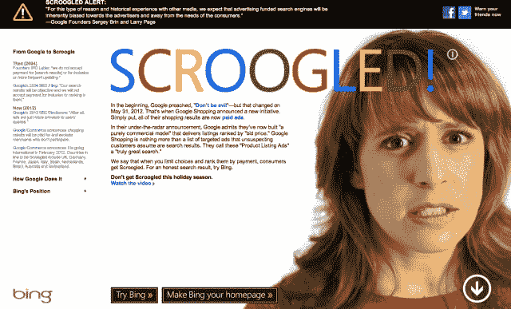

# # stuff 微软说:“不要被搜索”，推出假日必应活动 

> 原文：<https://web.archive.org/web/https://techcrunch.com/2012/11/28/stuffmicrosoftsays-dont-get-scroogled-launches-holiday-bing-campaign/>

# # stuff 微软说:“不要被 Scroogled”，推出假日必应活动

微软刚刚针对假日购物者发起了一场名为“ [Scroogled](https://web.archive.org/web/20221007004322/http://scroogled.com/) ”的全面攻势是的，这就是你所想的——试图告诉人们不要在这个假日购物季被谷歌搞砸了。

这是阿炳的竞选，如果你不确定的话。这是来自任何公司的相当强烈的言辞。我的事？除非你有足够的证据支持，否则不要让竞争对手出局。请注意，这句话来自一家公司，其首席执行官[几周前变得极其愚蠢](https://web.archive.org/web/20221007004322/https://beta.techcrunch.com/2012/11/14/steve-ballmer-android-ecosystem-is-wild-and-uncontrolled-apple-is-high-priced-and-highly-controlled/)。是的，撕掉谷歌标志，颜色等。

谷物。的。盐。也许这就是微软的[哦时刻](https://web.archive.org/web/20221007004322/https://beta.techcrunch.com/2012/11/14/steve-ballmer-during-reid-hoffman-interview-people-are-having-their-oh-moment-with-surface/)。

以下是该公司在网站上的声明:

> 一开始，谷歌宣扬“不要作恶”——但这在 2012 年 5 月 31 日发生了改变。这时，谷歌购物宣布了一项新举措。简单来说，现在他们所有的购物结果都是付费广告。
> 
> 在他们低调的声明中，谷歌承认他们现在已经建立了一个“纯商业模式”，提供按“出价”排序的列表。谷歌购物只不过是一系列有针对性的广告，不知情的顾客会认为这些广告是搜索结果。他们称这些“产品列表广告”是“真正伟大的搜索”
> 
> 我们说，当你限制选择，并根据支付情况对它们进行排序时，消费者就会被盯上。想要一个真实的搜索结果，试试 Bing。
> 
> 不要在这个假期被偷窥。
> 观看视频

甚至还有视频！
[视频:不要被偷窥](https://web.archive.org/web/20221007004322/http://www.bing.com/videos/browse?mkt=en-us&vid=0dc0abc1-0502-409c-a29f-c2b04bf67224&from=shareembed-syndication&src=v5:embed:syndication:&from=shareembed-syndication "Don’t get Scroogled")

等等等等。你们这些家伙！看看这个，甚至有谷歌创始人的名言！

这还不是全部。他们甚至造了一个词——“Scroogled”——以及一个定义！

> 动词
> 1。谷歌将购物搜索结果卖给出价高者的做法；众所周知，这会让网上购物者产生强烈的愤怒，他们可能会错过最优惠的价格或最高质量的商品。
> 
> 2.因为谷歌购物只包括向其付费的广告商的结果，一些世界上最大的零售商不包括在内。
> 
> 3.与糟糕的谷歌购物搜索结果相关的金钱损失。当你认为你得到了最好的价格时，没有得到最好的价格的副作用包括悲伤、沮丧和总体愤怒。

微软又一次做了它最擅长的事情。复制然后失败。干得好，很努力。他们显然在和[战斗起来。](https://web.archive.org/web/20221007004322/http://www.twitter.com/parislemon)

http://www.youtube.com/watch?v=4XK52HUFBBw

伙计们，搜索引擎市场份额感觉如何？我有一个想法，把所有的营销资金和脑力集中在创造[真正伟大的产品](https://web.archive.org/web/20221007004322/https://beta.techcrunch.com/2012/11/19/i-got-one-but-i-dont-get-it/)上。这个怎么样？我可以说上几天，但你应该明白。这太简单了。不过说真的，如果你正在微软努力工作，就不要在意这个。继续工作，因为这一切都会过去的。

#~~Stuff~~shit 微软说(在标题中为我妈做了修改。)

**更新:**请再看一遍，然后查看 [Scroogled](https://web.archive.org/web/20221007004322/http://scroogled.com/) :

[https://web.archive.org/web/20221007004322if_/https://www.youtube.com/embed/eywi0h_Y5_U?feature=oembed](https://web.archive.org/web/20221007004322if_/https://www.youtube.com/embed/eywi0h_Y5_U?feature=oembed)

视频

[图片来源: [Flickr](https://web.archive.org/web/20221007004322/http://www.flickr.com/photos/orcmid/5082663075/sizes/z/) ]