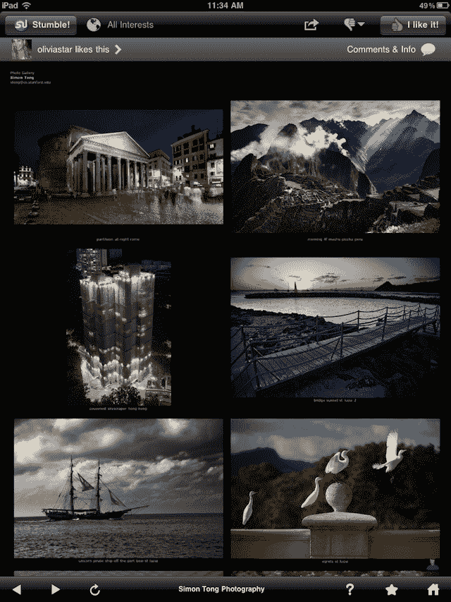
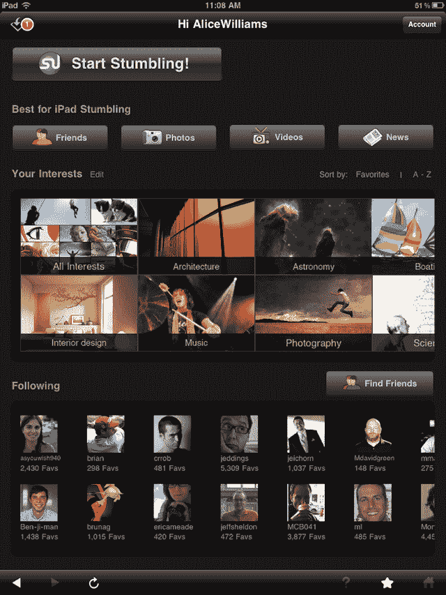

# iPad 是为 StumbleUpon 这样的东西设计的，现在他们有了一个有价值的应用 

> 原文：<https://web.archive.org/web/https://techcrunch.com/2011/07/11/stumbleupon-ipad/>

# iPad 是为 StumbleUpon 这样的东西设计的，现在他们有了一个有价值的应用

自诞生以来， [StumbleUpon](https://web.archive.org/web/20230203105444/http://stumbleupon.com/) 一直是最完美的后倾应用之一。早在有人使用这个术语之前，StumbleUpon 工具栏就可以在网上找到各种页面，并允许你在它们之间快速跳转以找到感兴趣的新东西。这个概念似乎非常适合 iPad 这样的设备。不幸的是，这个应用程序并不是很好。直到今天。

StumbleUpon 刚刚发布了一个完全重新设计和重建的 iPad 应用程序，最终为 iPad 用户带来他们应得的体验。“我觉得跌跌撞撞对 iPad 来说再合适不过了——对坐在沙发上的人来说。创始人 [Garrett Camp](https://web.archive.org/web/20230203105444/http://www.crunchbase.com/person/garrett-camp) 在谈到他们的 iPad 应用程序的第一次迭代(由承包商开发)时说:“它从来没有像我们希望的那样成功。“我们决定从头再来。我们重新做了界面。比以前好多了。这几乎就像一个黑色版的 Flipboard，”他说。

这是一个很好的对比。 [Flipboard](https://web.archive.org/web/20230203105444/http://flipboard.com/) 通常被视为 iPad sor 迄今为止媒体消费设计的巅峰。但它主要与文本有关。StumbleUpon 的应用程序既可以处理网页，也可以处理图片和视频等东西，这些已经成为磕磕绊绊体验的重要组成部分——尤其是在移动设备上。

Camp 注意到 StumbleUpon 的手机使用率正在飙升。他说，在 iPhone 和 Android 设备上，这项服务的月增长率为 35%(相比之下，整体增长率为 20%)。他指出，自从去年 8 月推出移动应用程序以来，现在有整整 10%的 stumblers 以这种方式访问。有了这种新的 iPad 体验，Camp 相信他们可以将目前徘徊在 1%左右的平板电脑使用率提高至少两倍。同样，这是一个对服务来说很自然的外形因素。

iPad 体验现在有了滑动到绊倒这样的功能，可以快速浏览内容。该应用程序会预加载内容，这意味着他们会看到你的下一个失误会是什么，他们会预加载内容，这样你就可以快速浏览并立即看到新内容。

但在坎普看来，最酷的新增功能是社交吧。这是一个新的灰色栏，位于应用程序的顶部，显示提交你所在页面的用户以及他们个人资料的链接。“现在，你不能轻易访问谁喜欢这个页面。你可能不知道它来自谁，”Camp 谈到移动应用程序时说。他们已经更新了 iPad，iPhone 和 Android 应用程序，现在都有这个。“这是一种更加社会化的体验，”他说，并指出在未来，他们将把它扩展到包括朋友的评论和推文等。

“我认为我们现在会适应人们空闲时间的其他时段，”Camp 谈到新的 iPad 体验。“这就像人们喜欢的 iPhone 体验，但在大屏幕上要好得多，”他说。

你可以在 App Store [这里](https://web.archive.org/web/20230203105444/http://itunes.apple.com/us/app/stumbleupon/id386244833)找到新的 iPad stumble upon 应用。

