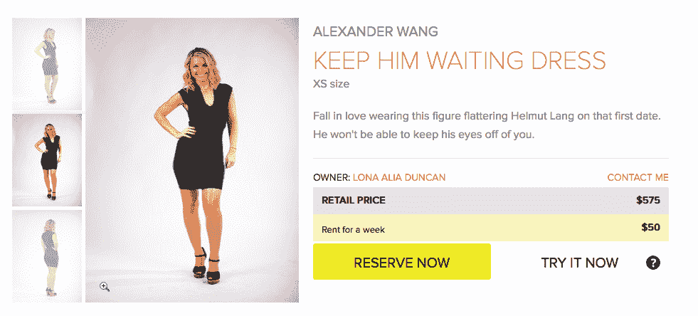

# Y Combinator 推出 Style Lend，成为女性衣橱的 Airbnb 

> 原文：<https://web.archive.org/web/http://techcrunch.com/2014/03/20/style-lend-launches-out-of-y-combinator-to-be-the-airbnb-for-womens-closets/>

近年来，合作消费市场已经起飞，让人们分享他们生活中的许多大件物品:房子、公寓、汽车。一家名为

[Style Lend](https://web.archive.org/web/20230128091505/http://www.stylelend.com/)

正在努力成为分享女性衣橱里大件物品的首选网站。

Style Lend 本质上是一个出售高端服装和配饰的 Airbnb，是一个点对点的市场，女性可以在这里列出和租赁商品，价格仅为原始零售价格的一小部分。大多数女性的衣柜里至少有几件很贵的东西，但很少穿:那件特殊场合穿的衣服，或者名牌手袋。这些种类的物品留在那里，因为它们不太适合寄售。她爱它们，想留住它们，但事实是它们 95%的时间都待在衣柜里。

## 它是如何工作的

与 Airbnb 非常相似，Style Lend 的优势在于其附加服务提供的便利和保证。对于服装出借人来说，Style Lend 的服务有两个层次:DIY，出借人获得租赁成本的 70%，以及“按需”，费用对半分摊，Style Lend 在物品被归还之前负责干洗等细节。贷款人也可以支付 5 美元的保险费，用于处理诸如小污点、拉链断裂和织物撕裂等问题。

一件在旧金山出租的连衣裙。

Style Lend 首席执行官 Lona Duncan 来到 TechCrunch 总部解释这项服务，并亲自向我们展示它提供的各种服装。你可以在上面的视频中看到。

邓肯说，Style Lend 是一个双赢的交易:服装所有者可以将她衣柜中的“投资品”货币化，并向 Style Lend 社区展示她的品味。借款人可以炫耀一件时髦的衣服或名牌包，而价格只是拥有它的一小部分。该网站旨在成为一个真正的市场，租户也是借款人，反之亦然。

Style Lend 的“高端设计师”类别的服装平均零售价为 2155 美元，每周租金为 120 美元。Style Lend 要求其网站上每件衣服的最低零售价为 150 美元。这种“注重成本的设计师”级别的服装以平均每周 30 美元的价格出租。

现在 Style Lend 只在旧金山，但它计划在未来几个月内在纽约市和其他大都市地区推出。该公司目前在 Y Combinator 的 2014 年冬季班，计划下周举行演示日。

## 大局

时尚可能看起来像一个轻浮的空间，但它是一个对世界有很大影响的巨大产业。

如今，越来越多的女性希望跟上潮流，尝试不同的外观。但是许多人无法证明在那些他们只会穿几次的衣服上投资很多钱是合理的。这导致了一次性“快时尚”的兴起，这对人权和 T2 环境产生了负面影响。

如果流行起来，Style Lend 可以通过鼓励女性购买更少、更好的东西来帮助抵消这种转变。如果一个女人知道她可以与他人分享一件物品并从中赚钱，她可能会选择购买 200 美元的负责任地在美国制造的丝绸 [Amour Vert](https://web.archive.org/web/20230128091505/http://www.amourvert.com/) 连衣裙，而不是 40 美元的聚酯纤维 Forever 21 连衣裙，那是在一家有问题的低成本劳动实践的工厂制造的。这是一个乐观的愿景，但 Style Lend 有潜力让它成为现实。