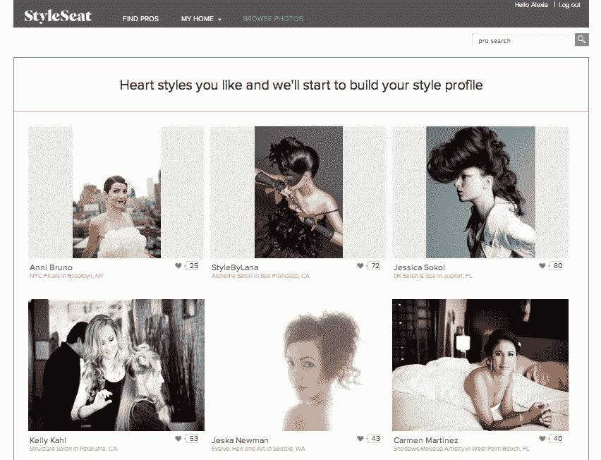

# StyleSeat 进一步证明了“Opentable For X”是有市场的

> 原文：<https://web.archive.org/web/http://techcrunch.com/2011/08/05/styleseat-is-yet-more-proof-theres-a-market-for-the-opentable-for-x/>

# StyleSeat 进一步证明了“Opentable For X”是有市场的

今天早些时候，当我们[写](https://web.archive.org/web/20230203080737/https://techcrunch.com/2011/08/05/one-billion-shakes-urbanspoon-opentable/)UrbanSpoon 试图从 [OpenTable 的](https://web.archive.org/web/20230203080737/http://www.opentable.com/)馅饼中分得一杯羹时，UrbanSpoon 副总裁卡拉·诺特曼的这句话深深打动了我，“两年前，在线预订系统需要大量的前期投资，”她说，现在她声称建立一个类似的平台就像建立一个 iPad/iPhone 应用程序一样简单。"

也许这种设置的便利性(以及降低的客户获取成本)就是为什么我们最近看到投资者对“OpenTable for X”服务的兴趣明显增加，最引人注目的是 DST 对 ZocDoc 的 5000 万美元投资。就在昨天，我[坐在](https://web.archive.org/web/20230203080737/https://techcrunch.com/2011/08/04/newme-accelerator-aiming-to-encourage-black-tech-entrepreneurs-has-its-first-demo-day/)中，参加了 [Pencil You In](https://web.archive.org/web/20230203080737/http://www.pencilyouin.com/) 的演示，这是一个将自己定位为沙龙约会的 OpenTable 的平台，而不是第一次[听到这个](https://web.archive.org/web/20230203080737/https://techcrunch.com/2011/05/23/styleseat-is-an-opentable-for-hair-salons-and-spas/)。

也许 OpenTable 模型在变得更加小众时会有更大的潜力？毕竟，美国有 3 万家接受预订的餐厅，而沙龙专业人士有 200 万人。

pencil You In competitor[style seat](https://web.archive.org/web/20230203080737/http://www.styleseat.com/)，由[于 5 月份在 TechCrunch Disrupt NY 推出](https://web.archive.org/web/20230203080737/https://techcrunch.com/2011/05/23/styleseat-is-an-opentable-for-hair-salons-and-spas/)，现在已经有超过 75000 个预约，相当于 350 万美元的支出。StyleSeat 允许发型师和沙龙代表建立简单的在线档案来展示他们的产品，现在拥有 14K 名沙龙专业人士，他们已经创建了账户，增加了 5 万名客户，创建了 1700 项促销活动(交易)。

StyleSeat 首席执行官 Melody McCloskey 告诉我，自从她加入 Disrupt turn 以来，已经有几个主要的行业参与者就合作关系与她进行了接触，“Disrupt 让我们接触到了我们通常不会在流程的早期接触到的公司——一些最大的公司的几位决策者与我们进行了接触。如果我们采用传统渠道，我们需要更长的时间才能接触到这些人。”

McCloskey 计划通过免费增值模式将 StyleSeat 货币化，免费提供核心的 StyleSeat 产品，然后对更高级的 CRM 和营销工具收取 25 美元的费用。她雄心勃勃地认为该公司有能力撼动(抱歉，我已经厌倦了使用“颠覆”这个词)整个美容行业，这个行业的年收入[为 710 亿美元](https://web.archive.org/web/20230203080737/http://analysees.co.uk/PDF/Top-100-Cosmetic-Manufacturers.pdf)。

麦克洛斯基表示，该网站的社交分享功能对其增长影响最大，并计算出通过该平台发布的脸书推荐价值 6.70 美元。在脸书上分享的六分之一的推荐会导致在线预订，平均服务成本为 40 美元。她告诉我，98%使用 StyleSeat 的客户说他们会向朋友推荐一位造型师。

StyleSeat 目前从众多热门投资者那里获得了 70 万美元的资金，其中包括[克里斯·萨卡](https://web.archive.org/web/20230203080737/http://www.crunchbase.com/person/chris-sacca)、[杰夫·克拉维尔](https://web.archive.org/web/20230203080737/http://www.crunchbase.com/person/jeff-clavier)、[特拉维斯·卡兰尼克](https://web.archive.org/web/20230203080737/http://www.crunchbase.com/person/travis-kalanick)、[戴夫·莫林](https://web.archive.org/web/20230203080737/http://www.crunchbase.com/person/dave-morin)、[加勒特·坎普](https://web.archive.org/web/20230203080737/http://www.crunchbase.com/person/garrett-camp)、[阿尔弗雷德·林、](https://web.archive.org/web/20230203080737/http://www.crunchbase.com/person/alfred-lin)、[克里斯托夫·扬茨](https://web.archive.org/web/20230203080737/http://www.crunchbase.com/person/christoph-janz)、[佩吉·克雷格](https://web.archive.org/web/20230203080737/http://www.crunchbase.com/person/paige-craig)、[乔·斯坦普、](https://web.archive.org/web/20230203080737/http://www.crunchbase.com/person/joe-stump) [500 初创公司【500】](https://web.archive.org/web/20230203080737/http://www.500startups.com/)