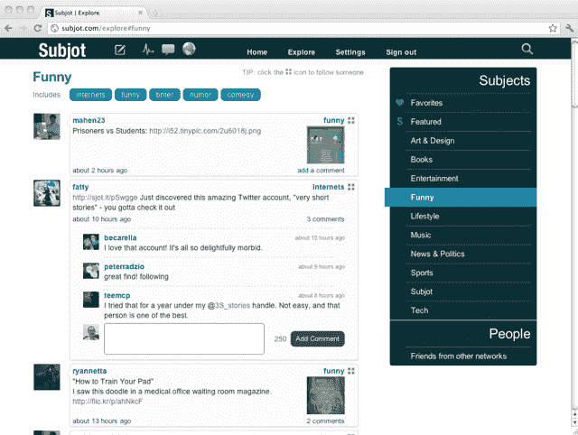
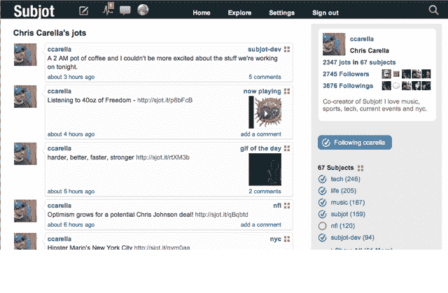

# Subjot:一个基于话题的 Twitter，没有噪音

> 原文：<https://web.archive.org/web/https://techcrunch.com/2011/08/31/subjot-a-topic-based-twitter-without-the-noise/>

啊，你在推特上的第一天。一段纯真和意外收获的时光。

看，你的朋友刚刚对他们烧焦的面包开了一个诙谐的玩笑！还有——奥普拉在推特上发布了她最喜欢的新书！就像你最喜欢的人一直在你口袋里和你说话。未来是美好的。

然后你会注意到，虽然有一些聪明和实用的精选金块，但你的 Twitter 流经常被自我推销所拖累(#humblebrag lol！)——或者更糟——某人的一条条推特重复着一个社交媒体专家的会议主题。

今天向公众发布的纽约创业公司 sub job 可能有答案。它想帮你联系你感兴趣的人，但只围绕你想听的*话题*。

比方说，你想了解我所有的科技文章，但你可能对我学习烹饪的不幸不感兴趣。在 Subjot 上，你可以这样做——你只需勾选我名字旁边的“技术”框，你就会看到我标记为技术的 Jots。没有太多要解释的:它就像 Twitter，但按主题分解。

该网站的初始注册流程会提示你连接你的脸书和 Twitter 账户，这时你会看到 Subjot 上的好友列表，以及他们最常谈论的话题。如果你和某人是好朋友，或者你觉得他们特别有趣，你可以选择关注他们所有的笔记。

Subjot 是由克里斯·卡雷拉和贝基·卡雷拉这对夫妻团队创建的，他们在去年 12 月首次提出这个想法，并于今年 2 月开始全职工作。卡雷拉先生说，他们的灵感最初来自 Quora——他们注意到特定主题的 Quora 帖子经常变得非常有趣，但它们受到限制，因为它们是问答形式的。Subjot 正在寻求将这个想法更开放一点。你可以通过查看克里斯的流[这里](https://web.archive.org/web/20230203084759/http://subjot.com/ccarella)来感受一下 Subjot 流是什么样子。(我更不敬的流是这里的)。

一些读者可能会在心里指出，他们可以在 Twitter 上使用标签来达到类似的目的:在你的推文中添加一个类似#tech 的标签，它会出现在一个充满其他技术相关推文的时间线中。当然，如果你曾经真正尝试过使用标签来表达除了妙语之外的任何东西，你就会知道它们很快就会分崩离析。首先，通常会有许多围绕同一主题或事件的标签。因为运行标签查询会显示 Twitter 上所有人(而不仅仅是你的追随者)的结果，信息流很快变得嘈杂，垃圾邮件发送者比比皆是。

过去两周我一直在断断续续地使用 Subjot，觉得它很有前途。有一些怪癖——我发现在用户和主题之间导航并不总是直观的，但这可能只是因为我习惯了 Twitter(例如，点击某人文章旁边的“技术”主题会带我到他们所有关于技术的*文章——你必须点击不同的按钮才能看到其他人关于该主题的文章)。UI 还有改进的空间，但这是一个好的开始。*

当然，Subjot 将不得不处理一些与 Twitter 相同的问题。最大的挑战是:让人们给他们的每一个更新贴上标签，并确保这些标签确实有用(当我使用这个网站时，我发现自己在问自己是否应该给我的一篇文章贴上“技术”或“科技”的标签)。

卡雷拉先生说，自从他们开始这个项目以来，他就一直在思考这个问题。在该网站的私人测试期间，这并不是一个主要问题——你可以看到你的朋友正在使用的标签，并使用相同的标签。但是随着网站规模的扩大，他们将不得不想出一些办法来解决这个问题，也许使用自动完成或建议标签。

话说回来，这些都是好问题。该网站目前面临的最大挑战是吸引大量用户——建立一个社交网络很难。但是因为 Subjot 是基于话题的，在某些方面，它可能实际上比你的普通 Twitter 竞争对手更容易:你的朋友可能还没有在上面，但是不难找到谈论你感兴趣的事情的人。

