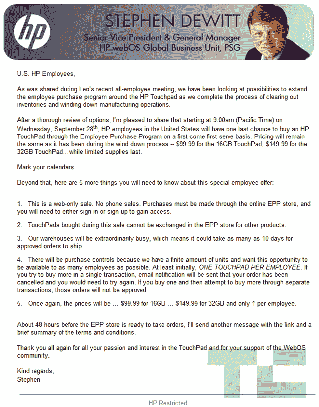

# 9 月 28 日，售价 99 美元的 TouchPad 重返惠普员工购买计划 TechCrunch

> 原文：<https://web.archive.org/web/https://techcrunch.com/2011/09/18/such-a-good-deal/>

# 9 月 28 日，售价 99 美元的 TouchPad 重返惠普员工购买计划

我很少能写下今天是惠普员工的好日子。但是，惠普员工也不是每天都能得到一些最后的触摸板。

该公司将于太平洋时间 9 月 28 日上午 9:00 开始向员工发布最后一批 99/149 美元的惠普触摸板。这是我从一名惠普员工那里收到的一封电子邮件(在跳转后嵌入的)，其中提到触摸板以先到先得的方式提供，员工只允许购买一个触摸板——有些人可能会在 ebay 上列出触摸板目前的售价超过 200 美元。TouchPad 的生命即将落幕，惠普很可能已经准备好继续前进，因为他们在 iPad 领域的冒险经历已经让他们焦头烂额。

正如电子邮件中所说，这是因为惠普正在“清理库存，逐步减少制造业务。”惠普之前取消了 TouchPad，并允许零售商以惊人的价格清仓:16GB 99 美元，32GB 149 美元。商店几乎在一夜之间售罄，让一些人对惠普将发布另一批抱有希望。不幸的是，我收到的电子邮件没有详细说明任何其他 TouchPad 零售销售，尽管我会密切关注 28 日前后百思买、亚马逊和惠普的网站。真是太划算了。

