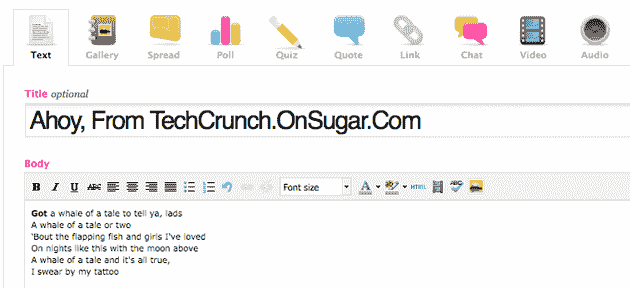

# Sugar Inc 跳过广告网络，转而推出博客平台 

> 原文：<https://web.archive.org/web/https://techcrunch.com/2008/09/19/sugar-inc-skips-ad-network-for-now-launches-blog-platform-instead/>

# Sugar 公司跳过广告网络，转而推出博客平台

[Sugar Inc](https://web.archive.org/web/20221007163940/http://www.sugarinc.com/) ，包括 [PopSugar](https://web.archive.org/web/20221007163940/http://www.popsugar.com/) 在内的广受欢迎的 Sugar 博客网络的所有者，正在[推出](https://web.archive.org/web/20221007163940/http://www.geeksugar.com/2040421)一个名为 [OnSugar](https://web.archive.org/web/20221007163940/http://www.onsugar.com/) 的免费博客平台。基于 [Drupal](https://web.archive.org/web/20221007163940/http://drupal.org/) 的 OnSugar 平台被设计得尽可能简单，同时仍然保持多功能，并且已经有了一个经过验证的记录——Sugar 博客网络是使用相同的技术编写的。用户将获得工具来创建已经成为博客支柱的特殊功能，包括照片库和投票，还可以访问 Getty 的大型免费图片库。

博主们将能够通过 AdSense 或 Glam 这样的标准广告网络从他们的网站中赚钱，也将能够包含商店风格的小工具(尽管它们要到 90 天后最终发布时才可用)。去年秋天被 Sugar 收购的 ShopStyle 允许博客作者创建真实世界产品的视觉传播。博客作者将从这些小工具的销售中获得分成。

该平台是 Sugar 在两个方面的明智之举:首先，它让现有的 Sugar 读者有机会在不离开网络的情况下向公众表达自己的观点，从而让 Sugar 增加当前用户的保留率。它精简的界面也将吸引那些原本可能不关心 Sugar 博客的潜在博主，让 Sugar 接触到全新的受众。

我们之前曾推测 Sugar 正准备用自己的广告网络与竞争对手 Glam Media 竞争，但是首席执行官 Brian Sugar 说，虽然 Sugar 曾考虑建立一个广告网络，但它决定暂时搁置这个想法。然而，他承认，如果 Sugar 改变主意，广告网络可以很容易地嵌入到新的博客中。

你可以在 TechCrunch.OnSugar.com 查看一个博客样本。

