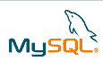

# Sun 以 10 亿美元收购 MySQL 开源是一种合法的商业模式

> 原文：<https://web.archive.org/web/https://techcrunch.com/2008/01/16/sun-picks-up-mysql-for-1-billion-open-source-is-a-legitimate-business-model/>

# Sun 以 10 亿美元收购 MySQL 开源是一种合法的商业模式

 今天早上的大新闻是，开源数据库初创公司 [MySQL](https://web.archive.org/web/20230326024548/http://www.mysql.com/) 终于发现了一年的传言，即他们正在[考虑首次公开募股](https://web.archive.org/web/20230326024548/https://techcrunch.com/2007/10/26/mysql-ipo-chatter-picking-up-again/)。相反，太阳微系统公司以 10 亿美元收购了他们。MySQL 已经从 Benchmark、Index、IVP、英特尔和 SAP 总共筹集了 3900 万美元。

Sun 公司首席执行官乔纳森·施瓦兹在他的博客上写下了这次收购，并对 MySQL 赞不绝口:“MySQL 是目前最受欢迎的平台，现代开发者可以在这个平台上创建网络服务。从 Sina.com、脸书、谷歌到银行和电信公司，寻求性能、生产力和创新的建筑师都转向了 MySQL。在高中和大学校园，在创业公司，在高性能计算实验室和在全球 2000 强。MySQL 在全球的采用简直令人惊叹。它们是网络经济中很大一部分的根源。”

拥有类似商业模式的创业公司——管理一个免费开源项目，将付费服务作为一种商业模式，会很高兴看到这一点。 [WordPress](https://web.archive.org/web/20230326024548/http://www.crunchbase.com/company/automattic) 和 [OpenAds](https://web.archive.org/web/20230326024548/http://www.crunchbase.com/company/openads) 是我们密切关注的两个。