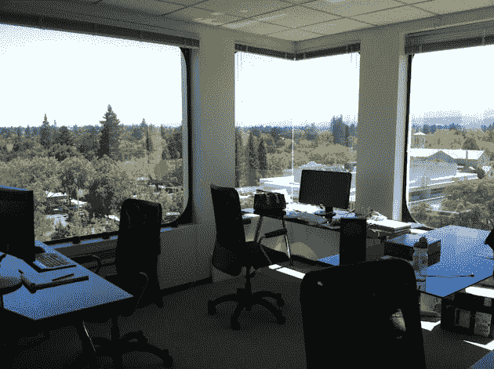
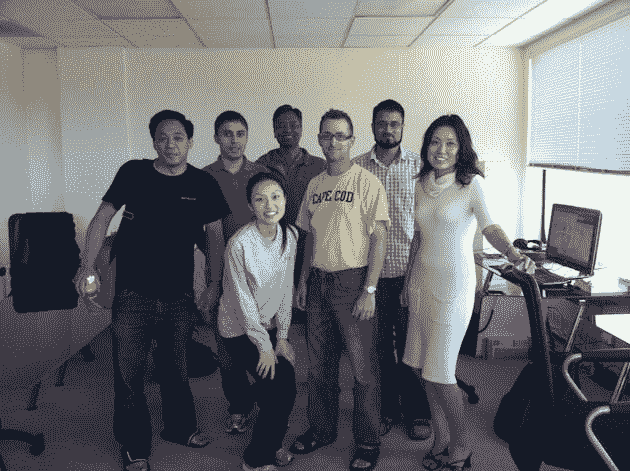

# 前谷歌员工和前 Facebooker 员工开始了仅限受邀者的工作空间 sun fire office 

> 原文：<https://web.archive.org/web/https://techcrunch.com/2010/08/28/sunfire-offices/>

# 前谷歌员工和前 Facebooker 员工创建了只接受邀请的工作空间 Sunfire Offices

三个月前，谷歌前工程经理和前工程经理王妮妮和王一山[创立了一个独特的联合办公空间概念。虽然在山景城市中心有许多其他的合作空间，如](https://web.archive.org/web/20221006132605/http://www.crunchbase.com/person/yishan-wong)[黑客道场](https://web.archive.org/web/20221006132605/http://hackerdojo.pbworks.com/)和[插件游戏，](www.plugandplaytechcenter.com/) Wong 和 Wang 对可用的选项不满意，决定创建他们自己的合作空间。

他们找到了一个办公场所，并从包括 Keith Rabois 和 Justin Calbeck 在内的许多天使投资人那里获得了资金，他们完全赞助了 Sunfire Offices，这意味着 Wong 和 Wang 可以向其他创业公司和从事个人项目的个人免费提供办公场所。他们回避谈论未来的商业模式。)

虽然它确实包含了孵化器类型的品质，但两人强调，只接受邀请的 Sunfire Offices 不是孵化器，“*我们正在优化人员的质量，因为他们是初创企业中真正重要的东西，”*Wong 说。他们想*“避免通常与孵化器相关的问题:更强的初创公司不需要孵化器，因此申请孵化器的初创公司往往是更弱的，导致孵化器自然选择更差的初创公司。”*

与大多数孵化器不同，Sunfire 的唯一义务是参加每周一次的联谊会，其中一家赞助商的投资组合公司做了一次推介或演示。这有利于 Sunfire 的赞助商，因为他们最终可以第一时间看到潜在的公司和 Sunfire 的居民，因为他们可以接触到潜在的投资者和招聘人员。

在寻找“积极高效的个人”作为住院医师时，王强调，申请者的血统并不重要。但是，谷歌和脸书之间不可避免的联系是紧密的，*“由于我们的背景，我们能够从一个非常高质量的人才库中寻找人才——尼尼安认识谷歌所有伟大的早期工程师，我也认识贝宝和脸书的所有人。”*

除了免租金之外，在一家大公司工作的同时仍然保持一个小规模，办公室居民获得了在聪明人/环境方面的存在。*“在咖啡店或家里工作会非常孤独，没有动力，”*王说。

王还举了一个例子，当收购 Nextstop 时，Nextstop 的一名工程师不想去，他宁愿留在一家初创公司。

"*我们邀请她来 Sunfire 工作，在此期间，她参与了自己的一个小项目，同时与各种与我们的赞助商和网络相关的公司进行了交流。就在上周，她接受了其中一家公司的职位，成为他们的第一名全职工程师。*

参观一下这些办公室，你会发现一个令人惊叹的景象，许多人都在为一些秘密和不那么秘密的项目努力工作，包括 YouTube 联合创始人贾韦德·卡里姆、前宇航员和谷歌经理埃德·卢，以及 iTeleport 联合创始人贾汉兹·谢尔瓦尼和维沙尔·卡普尔。

你可以通过[联系办公室经理(前谷歌员工)Elaine Yu](https://web.archive.org/web/20221006132605/http://www.sunfire-offices.com/contact) 获得参加 Sunfire weekly mixer(甚至可能是 Sunfire)的邀请，或者在他们走过卡斯特罗街的时候跟紧他们。

