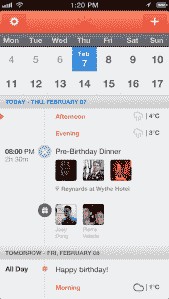
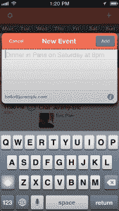

# Sunrise 出色地重新定义了 iOS  上的日历应用

> 原文：<https://web.archive.org/web/https://techcrunch.com/2013/02/19/sunrise-brilliantly-redefines-calendar-apps-on-ios/>

认识一下 [Sunrise](https://web.archive.org/web/20230322160428/http://www.sunrise.am/) ，这款日历应用将取代你迄今为止尝试过的所有日历应用。这是你用过的最好的日历。在它明显的简单背后，有一个服务器组件(就像[邮箱](https://web.archive.org/web/20230322160428/https://techcrunch.com/2012/12/13/omg-mailbox-is-amazeballs/))，让它在处理来自谷歌日历、脸书、LinkedIn 和其他网站的数据时变得更加智能。这款应用是由前 Foursquare 设计师开发的，他们认为自己可能最终发现了如何让日历成为一个强大的工具。

Sunrise [首先推出的](https://web.archive.org/web/20230322160428/https://techcrunch.com/2012/11/27/ex-foursquare-designers-focus-on-sunrise-want-you-to-do-more-with-your-calendar/)是一份电子邮件简讯，每天将你的日历信息发送到你的收件箱。当时，UX 的设计师和开发者 Pierre Valade 在接受采访时说，“今天的日历应用程序大多都是坏的，因为它们不会向你显示有用的信息，即使你每天花很多时间添加项目。”

有了全新的 iOS 应用，这种说法在今天听起来更加真实。我已经使用 Sunrise 几个月了，看到它成长为手机上最好的日历实现。

“我们关注这个被低估的问题，因为没有人想重新定义现有日历应用的基本原则，”Valade 说。“我们认为我们建立了一个非常未来的应用程序，在一个漂亮的用户界面中给你所有你需要的信息，”他继续说道。

当你启动这款应用时，你会收到谷歌日历、脸书活动、生日和当天天气的无限提要。对于每个事件，该应用程序将提供你要见的人的信息，如脸书个人资料照片或 LinkedIn 个人资料。你可以在不离开应用程序的情况下回复活动。

### 《日出》干净而易懂，高效而充满“啊哈”时刻。

总的来说，这是我在手机应用中见过的最好的用户界面之一。《日出》干净而易懂，高效而充满“啊哈”时刻。

例如，当您第一次在月份网格上滑动手指时，您会惊讶地看到两周区域扩展为显示整个月份。然后你可以很容易地滚动到三个月或四个月以后。这是一种你在其他日历应用程序中看不到的轻松而聪明的 UX 技巧。

由于日历用户往往对功能集吹毛求疵，Sunrise 包含了许多基本功能。例如，您可以通过键入“明天下午 1 点与 Matt 共进午餐”来快速添加事件重复事件、提醒和全天事件都在那里。

说到竞争，其他开发者也有同样的感觉，你需要让你的日历更智能。 [Cue](https://web.archive.org/web/20230322160428/https://www.cueup.com/) 就是那些应用中的一个，但 Sunrise 的实现更进了一步，使用起来并不繁琐。 [Google Now](https://web.archive.org/web/20230322160428/http://www.google.com/landing/now/) 可以被视为另一个竞争对手，但谷歌正在用 Google Now 重新发明另一项服务，而不是改进其已经稳固的谷歌日历。

在 App Store，你可以找到很多日历应用。然而，它们中的许多只是围绕 iOS 核心日历 API 的 UI 层(Fantastical、Calvetica 等)。).这些应用程序受到默认日历应用程序对基本日历功能的限制。例如，他们可以添加脸书的个人资料照片，但不能管理脸书的活动邀请或发送推送通知。

这就是为什么他们吸引了一小部分用户。就像邮箱一样，Sunrise 需要一个服务器组件才有意义。除了提供更多功能，该应用程序还解决了许多同步和冲突问题，因为 Sunrise 到处都使用推送同步。

《日出》由 Pierre Valade、Jeremy Le Van 和 Joey Dong 在纽约制作，目前只在 iOS 上可用，而且是免费的。它还没有得到任何资助。在 Mailbox [用其云端功能取代了](https://web.archive.org/web/20230322160428/https://techcrunch.com/2012/12/13/omg-mailbox-is-amazeballs/)你的电子邮件客户端之后，Sunrise 将成为取代你默认日历应用的完美应用。这两个应用程序图标在你的 iPhone 上形成了一个完美的生产力组合。

[维梅奥·http://vimeo.com/59057990 w = 640 & h = 360]