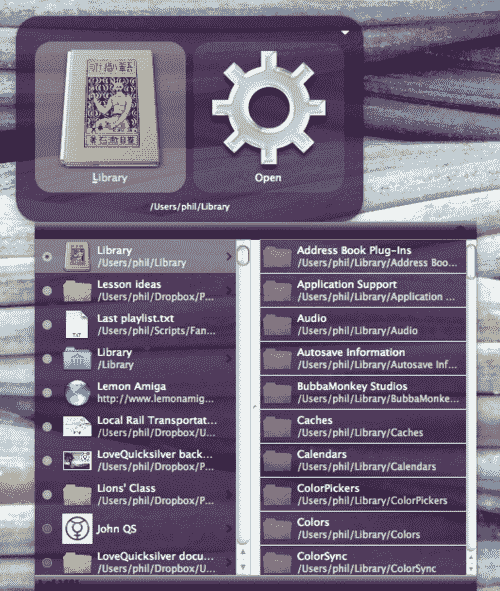

# 超级强大的启动应用 Quicksilver 增加了对 OS X 狮子 TechCrunch 的支持

> 原文：<https://web.archive.org/web/https://techcrunch.com/2011/10/23/super-powered-launch-app-quicksilver-adds-support-for-os-x-lion/>

# 超级强大的启动应用程序 Quicksilver 增加了对 OS X 狮子的支持

如果你在 Mac 上，并且还没有将你的视野扩展到 Spotlight 之外，你应该看看 [Quicksilver](https://web.archive.org/web/20230204175902/http://www.qsapp.com/) ，这是一个免费的开源 launchbar 应用程序，一旦你度过了学习曲线，它会证明非常方便。该应用程序刚刚更新了一系列新功能，包括自动插件更新(参见他们的[博客](https://web.archive.org/web/20230204175902/http://lovequicksilver.com/post/11814325098/quicksilver-roars)了解完整概要)，并且还针对 Mac OS X 狮子进行了优化。

水银有一段有趣的历史。这款应用最初是由 [Blacktree Software](https://web.archive.org/web/20230204175902/http://www.blacktree.com/) 开发的，该公司几年前就停止了积极的开发——但在开源他们的代码之前。从那时起，它就定期更新，但更新次数很少，以至于一些长期粉丝[放弃了](https://web.archive.org/web/20230204175902/http://www.kungfugrippe.com/post/2409037212/quicksilver)而转向别处。但在过去的六个月里，这款应用已经出现了某种程度的复苏，因为 QSApp 团队的更新和博客更新变得更加频繁。网站的标语？《水银生活》。

当然，Quicksilver 并不是镇上唯一一个超级启动应用程序的游戏——替代产品包括 [Alfred](https://web.archive.org/web/20230204175902/http://www.alfredapp.com/) (免费，12 人可选择一个功能包)和 [LaunchBar](https://web.archive.org/web/20230204175902/http://www.obdev.at/launchbar/) ，一个新的单一许可证收费 35 美元。Quicksilver 免费提供了它的全部功能，但是使用起来可能比这些替代品更复杂。

最终这将归结为个人偏好——无论如何，从长远来看，学习如何有效地使用这些应用程序可以节省大量时间。

**更新** : Quicksilver 的首席开发者 Patrick Robertson 告诉我们, [LoveQuicksilver](https://web.archive.org/web/20230204175902/http://www.lovequicksilver.com/) 网站实际上是他们的博客——这个应用程序本身在[QSApp.com](https://web.archive.org/web/20230204175902/http://www.qsapp.com/)。
