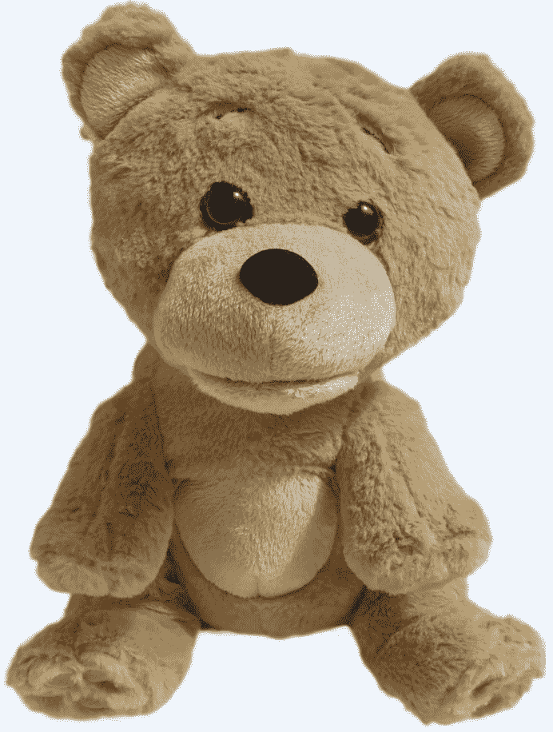

# 超级玩具泰迪熊是我们梦寐以求的泰迪熊——一只拥有对话技巧的毛绒熊 

> 原文：<https://web.archive.org/web/https://techcrunch.com/2013/07/29/supertoy-teddy-is-the-teddy-ruxpin-we-all-dreamed-of-a-stuffed-bear-with-conversation-skills/>

【YouTube http://www.youtube.com/watch?v=egt8cGlQlP4？feature = player _ 嵌入式]

一个新的 Kickstarter 项目看起来像是一个 80 年代末或 90 年代初的孩子的愿望实现:超级玩具泰迪熊是一个你可以与之交谈的填充熊，就像泰迪·鲁斯平一样，但这一个智能地回应，而不仅仅是通过一个嵌入的卡带操作，卡带有固定的数量和记录语句的顺序。超级玩具泰迪是一个机器人，拥有类似人工智能的对话能力，由威尔士的一家机器人公司制造。

Supertoy 的血统很好，因为 Supertoy Robotics 的联合创始人 Ashley Conlan 和 Karsten Flügge 之前制作了 Jeannie Rabbot，这是一款类似 Siri 的虚拟助手，部分由 Nuance tech 提供支持，可用于 iPhone，Mac，Android 等。泰迪熊继承了珍妮活泼的个性，提供人类情感近似和完全自主的语音生成。

Supertoy Teddy 使用智能手机和远程服务器来处理请求和制定答案，并使用免费的 Android 或 iOS 应用程序来完成这些工作。毛绒熊本身有一个拉链隔间，可以容纳手机并将其连接到内部处理位。该公司表示，他们已经建造了三个原型，最后一个已经可以生产，这就是为什么他们计划在 12 月推出第一批支持者，如果活动成功的话。

 泰迪有一张会动的嘴，以后他的四肢和其他部位也会有更多的机器人动作。这种玩具还可以学习一个人的偏好，并相应地改变它的态度，这意味着一个拥有这种玩具的成年人可能会有一个类似 Ted 的伴侣，而一个孩子可能会得到身边最可爱的熊。泰迪熊也可以是一个实用的帮助，提供天气预报，设置闹钟，阅读睡前故事，播放音乐，打电话，发送短信或电子邮件等等。

开箱即用的 Supertoy Teddy 可以管理 30 种不同的语言，并计划在未来支持为每种语言量身定制的不同声音。它的声调已经适应了不同的情绪，使它更加逼真。支持者可以从 42 英镑(约 62 美元)起获得一台。

泰迪·鲁斯平是我们想象中会活过来和我们说话的玩具，但超级玩具泰迪看起来是童年梦想的真正实现。此外，由于它是为所有年龄的孩子设计的，任何仍然深情地记得 Ruxpin 的人也可以得到一个，并使用超级玩具来帮助他们纳税或想到的任何其他事情。