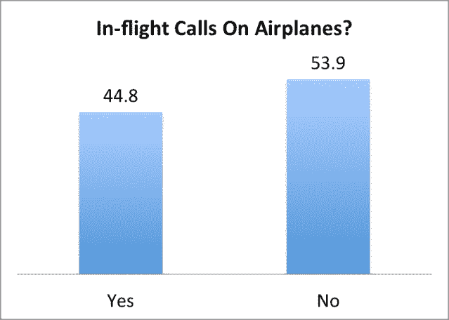

# 调查:54%的美国人希望航空公司禁止飞行中打电话 

> 原文：<https://web.archive.org/web/http://techcrunch.com/2013/11/22/survey-54-of-americans-want-airlines-to-ban-in-flight-calls/>

根据一项*CrunchGov 民意调查显示，微弱多数的美国人希望航空公司禁止乘客在飞行中打电话。昨天，*华尔街日报*报道称，联邦通信委员会[可能允许](https://web.archive.org/web/20230129223628/https://techcrunch.com/2013/11/21/fcc-may-let-airplane-passengers-chat-on-the-phone-in-flight/)乘客在商业航班上测试他们的无限通话计划的限制。

据《T7》杂志报道，由于公众的强烈反对，联邦通信委员会和美国联邦航空管理局粉碎了之前将飞机变成巨大的听觉折磨钢管的计划。2004 年，联邦通信委员会收到了 8000 多条关于类似提案的意见。美国联邦航空局后来的一项调查显示，微弱多数(51%)的人对规则变化持负面反应。

**调查结果**

我们问了一个简单的问题:航空公司应该禁止飞行中打电话吗？微弱多数支持这项禁令。

我们的 CrunchGov 民意调查使用了谷歌调查，访问了 1，578 名美国成年人，误差率为-/+2.5%。具体来说，我们问“航空公司正在考虑允许乘客在飞行途中打电话。有些人认为飞行中打电话不应该被允许。你怎么看？”。

53.9%的受访者选择了“航空公司不应该允许机上通话”。

**Nerdry！**

我喜欢调查，但它们经常进行得很糟糕。正如我所写的，措辞上非常微小的变化会戏剧性地改变调查结果。美国联邦航空局的调查存在一些方法论问题，无助于航空公司制定自己的飞行通话规则。

首先，美国人往往天生厌恶政府禁止任何事情。调查方法学家称之为“[双筒](https://web.archive.org/web/20230129223628/http://en.wikipedia.org/wiki/Double-barreled_question)问题。例如，如果我问“政府应该增加教育经费吗？”而一个回答者回答“不”，我不知道回答者是不喜欢政府还是不喜欢教育经费还是两者都不喜欢。

在现实中，规则可能会落到私营航空公司身上，这也是我们的问题所关注的(而不是询问法律)。

其次，规则变化对“禁止/允许不对称”极其敏感，参与者根据暗示禁止或允许某种行为的措辞给出截然不同的答案，即使效果相同。

正如我以前写的那样，“1989 年，一项民意调查发现，当被问及政府是否应该“允许”异族通婚(32%)和“禁止”这种婚姻(19%)时，似乎有更多的受访者[支持异族通婚(T3)，尽管从法律上讲，这是完全一样的。”](https://web.archive.org/web/20230129223628/http://www.cbsnews.com/2100-501863_162-3324587.html)

因此，为了测试飞行中打电话的偏好是否稳定，[我们还询问了](https://web.archive.org/web/20230129223628/https://www.google.com/insights/consumersurveys/view?survey=k4t4iuxf7noyi&question=1&filter=&rw=1)航空公司是否应该“继续禁止飞行中打电话”。未检测到显著变化。谷歌调查有字数限制，所以我预计如果我们能添加法律的全部细节(它适用于 10，000 英尺以上的商业航班上的手机)，结果将是一样的。

我们进行的所有 3 项调查都有几乎相同的结果，并且非常接近 FAA 的结果，所以这是一个好迹象，表明消费者知道他们想要什么。

我不知道微弱多数是否足以说服航空公司维持禁令。如果没有，我就把我的积蓄投资在耳塞行业。

* *注:对于 CrunchGov 调查的方法问题，[这就是我们使用谷歌调查](https://web.archive.org/web/20230129223628/https://techcrunch.com/2013/07/20/how-google-surveys-could-turn-anyone-into-a-professional-pollster-as-shown-in-1-graph/)的原因，我们的飞行调查方法可以在这里找到[，在这里](https://web.archive.org/web/20230129223628/https://www.google.com/insights/consumersurveys/view?survey=k4t4iuxf7noyi)[找到](https://web.archive.org/web/20230129223628/https://www.google.com/insights/consumersurveys/view?survey=v5vtmb67xbedc)，在这里[找到](https://web.archive.org/web/20230129223628/https://www.google.com/insights/consumersurveys/view?survey=jhcsemlm43fjc)。*