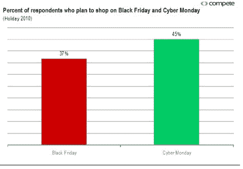
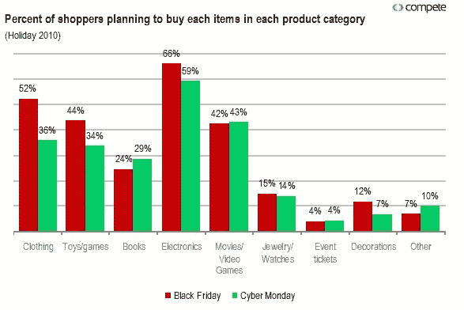

# 调查:消费者选择网络星期一而非黑色星期五

> 原文：<https://web.archive.org/web/http://techcrunch.com/2010/11/19/survey-consumers-choose-cyber-monday-over-black-friday/>

# 调查:消费者选择网络星期一而不是黑色星期五

黑色星期五，或感恩节的第二天，一直被认为是一年中最大的假日购物日之一。但是在过去的五年里，网络星期一，感恩节后的星期一，已经成为网上销售和促销的重要购物日。去年，网络星期一带来了 8 . 87 亿美元的销售额，相比之下，黑色星期五的网上支出为 5 . 95 亿美元。今天，Compete 发布了一项调查，表明消费者可能再次选择网络星期一购物，而不是黑色星期五。

根据 Compete 的数据，45%的受访者表示他们将在网络星期一购物，而 37%的人计划在黑色星期五购物。有趣的是，黑色星期五购物者计划比网络星期一购物者花更多的钱，黑色星期五购物者平均预期为 353 美元，网络星期一购物者平均预期为 233 美元。

Compete 表示，消费增加可能是因为在黑色星期五购买电子产品、服装、玩具和游戏等高端商品的人比在网络星期一的人多。该报告显示，在黑色星期五购买这些商品的人数分别比网络星期一多 11%、32%和 23%。

去年 Hitwise 报道亚马逊[在网络星期一](https://web.archive.org/web/20230202215305/https://techcrunch.com/2009/12/01/amazon-takes-the-top-spot-for-cyber-monday/)和[黑色星期五上拔得头筹。](https://web.archive.org/web/20230202215305/http://www.internetretailer.com/2009/11/30/amazon-leads-black-friday-web-traffic-walmart-was-tops-on-thank)

网络星期一变得比黑色星期五更受欢迎并不奇怪，尤其是如果这两天的交易一样好的话。如果能在电脑上点击“立即购买”,谁愿意在感恩节后的第二天凌晨 4 点排起长队等待呢？

