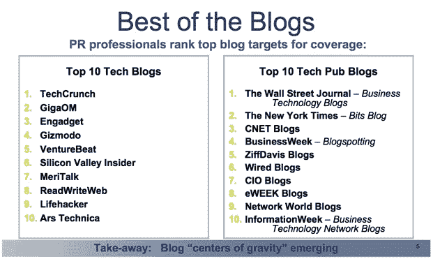

# 调查显示:公关人员喜欢我们的无禁运政策 TechCrunch

> 原文：<https://web.archive.org/web/https://techcrunch.com/2009/05/04/survey-says-pr-people-love-our-no-embargo-policy/>

# 调查显示:公关人员喜欢我们的不禁运政策

公关行业从未停止让我惊讶。尽管事实上我们早在 2008 年 12 月就已经停止遵守大多数禁令，并就此发出了一份非常公开的[备忘录](https://web.archive.org/web/20221006005041/http://www.beta.techcrunch.com/2008/12/17/death-to-the-embargo/)，我们仍然会收到大量不请自来的电子邮件和新闻稿，要求我们只在某个特定日期后发布其中包含的信息。当我们决定停止玩整个禁运游戏时，我们完全预料到了公关行业的强烈反对。而且，说实话，我们有时确实需要更努力地去获得一个故事，或者完全绕过其他人都在报道的大规模发布。但是根据 T4 对 246 名科技公关专家的调查，TechCrunch 仍然是他们为客户获取报道的首选科技博客。太好了。

退一步说，这是一个可疑的荣誉。但是我只能从这个调查中得出结论，公关人员喜欢我们的不禁运政策。所以我们只能继续执行它(除了少数例外)。事实上，我对此感到很抱歉，我现在正在执行。我本该在 5 月 20 日之前告诉你这个绝密调查的。一个很好的公关人员，他要求我保持沉默。但我不能这样做，因为我们的政策是尽快与我们的读者分享有趣的新闻。尽管我们尽了最大努力避免成为目标，但哪些科技博客最容易成为公关行业的攻击目标？以下是列表(出于某种原因，他们将它分为“科技博客”和更传统的主流媒体博客):

**十大科技博客**

1.TechCrunch
2。GigaOM
3。Engadget
4Gizmodo
5。文丘里管
6。硅谷内幕(原文如此)
7。MeriTalk
8。读写网
9。生活黑客
10 Ars 技术

**十大科技博客**

1.《华尔街日报》的商业技术博客
2。NYT 的比特博客
3。商业周刊的博客。CNET 博客
5。ZiffDavis 博客
6。连线博客
7。首席信息官博客
8。eWEEK 博客。网络世界博客
10。信息周刊的商业技术网络博客

据公关专业人士称，该调查还列出了最具影响力的科技博客作者。

1.迈克尔·阿灵顿(TechCrunch)
2。奥姆马利克(GigaOm)
3。
罗伯特·斯考伯(Scobleizer)4。沃尔特·莫斯伯格
5。大卫·波格(NYT)
6。本·沃森(华尔街日报数字博客)
7。道格·亨舍恩(智能企业博客)
8。索尔·汉塞尔(NYT·比特博客)
9。斯泰西·希金波坦。埃里克·舍恩菲尔德(TechCrunch)

我对出现在这个名单上感到有点尴尬(但没有迈克应该感到的尴尬——我的意思是，多好的一个工具)。我希望通过在“禁运”前出版它，我会在它正式发行前被踢出去。说真的，Engadget 的乔舒亚·托波尔斯基比我更应该上。