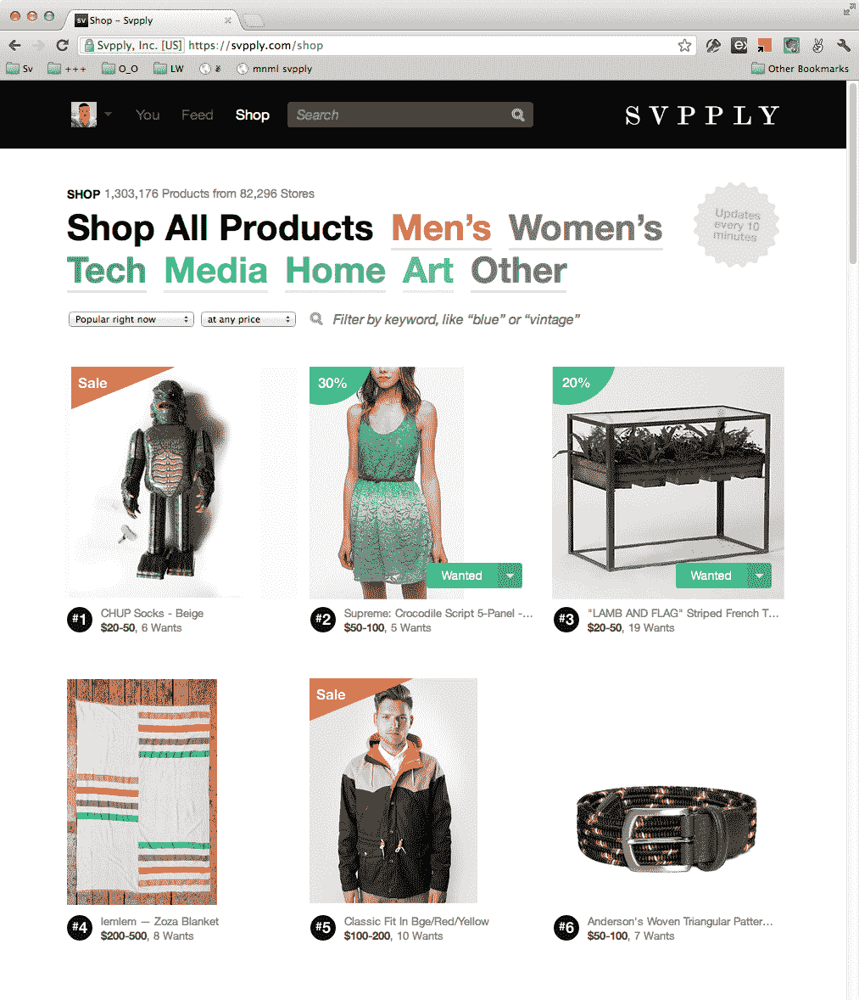
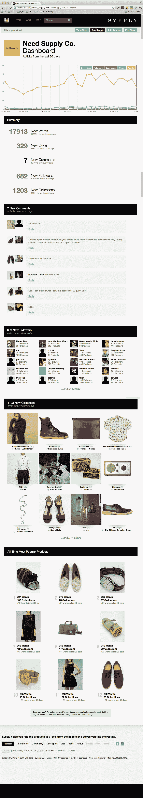

# Svpply 的“我们要这个！”是零售商瞄准穿着考究的顾客的一种有品位的方式 

> 原文：<https://web.archive.org/web/https://techcrunch.com/2012/05/14/svpplys-we-want-this-is-a-tasteful-way-retailers-can-target-well-dressed-shoppers/>

# Svpply 的“我们要这个！”是零售商瞄准穿着考究的购物者的一种有品位的方式

总部位于纽约的创业公司 T4，复制了网上逛街的感觉，正在推动其富有的客户将他们的“想要”变成真正的购买。

该公司由 Vimeo 设计师扎克·克莱恩(Zach Klein)共同创立，正在一个名为“我们想要这个！”的项目中为零售商推出分析和目标功能

像 [Free People](https://web.archive.org/web/20221006010041/https://svpply.com/freepeople.com) 、[cx6](https://web.archive.org/web/20221006010041/https://svpply.com/cxxvi.net)和 [All Saints](https://web.archive.org/web/20221006010041/https://svpply.com/allsaints.com) 这样的商店可以根据他们的“需求”进行有针对性的促销，从而接触到 Svpply 社区中有影响力的成员。在 Svpply 上,“想要”和脸书上的“喜欢”按钮非常相似。自从公司几年前成立以来，Svpply 的成员在网站上点击“想要”的次数超过了 500 万次，目前的速度是每周约 16 万次。

这家初创公司是试图让购物者在网上购买高端时尚产品更加舒适的公司之一。在过去的十年里，随着消费者已经习惯于在网上订购书籍和电子产品，时尚自然会成为另一个向网上转型的主要行业。虽然他们并不是真正的竞争对手，但还有很多其他创业公司，如 Bonobos、Trunk Club、Gilt Groupe、 [Index Ventures 支持的 Nasty Gal](https://web.archive.org/web/20221006010041/https://beta.techcrunch.com/2012/03/05/fashion-outpost-nasty-gal-raises-9m-from-index-ventures-with-28m-in-revenue/) 和 [Y Combinator 支持的 Shoptiques](https://web.archive.org/web/20221006010041/https://beta.techcrunch.com/2012/03/21/andreessen-horowitz-greylock-back-marketplace-for-local-fashion-boutiques-shoptiques/) 正在尝试在网上制作更高端的时尚作品。在签下迈克高仕和维维安·韦斯特伍德这样的设计师后，甚至亚马逊也加入了竞争[。](https://web.archive.org/web/20221006010041/http://www.nytimes.com/2012/05/08/business/amazon-plans-its-next-conquest-your-closet.html)

新的“我们想要这个！”程序应该有助于缩短从用户说他们想买东西到他们真拿出信用卡来买东西之间的最后一英里。

自从几年前推出以来，Svpply 的首席执行官 Ben Pieratt 表示，该公司一直非常小心地确保该网站有一个紧密团结的社区。

“我们的理解是，高质量也意味着高质量的社区，”他说。“我们的产品是零售业的一个缩影，其中有一小群引领潮流的人影响着社区其他人的需求。”

他们将它播种给纽约的一小群设计师，然后这些设计师用他们喜欢的产品填充 Svpply。他们确保每一件产品都是你可以立即在网上购买的。“这些不是梦寐以求的事情，”他说。“你看到的一切都是可以购买的。”

从那时起，该网站已经发展到每周有 620，000 次产品浏览，有 140，000 名注册会员和 700，000 名每月访问的独立用户。他们的 iPhone 和 iPad 应用程序也有大约 37，000 次下载。注意:iPad 应用程序六天前刚刚推出。他们赚取的代销商收入足以支付他们在纽约的员工的服务器和租赁费用。最近的脸书时间线整合也使注册量增加了 40 %,因为 Svpply 在 ticker 和新闻提要中使用了动词“Want”。

Svpply 已经从 Spark Capital 和 Founder Collective 筹集了 55 万美元。

