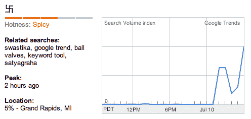

# 纳粹出现在谷歌趋势

> 原文：<https://web.archive.org/web/https://techcrunch.com/2008/07/10/swastika-appears-on-google-trends/>

# 纳粹出现在谷歌趋势

A number of people [noticed](https://web.archive.org/web/20230314220833/http://bloggle.typepad.com/bloggle/2008/07/strange-symbols.html) a swastika (卐) on the hot trends list of [Google Trends](https://web.archive.org/web/20230314220833/http://trends.google.com/) this morning.

谷歌关闭了该网站，并告知该网站正在进行网络维护，几个小时后应该可以再次使用。然后，几分钟后，该网站又恢复了，纳粹党徽仍然被列为第十三大热门搜索词。

谷歌趋势称，查询峰值出现在太平洋时间早上 6 点左右。该查询实际上是一个中文字符，但它显示的趋势列表是美国搜索。这看起来像是一次成功的垃圾邮件尝试，但考虑到谷歌处理的查询数量，它看起来相当复杂——在某一点上，它是排名第一的查询。我们在谷歌上搜索了评论。

**更新:**它现在已经被移除或者从流行趋势列表中消失了。