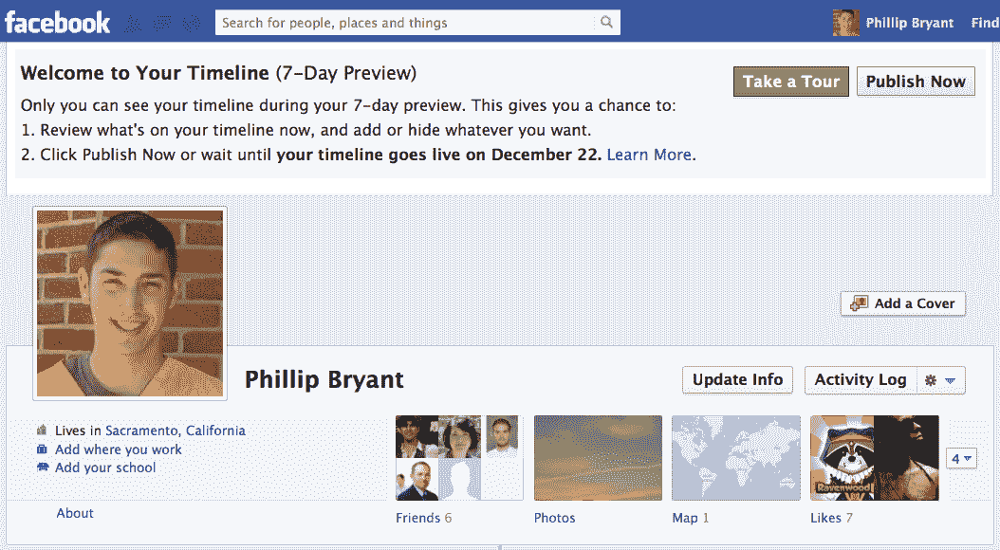
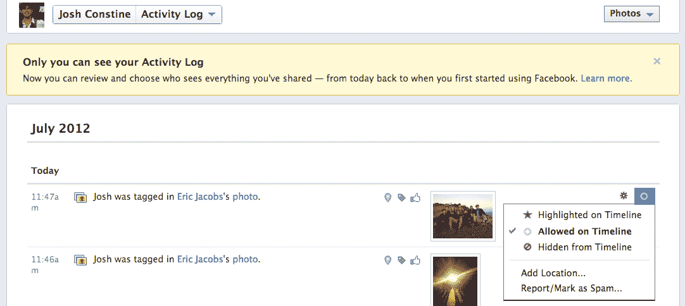

# 还在抗议？脸书很快会强迫你切换到 Timeline TechCrunch

> 原文：<https://web.archive.org/web/https://techcrunch.com/2012/07/30/switch-to-timeline/>

脸书告诉我，在接下来的几个月里，任何仍然拒绝自愿切换到[时间线档案重新设计](https://web.archive.org/web/20221206221939/http://www.facebook.com/about/timeline)的人都将被自动迁移。用户可以选择从 1 月开始采用[的重新设计，但是已经有一些拒绝者不希望他们的整个生活变得更容易访问，或者只是讨厌改变。](https://web.archive.org/web/20221206221939/https://beta.techcrunch.com/2012/01/24/facebook-timeline-now-open-to-all-users-get-a-week-to-clean-up-profiles/)

不过，很快他们就别无选择了。脸书向我透露，它计划在今年秋天完成时间表的推出，作为其今天早上的[照片改造的一部分。通过等待最大限度地减少被迫切换的用户数量，并逐步做到这一点，脸书将成功避免早年特有的野火式抗议。](https://web.archive.org/web/20221206221939/https://beta.techcrunch.com/2012/07/30/facebook-photos-timeline/)

在今年年底之前，那些仍然使用旧设计的人将在下次登录时看到一个提示，告诉他们切换到时间线。然后，他们将有七天时间整理他们的旧帖子，并在时间线自动上线并对他们的朋友可见之前自愿发布他们的时间线。

一些用户已经被要求切换，尽管最后一次推送将确保所有 9 . 55 亿用户使用相同的档案格式。脸书告诉我，在过去的几个月里，它一直在向最初的一些人推出时间表，但迁移可能会加速，希望在秋天之前让所有人都转换过来。脸书的推理？给每个人一致的体验。

也可能有其他的动机。Timeline 带有“最近活动”框，可以调出你使用的应用程序，帮助它们成长，并将开发者吸引到脸书的平台上。还有一个[改进的照片部分](https://web.archive.org/web/20221206221939/https://beta.techcrunch.com/2012/07/30/facebook-photos-timeline/)，鼓励更多的浏览和标记。[想知道脸书下一步在建什么吗？本周五来参加我们的[脸书生态系统峰会](https://web.archive.org/web/20221206221939/https://beta.techcrunch.com/events/crunchup-august-capital-party-2012/coverage/)

肯定会有一些用户害怕切换。我认识的年纪较大的人说，他们仍然会遇到很多没有时间线的个人资料。这些用户可能是在 2009 年和 2010 年脸书高速增长期间加入的，并且在 Timeline 推出时刚刚习惯了更简单的设计。

其他人可能担心他们的整个脸书内容档案变得更容易被访问。Timeline 不会改变你的隐私设置，而且它包括活动日志，这是一种更强大的控制内容可见性的方法。不过，它确实可以更快地导航到多年前的帖子。浏览这些帖子以隐藏令人尴尬或不合适的照片或状态更新是[有点烦人的事情。](https://web.archive.org/web/20221206221939/https://beta.techcrunch.com/2011/12/15/review-your-timeline/)

然而，策划时间表是重要的。突出和隐藏不同的内容可以让你在网上更真实地展现你当前的个性和态度，而不仅仅是你过去的总和。此外，在脸书任职的八年里，“朋友”的定义已经扩大到包括老板和家人，而不仅仅是同事。

有些人可能会说未删节的时间线更准确，但我认为我们都应该有机会让我们的亲密朋友看到色情笑话或聚会照片，而不是我们的朋友可能会误解和判断我们。

因此，如果你(或你的朋友)仍然不在时间线上，不要害怕。去告诉世界你是谁，而不仅仅是你曾经是谁。