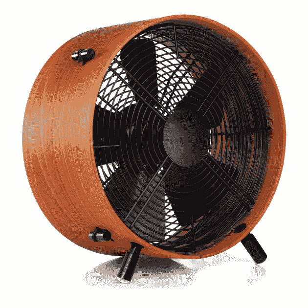
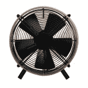

# Swizz Style Otto:男人味十足的木制风扇 

> 原文：<https://web.archive.org/web/https://techcrunch.com/2009/03/29/swizz-style-otto-a-manly-mans-wooden-fan/>

# 瑞士风格奥托:一个有男子气概的人的木扇

我们这里有一个男人的粉丝。随着夏天的快速临近，你们中的许多人会在车库里寻求庇护，远离孩子或妻子，而啤酒冰箱不能在你观看比赛时开着。不过，奥托可不是你能在沃尔玛买到的普通老式风扇。这是一个 45W 的三速“工业”风扇，有可调脚和一个别致的四分之一 sapele 木制框架。这是瑞士制造的，所以你知道它值 199.99 美元。

[产品页面](https://web.archive.org/web/20221006071216/http://www.swizz-style.com/store/fans-c-2/otto-p-14)