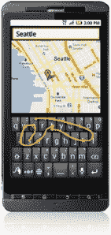

# 快速虚拟键盘制造商 Swype 将被 Nuance 以 1 亿多美元收购

> 原文：<https://web.archive.org/web/https://techcrunch.com/2011/10/06/swype-the-maker-of-speedy-virtual-keyboards-to-be-acquired-by-nuance-for-100-million/>

# 快速虚拟键盘制造商 Swype 将被 Nuance 以 1 亿多美元收购

自从 2008 年 9 月在 TechCrunch 50 上首次发布以来，Swype 就一直让[感到震惊。对于那些不熟悉的人来说，Swype 是一个很棒的应用程序的制造商，该应用程序允许触摸屏移动设备的用户通过手指或手写笔在屏幕键盘上移动来输入信息。事实证明，这种另类(且已获专利的)输入法速度非常快，每分钟可以输入超过 40 个单词，并且已经席卷了安卓设备。](https://web.archive.org/web/20221127014450/https://beta.techcrunch.com/2008/09/09/tc50-swype-truly-gesture-based-data-entry/)

今天，[多亏了《一个迈克尔·阿灵顿》通过 ununched](https://web.archive.org/web/20221127014450/http://uncrunched.com/2011/10/06/nuance-to-acquire-swype-for-100-million/)的报道，我们得知 Swype 已经被 [Nuance](https://web.archive.org/web/20221127014450/http://www.nuance.com/) (语音识别技术的制造商)以超过 1 亿美元收购。《华尔街日报》证实了这笔交易，估计金额在 1 亿到 1.5 亿美元之间。

官方声明预计将于明天发布。

Nuance 的市值约为 67 亿美元，最近一直在进行收购，在 6 月份收购了语音识别软件公司 SVOX，同时宣布以 1.57 亿美元收购软件开发商 Equitrac。

 语音识别巨头最近也出现在新闻中，因为[正与苹果公司就狮子 OSX](https://web.archive.org/web/20221127014450/https://beta.techcrunch.com/2011/06/06/apple-nuance-wwdc-keynote/) 的授权进行谈判。更重要的是，尽管苹果没有证实， [MG 认为 Nuance](https://web.archive.org/web/20221127014450/https://beta.techcrunch.com/2011/10/05/apple-siri-nuance/) 也是 Siri 背后的一大部分技术，所有 iPhone 4Ses 都将采用这一技术。正如 MG 昨日所写，“即使苹果想要并试图为 Siri 开发自己的语音技术后端，他们也很难做到不侵犯 Nuance 的一些专利。众所周知，Nuance 首席执行官 Paul Ricci 会最大限度地实施专利。

更重要的是，看看 Nuance 如何解决它现在同时拥有 Swype 和另一款预测文本应用 T9 的事实将是有趣的。正如 Mike 所写的，T9 恰好“与 Swype 直接竞争”,而且也是由 Cliff Kushler 创建的，他也是 Swype 的创始人之一。是两个产品联手，还是 T9 走向垃圾堆？我相信 Nuance 明天或未来几周会有更多关于这方面的信息。

自 2008 年以来，Swype 已经筹集了不到 1400 万美元的外部投资，并于 7 月份完成了 C 轮投资。此次收购对这家初创公司、其投资者(三星风险投资公司、诺基亚成长伙伴公司、贝纳罗亚资本公司、DoCoMo 资本公司、Ignition Partners 等)以及 Nuance 来说都是一次巨大的胜利。随着 Swype 的应用出现在(即将出现在)1 亿台设备上，智能手机和触摸屏的采用率飙升，这些技术无疑将成为我们移动未来的重要组成部分。

**更新**:根据一份 [SEC 文件](https://web.archive.org/web/20221127014450/http://phx.corporate-ir.net/preview/phoenix.zhtml?c=110330&p=irol-SECText&TEXT=aHR0cDovL2lyLmludC53ZXN0bGF3YnVzaW5lc3MuY29tL2RvY3VtZW50L3YxLzAwMDA5NTAxMjMtMTEtMDg5MDE0L3htbA%3d%3d)显示，为 Swype 支付的确切金额为 1.025 亿美元。