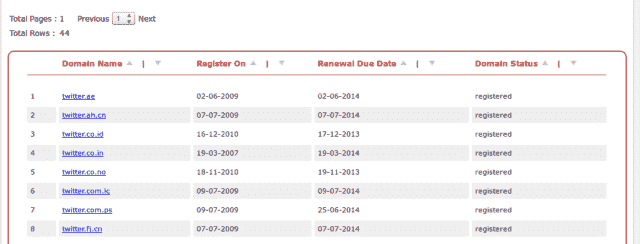

# 叙利亚电子军显然通过注册服务商 Melbourne IT TechCrunch 入侵了 NYT Twitter 的 DNS 记录

> 原文：<https://web.archive.org/web/https://techcrunch.com/2013/08/27/syrian-electronic-army-apparently-hacks-dns-records-of-twitter-new-york-times-through-registrar-melboune-it/>

叙利亚电子军声称对黑客入侵 Twitter 的两个网站的域名服务器负责，第三个网站似乎被重定向到 SEA 托管的服务器。此外,《纽约时报》和《赫芬顿邮报》的英国域名服务器也遭到了攻击。更新了 Twitter 声明和墨尔本 IT 部门的确认声明。两者都在文末。]

《纽约时报》称,[通过其注册服务商](https://web.archive.org/web/20230120210234/http://news.nytco.com/2013/08/28/business/media/hacking-attack-is-suspected-on-times-web-site.html)受到攻击。一旦叙利亚电子军获得了登记记录，它就能够改变联系方式和域名服务器。

现在，海洋[声称可以访问](https://web.archive.org/web/20230120210234/https://twitter.com/Official_SEA16/status/372484705238540288)各种国际 Twitter 域名:

在声称对黑客入侵《纽约时报》的域名系统记录负责之后，与推特图片托管相关的其他问题开始出现。这些问题之后，一个被认为是黑客组织的推特账户在[发了一条推文，声称它已经控制了 Twitter.com 的域名。此时，Twitter 的域名服务器似乎没有改变，只有](https://web.archive.org/web/20230120210234/https://twitter.com/Official_SEA16/status/372462339456380928)[的联系方式](https://web.archive.org/web/20230120210234/https://twitter.com/briankrebs/status/372468161595338752)。

SEA 随后跟进[声称对《赫芬顿邮报》英国版和《纽约时报》域名服务器变更](https://web.archive.org/web/20230120210234/https://twitter.com/Official_SEA16/status/372474022358810624)负责。

该帐户的另一条推文指向 Twitter.co.uk 的中断，其 DNS 记录显然也被修改以引用 SEA 的服务器。Twimg . com 域名，提供 Twitter 图片和头像，也显示了一些变化[指向显然是 SEA 拥有的服务器。](https://web.archive.org/web/20230120210234/https://twitter.com/briankrebs/status/372477936466948098)

Twitter 的一名代表告诉 TechCrunch，该公司正在“调查”SEA 改变 DNS 记录的可能性。

NYT 发言人艾琳·墨菲说:“部分网站关闭，但不是全部，我们正在努力解决这个问题。”。“我们的初步评估是，今天的这种情况很可能是恶意外部攻击的结果。”

有趣的是，纽约时报和 Twitter 的域名服务器似乎都是通过墨尔本 IT 注册处注册的。这导致一些人认为注册服务商的违规允许进行更改，可能是通过管理帐户。这可以解释为什么几个公司都在进行变革。《纽约时报》现在已经证实这是真的。

根据 The Next Web 的报道，墨尔本 IT [于 2009 年](https://web.archive.org/web/20230120210234/http://thenextweb.com/twitter/2013/08/28/domain-registrar-melbourne-it-at-center-of-sea-meddling-with-new-york-times-twitter-whois-info/)开始管理 Twitter 的[域名。该公司在 2008 年收购 VeriSign 时继承了它的高端 DNS 业务(感谢](https://web.archive.org/web/20230120210234/http://www.melbourneit.info/assets/announcements/twitter.pdf)[道格](https://web.archive.org/web/20230120210234/https://twitter.com/dlane/status/372499054787579904))。墨尔本 IT 的域名业务本身实际上在今年早些时候被 CSC 收购。

《纽约时报》的首席信息官 Marc Frons 向员工发表了一份声明，将此次攻击归咎于“叙利亚电子军或试图成为他们的人”

《纽约时报》员工随后被告知，在情况得到解决之前，发送敏感电子邮件时要小心谨慎。

这是《泰晤士报》一个月内第二次停刊，上一次停刊发生在 8 月 14 日。《纽约时报》一直在努力避免失去对其 DNS 服务器的控制，方法是在推特上发布直接指向其 IP 地址的链接，并在 news.nytco.com 发布新闻。

华尔街日报利用这种情况，暂时取消了付费墙，甚至可能针对有关《纽约时报》黑客事件的推文宣传这一事实。

在过去的几个月里，SEA 通过高调的媒体攻击制造了新闻，其中包括一个美联社 Twitter 账户在 4 月份引起了股市交易的大规模崩溃。SEA 发了一条推特说白宫遭到假袭击。

**更新**:推特[就 Twimg.com 的 DNS 记录问题发表了如下声明](https://web.archive.org/web/20230120210234/http://status.twitter.com/post/59528478030/twitter-service-issue):

> 在 UTC 时间 20:49，我们的 DNS 注册服务商遇到了一个问题，似乎各个组织的 DNS 记录都被修改了，包括 Twitter 的一个用于图像服务的域名，twimg.com。图像和照片的查看偶尔会受到影响。到世界协调时 22:29，twimg.com 的原始域名记录被恢复。没有 Twitter 用户信息受到此次事件的影响。
> 
> *【更新，2013 年 8 月 28 日:更新帖子以反映问题出在我们的 DNS 注册商，而不是我们的 DNS 提供商。】*

该公司尚未对 Twitter.com 记录中联系方式的变更做出回应。

**更新 2** :墨尔本 IT 现在提供一份声明，我们已经贴在下面了(h/t[Matthew](https://web.archive.org/web/20230120210234/https://twitter.com/MatthewKeysLive/status/372525667121786880)Keys

墨尔本 IT 经销商的凭据(用户名和密码)被用来访问墨尔本 IT 系统上的经销商帐户。

该经销商账户上的几个域名的 DNS 记录被更改，包括[nytimes.com](https://web.archive.org/web/20230120210234/http://nytimes.com/ "http://nytimes.com")。

墨尔本 IT 部门接到通知后，我们:

–将受影响的 DNS 记录改回之前的值

–锁定受影响的记录，防止其在。com 域名注册中心

–已更改经销商凭据，因此无法进行进一步的更改

我们目前正在审查我们的日志，看看我们是否可以获得使用经销商凭据的一方的身份信息，我们将与经销商和任何相关执法机构共享此信息。

我们还将审查可以添加到我们的经销商帐户中的附加安全层。

对于任务关键型域名，我们建议域名所有者利用域名注册管理机构提供的其他注册管理机构锁定功能，包括。针对经销商帐户的一些域名激活了这些锁定功能，因此不受影响。