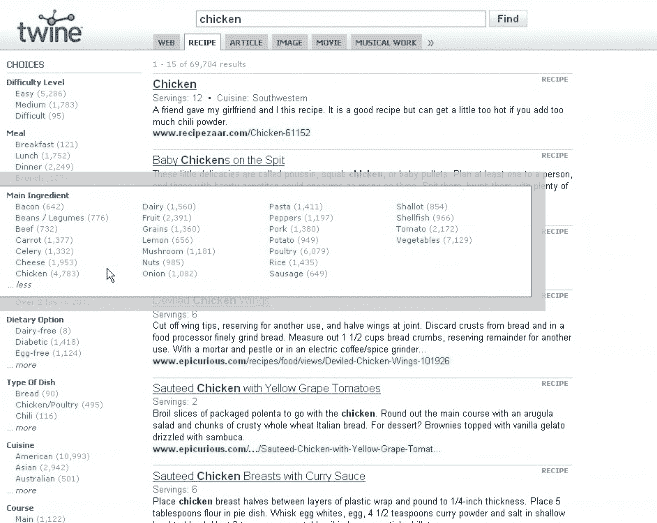
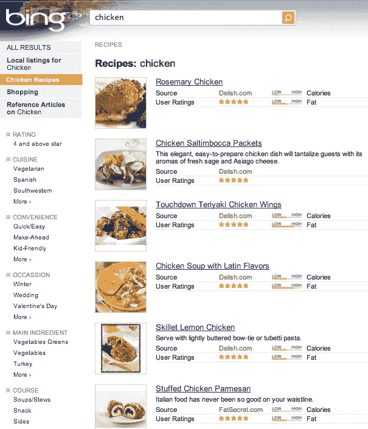

# 必应、谷歌和神秘的 T2:一个完整语义搜索引擎的竞赛

> 原文：<https://web.archive.org/web/https://techcrunch.com/2010/01/22/t2-bing-google-radar-semantic-search-race/>

昨天，必应发布了一个关于菜谱搜索的惊人有用的新功能[。如果你搜索“鸡肉”，你可以通过](https://web.archive.org/web/20230315095322/https://techcrunch.com/2010/01/21/bam-bing-now-cooks-up-recipes/)[“鸡肉食谱”](https://web.archive.org/web/20230315095322/http://www.bing.com/recipe/search?domain=recipe&type=listing&q=chicken&qpvt=chicken&FORM=Z7FD1)缩小搜索结果，然后一大堆新的过滤选项出现在左栏。您可以通过菜谱评级、菜肴(素食、西班牙菜、西南菜)、便利性(快速/简单、家庭、娱乐)、场合(婚礼、情人节)、主料、课程或烹饪方法来进一步缩小结果范围。Bing 擅长引导式搜索(显示相关搜索类别以帮助缩小搜索结果)，但这向语义搜索(通过不同方面索引和搜索网络的能力)又迈进了一步。菜谱只是个开始，不只是 Bing。谷歌和一些初创公司，包括 [Evri](https://web.archive.org/web/20230315095322/http://www.crunchbase.com/company/evri) 、 [Hakia](https://web.archive.org/web/20230315095322/http://www.crunchbase.com/company/hakia) 和 [Radar Networks](https://web.archive.org/web/20230315095322/http://www.crunchbase.com/company/radar-networks) ，正在努力让语义搜索成为现实。这场竞赛正在为网络上几乎每一个搜索类别带来这种类型的语义过滤。

事实上，必应的菜谱搜索看起来非常像 T2，这是一个由雷达网私下开发的语义搜索引擎。这家初创公司目前提供了一个名为 [Twine](https://web.archive.org/web/20230315095322/http://www.twine.com/) 的语义书签应用，这是自动驾驶的，但 T2 更有雄心。没有多少人看过 T2，但首席执行官诺瓦·斯皮瓦克曾经给过我一个演示，我拍了一堆像上面这样的截图(网上也有[的幻灯片](https://web.archive.org/web/20230315095322/http://www.slideshare.net/novaspivack/twine-t2-demo-dev-tools-screenshots-series))。当你在 T2 上搜索“鸡肉”时，你也可以通过难度、食物、主料、饮食选择、烹饪、课程等来缩小搜索范围。食谱恰好是 T2 的强项之一。它可能拥有世界上最大的食谱语义索引，有 300，000 个食谱。但它也在为视频游戏、电影、音乐、旅游、健康、体育和其他垂直类别建立语义搜索索引。

这就是情节变得复杂的地方。T2 本应在去年年底发射。部分延迟可能是因为语义搜索是一个非常困难的问题。但也可能有其他原因。有传言称，雷达网络正在 M&A 与“通常的嫌疑人”进行深入讨论在搜索方面，通常的嫌疑人是谷歌和必应。斯皮瓦克不会对任何传言发表评论，但表示 T2 正在步入正轨，目前没有其他搜索引擎授权它。本周早些时候，不管怎样，他发了[推文](https://web.archive.org/web/20230315095322/http://twitter.com/novaspivack/status/8001494653)讲述他如何参加“疯狂”的会议，就在他发[推文](https://web.archive.org/web/20230315095322/http://twitter.com/novaspivack/status/8001388454)说“谷歌仍然有一个很棒的自助餐厅”之后在必应推出新的食谱功能后，他发出了这条神秘的推文:

> 我敢打赌，在 12 个月内，谷歌和必应将为实现最好的多面搜索体验而战。看着吧。

人们很容易对这些闲置的推文有过多的解读。斯皮瓦克是一家搜索初创公司的首席执行官。显而易见，他会与谷歌和其他大型搜索引擎就许多事情进行会谈，从授权他的语义搜索技术到直接出售。有一点可以肯定，那就是谷歌和必应都对语义搜索非常感兴趣。菜谱搜索的推出表明，必应似乎比谷歌走得更远。

但在语义搜索方面，两家公司都面临着是买还是建的抉择。Bing 的菜谱搜索只是基于合作伙伴的 feeds 和标签，而不是一个合适的语义索引。Radar Networks 在这里是一个重要的参与者，自 2006 年以来共筹集了 2400 万美元的资金。它拥有这项技术的四项专利，还有 20 多项正在申请中。Radar 本质上是为 Web 上的每个页面建立一个巨大的结构化数据库，它将这些页面上包含的信息分解成定义明确的方面。对于菜谱来说，就是食材，烹饪时间，难度。对于视频游戏，它可以通过标题、开发者、角色等进行搜索。由于它是一个结构化的数据库，它可以从“星球大战”视频游戏跳转到“[星球大战”食谱](https://web.archive.org/web/20230315095322/http://starwars.wikia.com/wiki/The_Star_Wars_Cookbook:_Wookiee_Cookies_and_Other_Galactic_Recipes)。这些都在语义索引中联系在一起。

雷达正在建立跨越许多不同类别的索引。每个类别都需要自己的本体，或者描述该类别中事物的方面的集合。Radar 正在建立自己的本体，也想为本体创建一个 SourceForge，网站管理员也可以在这里做出贡献。Radar 开发的一些网站管理员工具将允许任何拥有网站的人告诉 Radar 关于其网页的信息。例如，在一个关于电影的网站上，网站管理员会使用浏览器插件来标记标题、演员、导演、评论等等。然后，雷达将采用该模板，并将其应用于整个网站。如果谷歌或必应采取类似的方法，网站管理员将有很大的动力来训练他们的语义索引，因为这将创建深度链接，提高他们的搜索引擎优化。

就像我说的，比赛开始了。

