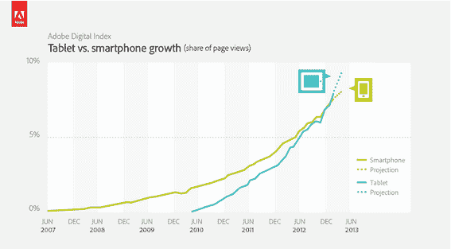
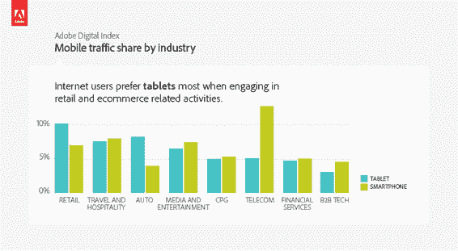
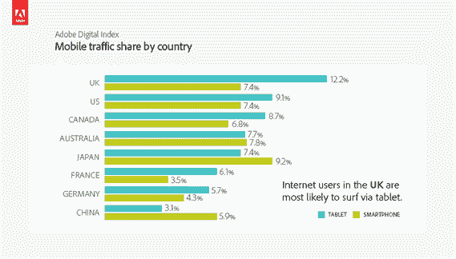
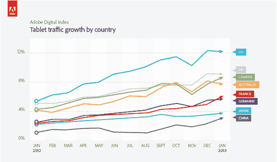

# 根据 Adobe 的数字指数 TechCrunch，平板电脑现在在全球网页浏览量中所占份额已经超过智能手机

> 原文：<https://web.archive.org/web/https://techcrunch.com/2013/03/07/tablets-vs-smartphones-page-views/>

# 根据 Adobe 的数字指数，平板电脑在全球网页浏览量中的份额已经超过了智能手机

根据 Adobe 最新的数字指数，来自平板电脑的网络流量比例第一次超过了智能手机，该指数从 2007 年 6 月至今跟踪了全球 1000 多个网站的 1000 多亿次访问，以比较哪些设备类型驱动了最多的页面浏览量。受监控的市场包括英国、美国、中国、加拿大、澳大利亚、日本、法国和德国。虽然智能手机和平板电脑之间的流量差异很小——平板电脑占实测页面浏览量的 8%，智能手机占 7%——但平板电脑页面浏览量的增长令人印象深刻，特别是考虑到这一类别是多么新(2010 年 4 月推出的第一款 iPad)。

当然，与台式机/笔记本电脑相比，这两种移动设备仍然只占页面浏览量总份额的一小部分——根据 Adobe 的数据，台式机/笔记本电脑占页面浏览量的 84%——但两者的份额都在增加，平板电脑的增长轨迹尤其陡峭:

【T2

Adobe 将平板电脑页面浏览量的上升归因于其外形非常适合网络浏览，最明显的原因是平板电脑比智能手机的屏幕尺寸更大(尽管随着一些平板电脑缩小、一些智能手机膨胀，这一差距正在缩小)。Adobe 发现，与智能手机相比，互联网用户在使用平板电脑浏览网页时，平均每次浏览的网页数量增加了 70%，因此平板电脑用户的浏览更加悠闲(可能也是闲暇时间)。

虽然平板电脑和智能手机上的不同活动分布广泛，但 Adobe 的指数表明，在线购物是平板电脑用户特别受欢迎的活动。根据其数据，零售网站获得了所有行业中最高的平板电脑流量份额，而汽车和旅游购物网站也获得了平板电脑流量的“份额”:

Adobe 在其数字索引博客上写道:

> 我们一直在密切关注平板电脑的发展速度。就在一年前的一月份，我们发现使用平板电脑的用户每笔在线订单的花费比他们在智能手机上的电脑部件多 54%，比台式机/笔记本电脑用户多 19%。在过去的平海购物日期间，我们看到 13.5%的在线销售是通过平板电脑完成的。上个月，在超级碗之前，我们了解到在大型体育赛事期间，通过平板电脑进行在线观看是非常困难的。现在我们知道，不仅平板电脑在商业和参与方面更有价值，平板电脑也已经成为移动浏览的主要设备。

英国领先于 Adobe 的平板电脑页面浏览量指数，美国位居第二:

所有被追踪的国家在 2012 年的平板电脑流量份额都翻了一番 Adobe 预计这一趋势将持续到 2013 年。它补充说，11 月份平板电脑在某些国家的份额略有下降，这是因为 PC 流量激增，而不是平板电脑页面浏览量下降:

