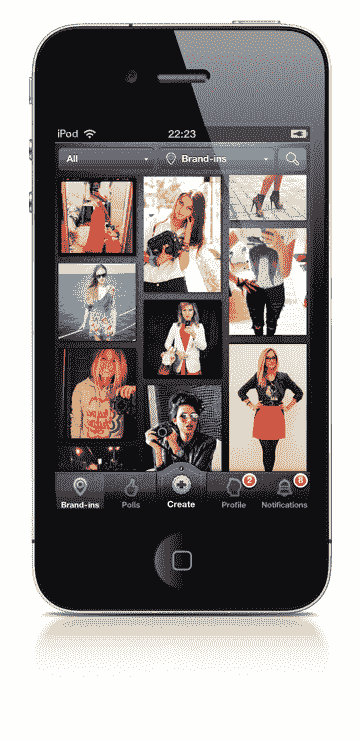
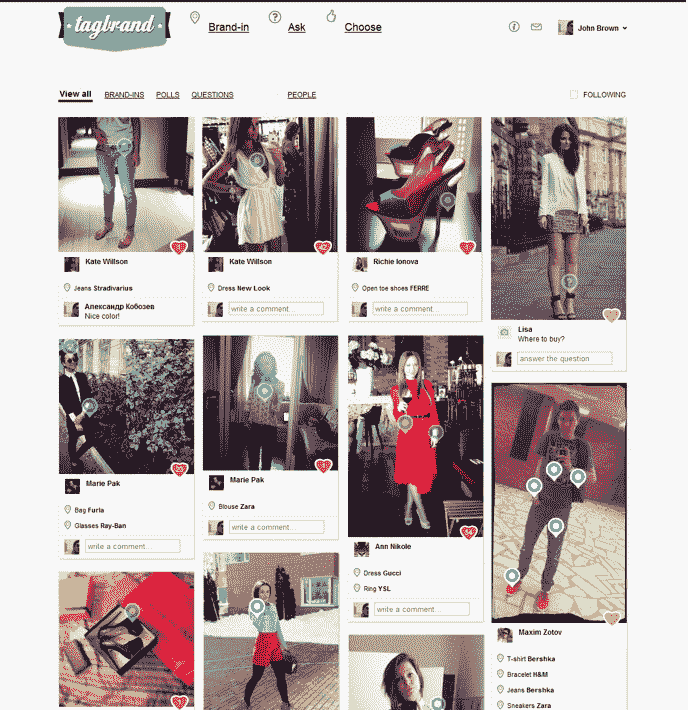

# Tagbrand 为时尚人士提供了一款查看品牌的应用程序 TechCrunch

> 原文：<https://web.archive.org/web/https://techcrunch.com/2012/05/21/tagbrand-gives-fashionistas-an-app-to-check-in-their-brands/>

“所有人都穿衣服！”Tagbrand 的创始人之一在 Disrupt today 的舞台上宣布。确实如此，但是我们来复习一下。

[DailyBooth](https://web.archive.org/web/20230112085759/http://dailybooth.com/) 曾是(仍是或许？)这是一个现象，因为人们习惯于以一种比单纯的视频更古怪的方式分享他们的日常生活。(好吧，好吧，这是一群青少年分享他们的青春痘，但在这里与我合作，人们)。现在，Tagbrand 希望将这一模式应用于时尚，但带有标签的扭曲。

这个模型很简单。拍摄并上传你穿的品牌服装的照片，并给它们贴上标签。实际上，这是品牌的照片登记，如果你愿意，也可以称之为“时尚的四方”。

奇怪的是，用户被鼓励在图片上贴上视觉标签，标明每件衣服的品牌。唉，这个网站还没有对衣服进行视觉识别。也许有一天…

TagBrand 不把这叫做签到，而是——等等——“品牌签到”。人们可以对他们朋友穿的品牌发表评论或投票。显然，这里的机会是抓住痴迷时尚的观众，并为广告商提供一个平台。

因此，虽然 Tagbrand 就像 DailyBooth，如果 DailyBooth 上的每个人都痴迷于时尚，但正是这种标签元素看起来非常流行。

该产品结合了品牌、民意测验和电子商务。这项服务内置了很多病毒式传播——每个标签上都有一个 Twitter 或脸书按钮。

但显然做这个的人是对时尚的痴迷。标签品牌给了他们痴迷的工具。当你试衣服的时候，民意测验的功能当然会让你的体验更有趣。

现在，服装品牌和零售店都在不断追逐这些人。这是向他们提供高目标受众的一种方式。Tagbrand 的商业模式是基于为他们创建一个特殊的市场，在浏览照片上的品牌标签时可以看到。商店向 Tagbrand 提供一份价目表，其系统会将它们贴在“推荐”栏上。

因此，当浏览朋友的衣服时，用户可以在图片旁边看到真实世界的商品，并可以在那里购买(点击是基于 CPC 的)。用户还可以获得他们喜欢的品牌的最新消息，比如新系列。

不可否认，他们在英国的业务中有更老的竞争对手，[WIWT.com](https://web.archive.org/web/20230112085759/http://wiwt.com/)，但是 Tagbrand 的视觉标签是一种更可爱的方式。

TagBrand 已经从俄罗斯投资者 Glavstart 获得了 10 万美元的种子投资，而创始人伊万·奥兰琴科和亚历山大·巴甫洛夫·科波泽夫已经在俄罗斯从事创业项目一段时间了。(我们应该补充一点，他们去年在莫斯科的一次 TechCrunch 会议上做了一次非常好的宣传)。

## 问与答(Question and Answer)

评委们询问如何扩展这款应用，让用户能够上传自己的自制品牌，据创始人称，这似乎是板上钉钉的事情。

该应用目前有俄语和英语版本，今天在美国发布。

评委们也有一个关于版权和上传图片的问题，这似乎是一个公平的观点。

目前，该产品 80%的使用是在 iPhone 应用程序上，而只有 20%是在网络上。

到目前为止，他们已经在 2 个月内拥有了 15，000 名注册用户，而没有仅仅在俄罗斯市场进行推广/营销。每年花在服装广告上的费用约为 45 亿美元，他们认为那里有很多钱可以赚。大！

