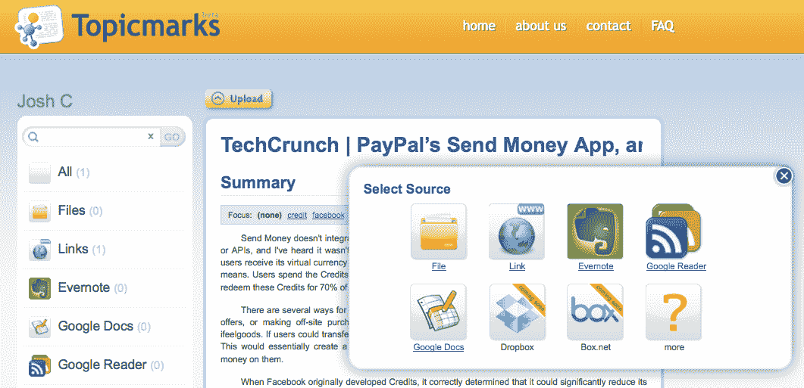

# Tagged 收购 Topicmarks，通过自然语言处理改进好友建议 TechCrunch

> 原文：<https://web.archive.org/web/https://techcrunch.com/2011/12/09/tagged-acquires-topicmarks/>

# Tagged 收购 Topicmarks，通过自然语言处理改进朋友建议

Tagged 的使命是帮助陌生人在网上相遇，所以它必须向朋友推荐你喜欢的人和喜欢你的人。这就是为什么它[收购了自然语言处理和机器学习公司 Topicmarks](https://web.archive.org/web/20221210002050/http://about.tagged.com/2011/social-discovery-leader-tagged-acquires-topicmarks/) 。 [Topicmarks](https://web.archive.org/web/20221210002050/http://www.crunchbase.com/company/topicmarks) 将允许 Tagged 分析其 1 亿注册用户的个人资料，并将他们与具有相似兴趣和词汇的其他人进行匹配。Topicmarks 的技术、CEO、CTO 和 3 名高级工程师将以现金和股票的形式加入 Tagged。在可预见的未来，其现有服务仍将保持活跃。

Tagged 的首席执行官 Greg Tseng 告诉我，收购价格介于支付 Topicmarks 的 15 万美元种子资金和显著影响其在线游戏和会议网络的底线之间。显然，对于 Topicmarks 来说，这不像许多人怀疑的[脸书收购 Gowalla](https://web.archive.org/web/20221210002050/https://beta.techcrunch.com/2011/12/05/gowalla-acqhire/) 那样是一个优雅的、低回报的退出。

得益于 1000 万到 2000 万的月活跃用户，Tagged 已经连续四年盈利。今年，它的员工从 50 人增加到 150 人，其中 17 人来自收购 Topicmarks、[游戏发现平台 WeGame](https://web.archive.org/web/20221210002050/https://beta.techcrunch.com/2011/09/21/tagged-wegame/) 和[社交消息客户端 Digsby](https://web.archive.org/web/20221210002050/https://beta.techcrunch.com/2011/04/19/tagged-buys-popular-socialinstant-messaging-client-digsby/) 。一名 Topicmarks 员工将不会加入标记的。

[Topicmarks 的现有服务](https://web.archive.org/web/20221210002050/http://topicmarks.com/)扫描文本并返回简短的内容摘要。它处理新闻文章链接、RSS 阅读器、桌面文件、像 Dropbox 和 Box.net 这样的云存储服务等等。现在，它的技术将被应用于读取被标记用户的个人资料、消息、评论和状态。它将寻找用户谈论的话题，他们的标点符号和表情符号的使用，以及他们是否以更城市或乡村的方式写作。然后，它将产生对彼此都感兴趣的用户的“双向推荐”。

在内部，Tagged 一直称这是“人类的潘多拉”。尽管实际上要复杂得多。正如曾解释的那样，“当潘多拉推荐音乐时，音乐并不需要喜欢你。”更准确的朋友建议可以增加用户之间的参与度、在线时间和相互联系，从而增加标签的粘性。他们还可以帮助 Tagged 抵御竞争对手，如赢得 TechCrunch Disrupt 2011 的 3d 虚拟化身 Shaker 和现在拥有 1.3 亿注册用户和 1 亿美元年收入的 Badoo)。

