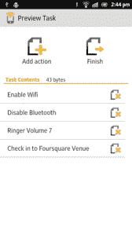
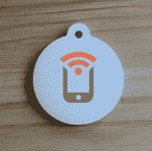

# Tagstand 重新推出 NFC 任务启动器应用程序，让 NFC 变得不那么令人讨厌 

> 原文：<https://web.archive.org/web/https://techcrunch.com/2012/03/23/tagstand-relaunches-nfc-task-launcher-app-makes-nfc-way-less-geeky/>

YC 支持的 Tagstand 公司致力于帮助 NFC 成为主流技术，该公司正在重启其 Android 应用程序 [NFC 任务启动器](https://web.archive.org/web/20221206212457/https://play.google.com/store/apps/details?id=com.jwsoft.nfcactionlauncher)，拥有全新的功能集和用户界面。在最近被 Tagstand 控制之前，该应用已经是 ~~Android Market~~ Google Play 商店中基于 NFC 的顶级应用之一，当时该应用的创建者加入了该团队。

该公司还表示，当谷歌发布 Galaxy Nexus 时，对 NFC 标签的需求大幅上升，现在一天内销售的标签数量与该服务首次推出时的整个 6 月份一样多。

[Tagstand](https://web.archive.org/web/20221206212457/http://www.tagstand.com/) ，你可能还记得，[在 10 月份筹集了 110 万美元的资金](https://web.archive.org/web/20221206212457/https://beta.techcrunch.com/2011/10/14/tagstand-raises-1-1-million-to-help-take-nfc-mainstream/)，其中包括许多著名的天使投资人。当时的完整名单:尤里·米尔纳、SV Angel、Naval Ravikant、Paul Buchheit、Yael Shazeer、Christina Brodbeck、Anand Agarawala、Mike Berolzheimer、Bee Partners、Quotidian Ventures、TEEC(中国天使网络)、Vaizra Investments(以色列基金)、迪恩·史密斯、Christopher Morton 和 Anand Swaminathan。

该公司表示，自那以来，它已经增加了新的投资者，包括 YC 合伙人 [Harjeet Taggar](https://web.archive.org/web/20221206212457/http://www.crunchbase.com/person/harjeet-taggar) 、 [Garry Tan](https://web.archive.org/web/20221206212457/http://www.crunchbase.com/person/garry-tan) 和 [Alexis Ohanian](https://web.archive.org/web/20221206212457/http://www.crunchbase.com/person/alexis-ohanian) 以及印度 Bharti Telecom 的 Kavin Bharti Mittal。

 在获得资助时，Tagstand 主要专注于向个人、公司和品牌提供工具和其他特殊的 NFC 贴纸。但从那时起，Android 应用 NFC 任务启动器的创造者[约书亚·克罗恩](https://web.archive.org/web/20221206212457/http://twitter.com/krohnjw)、[加入了团队](https://web.archive.org/web/20221206212457/https://twitter.com/#!/krohnjw/status/175245142326910977)，带来了他在移动设备上的经验。

在应用之前，用户首先会访问 Tagstand 的网站，购买 NFC 入门套件、标签或贴纸。NFC 标签可以使用基于网络的控制面板或现在的任务启动器应用程序本身进行配置。对于熟悉流行的 [Automator](https://web.archive.org/web/20221206212457/https://play.google.com/store/apps/details?id=Technicaljar.BluetoothAppBinder&feature=search_result#?t=W251bGwsMSwxLDEsIlRlY2huaWNhbGphci5CbHVldG9vdGhBcHBCaW5kZXIiXQ..) 应用程序的 Android 用户来说，NFC 任务启动器非常相似，只是它自动化的任务是通过扫描 NFC 标签启动的，而不是其他某种预编程的事件。

例如，Tagstand 的联合创始人 Kulveer Taggar 告诉我，他的钥匙链上有一个标签，这样一来，当他进入他想工作的咖啡店时，他只需用手机点击这个标签，他的笔记本电脑就会立即连接到他手机的 Wi-Fi 热点。完成工作后，他再次点击它来关闭热点。

与此同时，联合创始人奥马尔·塞亚尔(Omar Seyal)喜欢在烹饪时使用这款应用程序——他设置了 10 分钟、20 分钟和 30 分钟的定时器，开始时他会将手机点击 NFC 标签。

你还可以使用 NFC Task Launcher 在手机上的“办公室”和“家庭”设置之间切换，打开或关闭铃声或闹钟，在 Foursquare 上即时签到，发送推文和大约一百万其他事情，其中许多事情在 ~~Android Market~~ Google Play 商店的应用描述页面上有详细的[。](https://web.archive.org/web/20221206212457/https://play.google.com/store/apps/details?id=com.jwsoft.nfcactionlauncher)

 随着该应用程序(第三版)的重新发布，用户界面进行了大规模的修改，变得更加友好，应用程序本身也有了许多改进。它现在提供了更好的保存任务管理、改进的开关创建、改进的写标签对话框(包括成功和错误)，并且增加了对新标签类型的支持。还有一组新的标签[专门为 Android 应用的粉丝设计。](https://web.archive.org/web/20221206212457/http://www.tagstand.com/collections/nfc-kits/products/nfc-task-launcher-pack-10-tags)

如果你还记得在之前的应用[是什么样子，这是一次伟大的更新。至于让 NFC 变得更主流，这可能是一个更大的挑战。NFC 虽然是一项有前途的技术，但面临着许多采用障碍，从 OEM 采用到鼓励使用的商业合作伙伴关系(如移动支付)。当然，总会有苹果最终会做什么——仍然是一个很大的未知数。但是对于那些已经走在潮流前面的 Android 用户，或者只是喜欢用手机做一些很酷的事情的人来说，](https://web.archive.org/web/20221206212457/http://www.nfcworld.com/2011/03/30/36757/nfc-task-launcher-android-tag-application/) [NFC 任务启动器应用](https://web.archive.org/web/20221206212457/https://play.google.com/store/apps/details?id=com.jwsoft.nfcactionlauncher)是一个很好的尝试。