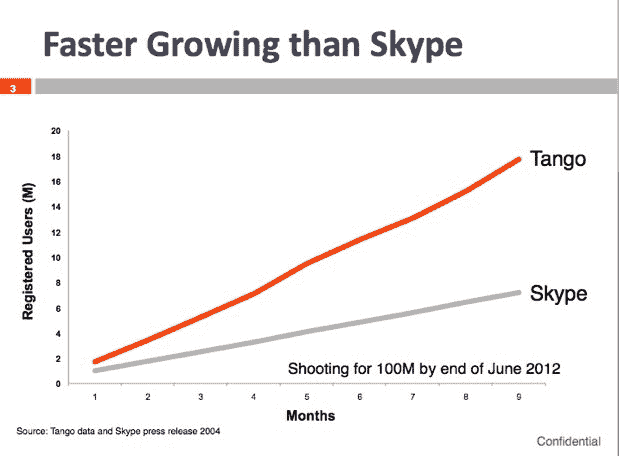

# Tango 拥有 1700 万注册用户，增长速度是 Skype 成立第一年的两倍 

> 原文：<https://web.archive.org/web/http://techcrunch.com/2011/07/01/tango-17-million-skype/>

# Tango 拥有 1700 万注册用户，其增长速度是 Skype 成立第一年的两倍

早在 Skype 早期，它的用户增长如此之快，以至于它喜欢向吹嘘它是“历史上增长最快的全球可用通信工具”至少从一个方面来看(推出 9 个月后的注册用户)，移动视频聊天服务 [Tango](https://web.archive.org/web/20230203032809/http://tango.me/) 正在超越 Skype。Tango 推出仅 9 个月，现在已经拥有 1700 万苹果和安卓设备的注册用户。相比之下，Skype 在 2004 年的第一个生日上庆祝了 900 万用户。

如今 Skype 的注册用户已经超过 6 亿，所以 Tango 还有很长的路要走。但该公司希望在明年达到 1 亿用户。(我们不都是吗？).如果它做到了这一点，它肯定会赢得增长最快的通讯工具的称号。

但是，即使在不到一年的时间里达到 1700 万注册用户也是一个不小的成就。Tango 用了四个月的时间到了[800 万](https://web.archive.org/web/20230203032809/https://techcrunch.com/2011/02/04/tango/)，又用了五个月再加 900 万。而且都是在手机上。Tango 每月新增 250 万注册用户。

最近 30 天的活跃用户数为 550 万。Tango 的点对点服务每天处理 250 万分钟的通话，平均通话时间为 4 分钟。

Tango 的出现正值苹果花费数百万美元推广其移动视频聊天功能, [FaceTime](https://web.archive.org/web/20230203032809/https://techcrunch.com/2010/07/03/facetime-and-why-apples-massive-integration-advantage-is-just-beginning/) 。FaceTime 只能在苹果设备之间运行，而 Tango 可以在 iOS 和 Android 平台上跨平台运行。跨平台兼容性确实有助于推动增长。下载量在两者之间对半分配，Tango 是 iPhone 上排名第六的最受欢迎的免费社交网络应用。

Tango 已经有 56 名员工，并且正在中国建立一个工程团队，在中国它的用户也在增长。这项服务仍然是免费的，但 Tango 将在未来的某个时候引入付费功能。

Tango 的增长令人难以置信的是，它甚至还没有提供任何桌面或网络软件。尽管这似乎是新产品的一个明显方向，但首先转向移动肯定不会损害公司。