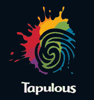

# 突破:由迪士尼 TechCrunch 收购的 tap up

> 原文：<https://web.archive.org/web/https://techcrunch.com/2010/07/01/tapulous-acquired-by-disney/>

[龙头企业](https://web.archive.org/web/20221127163959/http://tapulous.com/)被迪士尼收购。这家拥有几款热门产品的苹果游戏初创公司是由巴特·德罗姆创建的，他将加入迪士尼担任高级副总裁。首席运营官·安德鲁·莱西也将加入迪士尼，担任高级副总裁。迪士尼对社交和移动游戏非常感兴趣，最近投资了 Playdom 在 T4 的 3300 万美元。

tap pure 是一家热门的苹果游戏初创公司，它仅从天使投资者那里筹集了 180 万美元，其中包括马克·贝尼奥夫、杰夫·克拉维尔和安迪·贝赫托尔斯海姆。去年去世的硅谷传奇导师、斯坦福大学教授拉杰夫·莫特瓦尼也是一名投资者。它的旗舰游戏*轻击复仇*有很多版本，已经被下载了数百万次。让玩家用手指轻触歌曲节奏的基本游戏是免费的，但是玩家必须为新歌曲付费。它最新的游戏是 iPad 的 *[点击辐射](https://web.archive.org/web/20221127163959/https://beta.techcrunch.com/2010/04/02/tap-tap-revenge-ipad/)* 。

以音乐为导向的游戏尤其吸引年轻人群。该公司推出了各种版本的 Tap Tap 复仇，包括贾斯汀比伯复仇、Lady Gaga 复仇、Nickelback 复仇和九寸钉乐队复仇等特定艺术家的歌曲。它的另一款手机音乐《瑞迪丝带》也很受欢迎。

[迪士尼互动工作室](https://web.archive.org/web/20221127163959/http://disney.go.com/disneyinteractivestudios/)出售大量围绕迪士尼电影和角色打造的电子游戏，如《玩具总动员》、《汽车》和《汉娜·蒙塔娜》。这些游戏大多是为 Xbox、PS3 或 GameBoy 等游戏机设计的。购买 tap purse 可以让它进入苹果手机/iPod Touch/iPad 游戏平台，并在音乐相关的游戏中占据一席之地。

**更新**:以下是通过法令确认交易的[微博](https://web.archive.org/web/20221127163959/http://tapulous.com/blog/2010/07/tapping-on/)。

> 今天，我们宣布加入迪士尼。我们将成为迪士尼互动媒体集团的重要组成部分，引领他们成为移动娱乐领域的领导者。
> 
> 作为迪士尼互动媒体集团的一部分，我们将利用世界领先娱乐公司的资源，更快地开发更多游戏。我们将继续开发生活在音乐和游戏交汇点的应用，但我们也将推进到新的和令人兴奋的移动社交娱乐领域。

他还指出，Tap Tap Revenge 已经被下载了 3500 多万次，播放了 10 亿首歌曲。价格没有透露。

**更新 2** :我和 Decrem 通过电话。他将成为负责迪士尼互动游戏集团移动业务的总经理和高级副总裁，但仍将留在帕洛阿尔托。

“我们将处于迪士尼移动战略的中心，”他说。“他们今天在应用商店里有 40 个应用。有迪士尼、漫威、ESPN、皮克斯——将我们在应用商店中对游戏的了解与迪士尼的品牌和 ID 相结合的想法令人兴奋。坐在驾驶座上令人兴奋。”

Decrem 的宗旨是随着时间的推移，在迪士尼的所有游戏中加入社交元素。目前，他专注于保持 Tapulous 哼唱，但他将影响迪士尼互动产品组合中的手机游戏。听起来他也准备在帕洛阿尔托招人了。他补充道:“我们真的想在硅谷留下一个大脚印。”他指出，在脸书的旧总部有很多空置的办公空间。