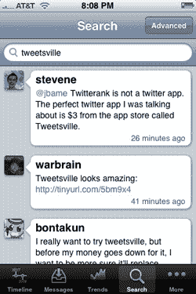

# Tapulous 发布 iPhone 最好的 Twitter 客户端之一；在线 Tap Tap 复仇上线 

> 原文：<https://web.archive.org/web/https://techcrunch.com/2008/11/12/tapulous-releases-robust-iphone-twitter-client-online-tap-tap-revenge-goes-live/>

# Tapulous 发布 iPhone 最好的 Twitter 客户端之一；在线 Tap Tap 复仇上线

多产的 iPhone 开发工作室 [Tapulous](https://web.archive.org/web/20221006051121/http://www.tapulous.com/) 推出了三款新应用，包括一款令人印象深刻的 Twitter 客户端，它很可能成为我手机上最常用的应用。他们还发布了一款新的在线多人版本的热门游戏 Tap Tap Revenge，这款游戏可能会(再次)受到欢迎，并宣布他们所有应用程序的用户总数达到了 300 万。

该公司的新 Twitter 客户端名为 Tweetsville(这里是，售价 3.99 美元)，由资深工程师 Ed Voas 开发。首席执行官 Bart Decrem 表示，Voas 最初是在对现有的 Twitter 客户端不满后开始为自己开发这款应用程序的，并加入了许多关键功能，使 Tweetsville 成为 Twitter 超级用户的理想应用程序。该应用程序包括一个顶级趋势的集成列表，高级搜索功能，以及一个精简的界面，感觉比竞争对手快得多。简而言之，它很棒，如果它取代 Twitterific 和 Tapulous 自己的 Twinkle 成为 iPhone 上首要的 Twitter 客户端，我不会感到惊讶。Decrem 表示，Twinkle 现在将专注于连接彼此亲近的人，同时仍然充当 Twitter 客户端，而 Tweetsville 将面向铁杆用户。

今天晚上，[Tap Tap revenue](https://web.archive.org/web/20221006051121/http://itunes.apple.com/WebObjects/MZStore.woa/wa/viewSoftware?id=284972147&mt=8)(一款类似于《吉他英雄》的令人上瘾的游戏)的更新也上线了，加入了在线多人游戏，允许多部 iPhones 上的玩家通过 Wi-Fi 或 3G 进行竞争。“Tapulous”的服务器目前完全被淹没了，所以我无法进入游戏，但它肯定会成功(尽管我怀疑它会像面对面的多人游戏一样有趣)。本月早些时候，Tapulous 还发布了[九寸钉乐队复仇](https://web.archive.org/web/20221006051121/http://www.beta.techcrunch.com/2008/09/29/nin-edition-of-tap-tap-revenge-brings-licensed-content-to-apples-app-store/)，这是一个以授权 NIN 音乐和新作品为特色的游戏版本。Decrem 说公司对结果很满意，以每本 5 美元的价格卖出了“数万本”。

本周早些时候，该公司还发布了一个名为 [Photo Collage](https://web.archive.org/web/20221006051121/http://itunes.apple.com/WebObjects/MZStore.woa/wa/viewSoftware?id=290822439&mt=8) 的简单应用程序，可以将在世界各地拍摄的照片显示到社区相册中(你也可以查看朋友和你附近的人拍摄的照片)。虽然就功能而言相当基本，但它很流畅，是一个很好的转移。