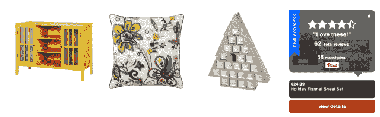
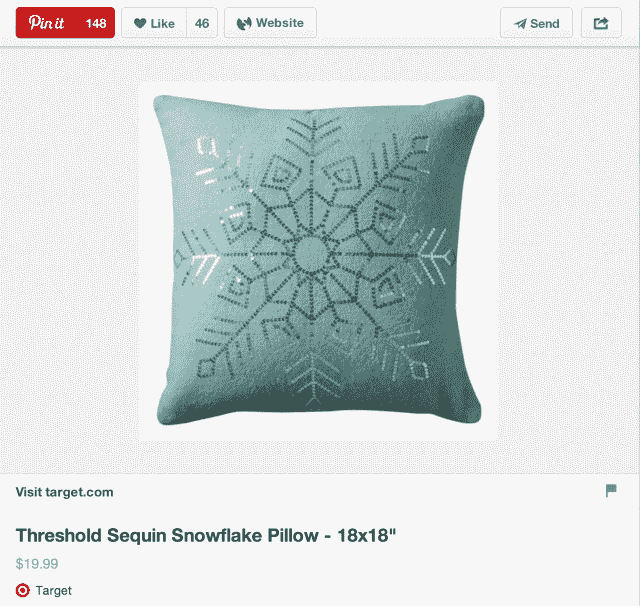

# 以 Pinterest 支持的网上店面为目标实验，被称为“牛逼商店”

> 原文：<https://web.archive.org/web/https://techcrunch.com/2013/12/09/target-experiments-with-a-pinterest-powered-online-storefront-dubbed-the-awesome-shop/>

Target 正在测试一个完全由 Pinterest 推荐驱动的电子商务店面，测试版网站名为“ [Target Awesome Shop](https://web.archive.org/web/20221206122737/http://awesomeshop.target.com/) ”该网站每天更新，是塔吉特百货自己的在线商店和社交网络数据的混搭。如今，它的特色是被证明是 Pinterest 上最受欢迎的商品，并且拥有来自 Target.com 的最高评论。该公司表示，新商店未来可能会发展到包括其他社交网络。

Awesome Shop 网站是由一个名为 RAD(快速加速开发)小组的内部开发团队在短短几周内共同开发的，该小组可以快速构建、部署和测试像这种社交购物体验这样的新举措。

这家零售商已经接受了 Pinterest 平台本身，维护着 [45 个定期更新的版块](https://web.archive.org/web/20221206122737/http://www.pinterest.com/target/)，展示从一般产品类别(家居、时尚、食品&饮料等)的一切。)给那些专门针对 Pinterest 群体寻找技巧、想法和操作方法的人。也有几个季节性的板块，宣传节日商品和活动，还有一个“你喜欢的大头针”板块，已经汇总了最热门的大头针商品。

当被问及将 pinners 从 Pinterst 发送到一个独立网站的好处是什么时，Target communication s manager Eddie Baeb 解释说，这个想法是为了设计一个策划的体验，其中也包括来自 Target.com 趋势产品(4 星或更高)的数据。这是像 Pinterest 这样的第三方网站无法访问的，所以这表明 Target 正在测试 Pinterest 的这个特定数据集，而不是在另一个 Pinterest 董事会内。

目前，新网站托管了 1000 多项内容，其中一些被标记为“最热门”或“高度评价”

该公司拒绝提供 Pinterest 为 Target.com 提供的整体流量和转化率的细节，但该公司[之前](https://web.archive.org/web/20221206122737/http://www.cnbc.com/id/101254290)报告称，在今年早些时候推出 Pinterest 的“Rich Pins”后的前六周，流量增加了 70%。

一般来说，第三方对 Pinterest 活动的分析发现，一个 pin 的价值在稳步上升。例如，一份报告最近发现，如今 Pinterest 上的一个大头针的销售额比一年前增加了 25%。在今年的黑色星期五/网络星期一购物假期期间，[的收入飙升](https://web.archive.org/web/20221206122737/https://beta.techcrunch.com/2013/12/04/on-cyber-monday-pinterest-more-than-tripled-the-revenue-sent-to-online-retailers/)，受益的零售商已经在该网站上建立了业务，销售收入是平时的三倍。

一些零售商，比如 Nordstrom，在 Pinterest 上走得更远。在那家商店，测试正在进行，销售人员带着 iPads，上面显示着流行的大头针，以及在 Pinterest 上标记为受欢迎的店内商品。

这些举措出台之际，Pinterest 本身正在努力实施自己的广告模式，即零售商为搜索结果和类别提要中的黄金位置付费。

至于塔吉特，该零售商表示，它将观察其客户对新的“真棒商店”的反应，以确定该服务如何适应该公司的未来计划，以及该网站接下来可能会收到哪些功能。有可能，它会成为 Target.com 的一个特色，也许类似于 ToyRUs.com 现在[在自己的网站上高亮显示](https://web.archive.org/web/20221206122737/http://www.bizjournals.com/twincities/blog/in_private/2013/11/minneapolis-e-commerce-company-lands.html)置顶的项目。

## 推动更多在线销售的需求

但是新的 Pinterest 支持的 Target 商店值得注意的是它的建立速度。随着亚马逊的在线业务不断增长，塔吉特(Target)和沃尔玛(Walmart)等大型实体零售商不得不加快自己的内部技术创新步伐。

就沃尔玛而言，该公司在硅谷经营着一个名为@沃尔玛实验室的研发实验室，该实验室已经收购了一系列测试电子商务新观念的初创公司，从云计算服务、网站优化器、开发商店、分析供应商等等。其中一些已经成为 Walmart.com 特色的动力，就像科斯密特通过改进网站的搜索引擎在 T2 所做的那样，而其他的则是一些后来让 T4 倒闭的实验。

与此同时，塔吉特或许更需要迎头赶上——该公司最近看到[销售额下降](https://web.archive.org/web/20221206122737/http://www.zacks.com/stock/news/115014/Target-Earnings-Drop-Trims-Outlook)，其中只有一小部分是在线销售。(据《华尔街日报》最近[报道，仅占其 2012 年 730 亿美元总销售额的 2%。)该公司在 2011 年引入了其电子商务网站的内部管理。在此之前，](https://web.archive.org/web/20221206122737/http://online.wsj.com/news/article_email/SB10001424052702304672404579184231426308394-lMyQjAxMTAzMDEwMTExNDEyWj)[已经将其运营外包给亚马逊，这是一个潜在的重大错误。即使在那之后，该公司也并不总是优先考虑网上购物的角度，而是更多地关注让人们在商店购物的事情，比如翻新、增加员工来帮助顾客，以及增加新鲜食品的选择。](https://web.archive.org/web/20221206122737/http://online.wsj.com/news/article_email/SB10001424052702304672404579184231426308394-lMyQjAxMTAzMDEwMTExNDEyWj)

然而，这家总部位于明尼阿波利斯的零售商最近在社交方面取得了一些进展，与脸书整合了交易。它还在进行其他数字计划，如广受欢迎的移动应用程序 Cartwheel，在[山谷](https://web.archive.org/web/20221206122737/http://www.techmeme.com/131117/p5#a131117p5)和其他地方[开设研发实验室](https://web.archive.org/web/20221206122737/https://beta.techcrunch.com/2013/11/26/target-yes-that-target-wants-to-launch-an-accelerator-in-india-to-tap-into-its-startup-scene/)，推出自己的[视频下载和租赁服务](https://web.archive.org/web/20221206122737/https://beta.techcrunch.com/2013/08/30/target-ticket-targets-tv-movie-download-rental-service-nears-launch/)，Target Ticket 等等。

然而，Pinterest 支持的“牛逼商店”是否能够转化为足够好的东西，整合到 Target 的在线或移动网站上，以促进电子商务销售，还有待观察。与此同时，这更像是一个一次性实验，以观察当顾客离开 Pinterest 时，Pinterest 效应会转化到什么程度。