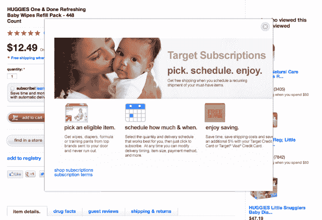

# Target 推出首个基于订阅的电子商务服务，目前的重点是婴儿护理用品 

> 原文：<https://web.archive.org/web/https://techcrunch.com/2013/09/25/targets-launches-its-first-subscription-based-e-commerce-service-focus-for-now-is-baby-care-items/>

随着亚马逊的在线业务继续侵蚀传统零售商的收入，塔吉特百货今天做出了反击。这家总部位于明尼阿波利斯的零售商刚刚推出了一个基于订阅的商务试点项目，名为[目标订阅](https://web.archive.org/web/20221207110452/http://www.target.com/targetsubscriptions)。最初，这项服务的重点是新父母，提供各种与婴儿护理相关的产品，包括尿布、湿巾、训练裤和其他必需品。

在发布时，有大约 150 个项目可以在订阅的基础上订购，包括一些塔吉特百货的较大批量产品。客户可以选择定期在 4 到 12 周内交付这些商品，Target 将在发货前至少 10 天发出提醒电子邮件，以便客户在需要时进行调整。

该免费程序包括十几个知名婴儿护理品牌的各种产品，包括好奇、帮宝适、第七代、安婴儿、雅培等，用户现在可以在 Target.com 上浏览，他们可以根据类别、品牌、价格、评级或相关交易过滤产品。购物者可以使用自己选择的信用卡或借记卡支付，当然，也可以选择用 Target 卡或 Target VISA 支付，以节省额外的 5%。

基于订阅的服务显然是塔吉特百货对亚马逊网站自己的“订阅并保存”项目的回应，该项目也让购物者订阅常用商品。通过亚马逊的计划，客户每月收到五份或更多订阅时，可以享受免费送货和高达 15%的折扣。与此同时，Target Subscriptions 也提供免费送货服务，但目前除了对精选商品进行通常的“降价”之外，并没有推出任何特别的优惠。(在发布时，只有两种交易——都是婴儿湿巾。)

鉴于其规模，亚马逊是基于订阅的商务领域的一个重要竞争对手。它不仅提供亚马逊订阅和保存服务，还通过 Prime 提供运输折扣，并通过其 [Quidsi 运营的品牌](https://web.archive.org/web/20221207110452/https://beta.techcrunch.com/2013/05/08/amazons-quidsi-gets-its-own-version-of-prime-with-new-membership-program-called-familyhood-plus/)进行订阅，如【Diapers.com】，自 2012 年秋季以来一直提供自动发货选项，并报告该领域每月增长 30%。此外，亚马逊有一个专门针对新父母/预算购物者的计划，特别是与[亚马逊妈妈](https://web.archive.org/web/20221207110452/http://www.amazon.com/gp/mom/signup)合作，其成员除了订阅和节省折扣外，还可以获得各种节省。

近年来，许多创业公司也在尝试订阅商务，他们的想法从样品盒(如 [Birchbox 的每月美容产品发货](https://web.archive.org/web/20221207110452/https://beta.techcrunch.com/2013/08/15/birchbox/))到专注于日常需求的产品(如 [Dollar Shave Club 的剃须刀](https://web.archive.org/web/20221207110452/https://beta.techcrunch.com/2013/06/04/dollar-shave-club-butt-wipes/))。就连沃尔玛也在这一领域进行了尝试，推出了零食盒子订阅服务 Goodies.co。因此，如果说有什么不同的话，那就是塔吉特百货在加入订阅大军方面来得太晚了。

但从更长远的角度来看，公平地说，这个市场仍然是一个新的市场，至少在一些垂直领域仍然有些未经证实。(例如，看着所有“X 的 Birchbox”创业公司开始倒闭。)但总体而言，网上购物是一个庞大且不断增长的行业，由于 Prime 等其他服务，以及网飞电影或 Spotify 音乐等内容订阅，消费者越来越接受订阅的想法。

在今天的公开亮相之前，Target 之前在员工中测试了这项服务。鉴于其“试点”的称号，该公司没有谈论在这一点上的预期收入。这家零售商目前不会证实扩张到婴儿护理以外的计划，但表示将考虑从这个试点项目中吸取的经验教训，以帮助它制定未来的计划，并将在获得这些细节时与大家分享。该公司还拒绝讨论是否会考虑其他新的电子商务服务，如杂货交付或当天交付，这是最近活动频繁的另一个领域。

顺便提一下，[目标订阅](https://web.archive.org/web/20221207110452/http://www.target.com/targetsubscriptions)的宣布与目标推出另一项技术主导的倡议[目标门票](https://web.archive.org/web/20221207110452/http://www.targetticket.com/)的同一天。正如我们之前报道的那样，电视和电影点播服务是 Target 对沃尔玛的 Vudu、网飞和 iTunes 的回应。虽然与电子商务服务无关，但这是这家零售商如何采取措施对抗各种科技公司和其他行业参与者的竞争的又一个例子。