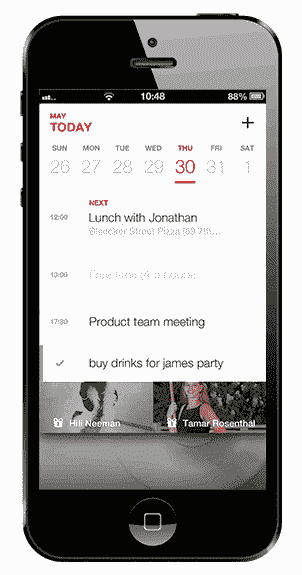

# 任务列表 App Maker Any。Do 通过新的“Cal”应用 TechCrunch 加入智能日历竞赛

> 原文：<https://web.archive.org/web/https://techcrunch.com/2013/07/11/task-list-app-maker-any-do-joins-the-smart-calendaring-race-with-new-cal-app/>

任何。移动智能任务应用程序制造商 DO 今天发布了其下一款非公开测试版产品。该公司面向 iPhone 的[新 Cal 应用程序现已推出，旨在与任务应用程序集成，并与其他移动日历服务同步，包括谷歌、iCloud 和 Exchange。](https://web.archive.org/web/20221007193206/https://itunes.apple.com/us/app/cal-calendar-for-living/id648287824)

这款新应用的独特之处在于，它不仅仅是一个约会日程安排程序。它首先从你的 iPhone 导入你的日历事件和联系人，然后让你通过脸书登录，获得额外的社交功能，例如通过电话、短信或电子邮件查看和回复你脸书朋友的生日通知。

[Cal](https://web.archive.org/web/20221007193206/https://itunes.apple.com/us/app/cal-calendar-for-living/id648287824) 还为约会本身增加了一层智能，自动添加位置地图(如果提供了地址)和一个可以点击启动导航的按钮。当你在 Cal 本身中添加一个约会时，该应用程序会自动从你的 iPhone 联系人中推荐人，在输入栏下方显示他们的姓名和缩略图。此外，它可以利用你的位置，建议附近的会议地点。

 整体设计是 iOS 7 友好的，具有干净、更简约的外观和感觉，尽管它仍然通过使用照片来增加色彩，给你的约会提供各种各样的“主题”。这些图片主题的选择也是内置的，你可以从中选择，比如“食物”、“艺术”、“风景”、“时尚”等等。

那些使用该公司任务列表应用程序的人也将能够看到 Cal 中显示的那些项目。

如今，移动日历应用程序风靡一时，每个人都有自己的最爱。但是这些创业公司也看到了可观的投资。例如，今天，[social calendar up 宣布了 150 万美元的种子资金](https://web.archive.org/web/20221007193206/https://beta.techcrunch.com/2013/02/28/with-1-5m-in-fresh-funding-social-calendar-app-upto-now-lets-any-group-create-publish-its-own-event-stream/)，Sunrise 最近筹集了[220 万美元的种子资金](https://web.archive.org/web/20221007193206/https://beta.techcrunch.com/2013/06/04/sunrise-raises-2-2-million-because-it-is-the-only-calendar-app-with-a-design-oriented-approach/)。其他领先的玩家包括像[节奏](https://web.archive.org/web/20221007193206/https://beta.techcrunch.com/2013/02/13/tempo-smart-calendar-launch/)、[奇幻](https://web.archive.org/web/20221007193206/https://beta.techcrunch.com/2011/09/23/fantastical-my-favorite-new-calendar-app/)和[阿特拉斯](https://web.archive.org/web/20221007193206/https://beta.techcrunch.com/2013/05/07/atlas-unsuck-calendaring/)等等。

任何。Do 的优势在于，它不仅开发日历应用，还开发了一套协同工作的生产力工具。应该指出的是，该公司是由自己的外部投资支持的:其 450 万美元的天使和种子资金意味着任何。Do 正在开发比应用程序更大的东西，我们现在才开始看到成果。

iPhone 的 Cal 是免费下载的。

[vimeo 69827636 w=400 h=300]