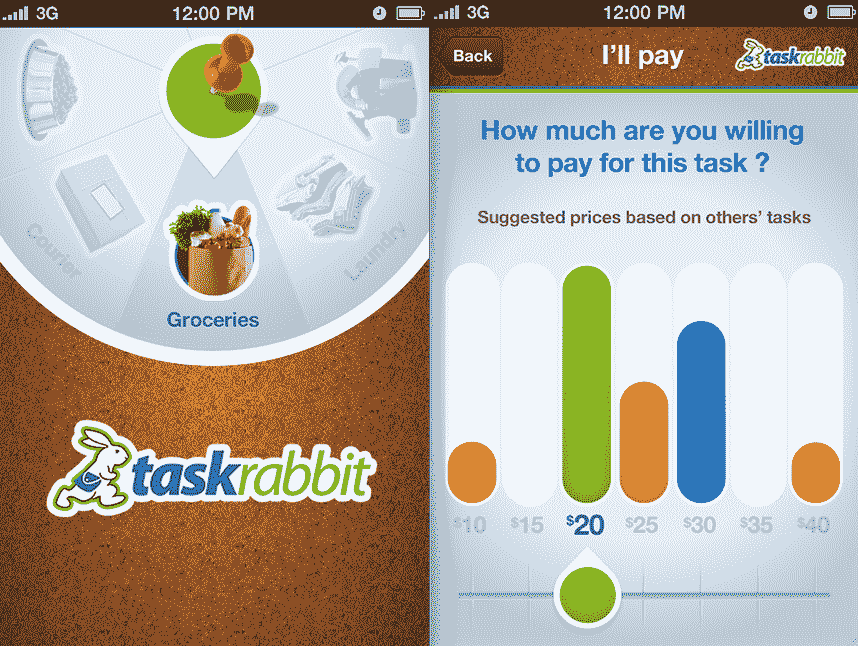
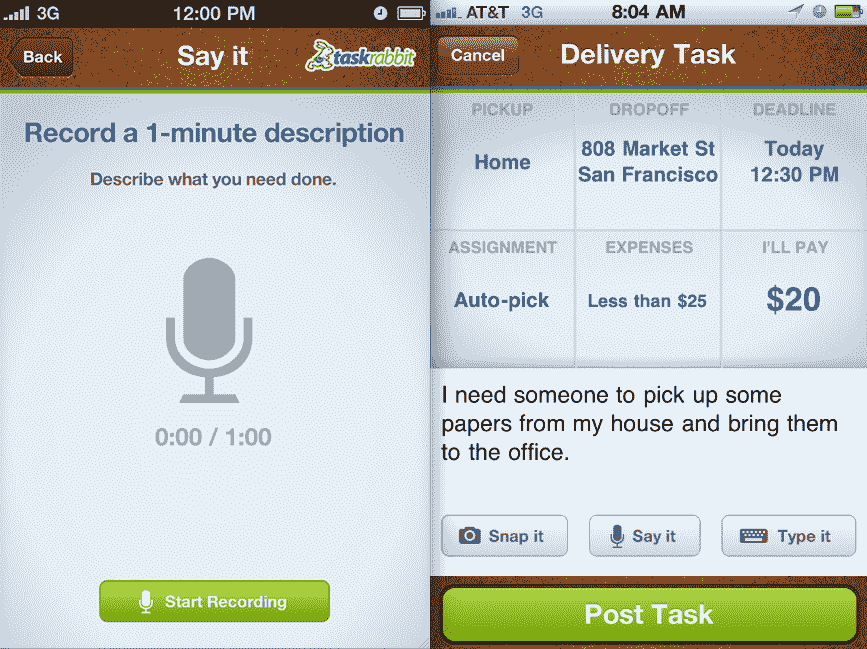

# TaskRabbit 发布令人惊叹的 iPhone 应用 TechCrunch

> 原文：<https://web.archive.org/web/http://techcrunch.com/2011/07/28/taskrabbit-drops-its-amazing-iphone-app/>

# TaskRabbit 发布了令人惊叹的 iPhone 应用程序

允许你发布任务并让其他人(经过审查、背景调查)在短时间内完成任务的协作消费服务 TaskRabbit 今天早上终于来到了 iOS。如果你错过了 [it，](https://web.archive.org/web/20230204114748/http://www.wired.com/magazine/2011/07/mf_taskrabbit/all/1) TaskRabbit 是城市居民的理想服务，他们太忙了，无法完成日常单调的工作，例如搭建桌子、拿聚会餐盘或叠衣服——这是 iPhone 用户的完美市场，因此[。](https://web.archive.org/web/20230204114748/http://search.itunes.apple.com/WebObjects/MZContentLink.woa/wa/link?path=appstore)

以前只能在移动网站上使用的 TaskRabbit iPhone 应用程序实际上是创新的，它允许任何需要快速完成任务的人通过说、键入或拍下他们想要完成的任务的照片来快速发布任务。使用 TaskRabbit iOS 应用程序，用户只需点击几下就可以在网站上发布任务，这听起来很老套。

说真的，如果你是一个 TaskRabbit 用户，你应该尝试一下，因为它非常令人印象深刻。懒得输入你的信用卡号码？你可以利用你的 iPhone 相机，拍下你的信用卡支付的照片。是啊。

任务海报可以使用类似懒苏珊的界面从任务类别中进行选择，如清洁、捐赠、购物、送餐、清洁、捐赠、(定期)送货以及其他模糊的事情。该应用程序使用位置来计算任务的接送坐标。它还包括一个全新的 TaskRabbit 功能，“定价历史”，它平均出为类似任务支付的价格，以便让那些没有时间做出决定的人更容易做出任务定价决定。

在等式的另一边，想要使用该应用程序的任务跑步者(兔子)可以通过使用“浏览你周围的任务”功能来选择他们想要完成的任务，使用 iPhone 的 GPS 来找到最相关的任务。

TaskRabbit 最近从[首轮资本](https://web.archive.org/web/20230204114748/http://www.firstround.com/)、 [Baseline Ventures](https://web.archive.org/web/20230204114748/http://baselinev.com/) 、 [Shasta Ventures](https://web.archive.org/web/20230204114748/http://www.shastaventures.com/) 和其他人那里获得了 500 万美元的 A 轮融资，以便聘请工程师来构建与这一款一模一样的应用，不是吗？TaskRabbit 目前每月发布约 3000 个任务，平均每个任务花费约 30 美元，平均削减 15%。该公司最近扩展到洛杉矶和奥兰治县，像其他人一样，下一步将目光投向纽约。

