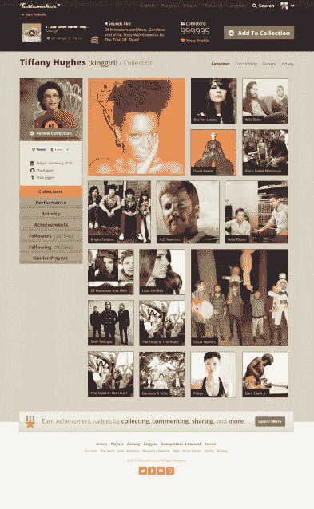

# TastemakerX 再融资 125 万美元，将自己定位为乐队的“梦幻联盟”

> 原文：<https://web.archive.org/web/https://techcrunch.com/2013/03/07/tastemakerx-raises-another-1-25m-to-position-itself-as-fantasy-league-for-bands/>

音乐探索移动应用软件 TastemakerX ，此前以“乐队股票市场”的形式运作，今天宣布获得 Baseline Ventures、True Ventures、Guggenheim Venture Partners 和 Aol Ventures*提供的 125 万美元新资金。它还取消了整个股票市场的类比，转而推出了一个名为“收藏”的新功能，让用户有另一种方式来展示他们的音乐品味。

公司[在去年春天科切拉谷音乐节](https://web.archive.org/web/20221006212216/https://beta.techcrunch.com/2012/04/13/stock-market-for-music-hipsters-tastemakerx-hits-beta-in-time-for-coachella/)前后首次推出测试版。它直接面向新的音乐爱好者——例如，这些人在过去的几年里可能花时间费力地浏览 MP3 博客。但如今，音乐发现已经走向移动，这在一定程度上要归功于大量流媒体音乐初创公司，如 Pandora、Spotify、Rhapsody、Rdio、MOG、Slacker 等。

TastemakerX 没有与竞争对手的阵容正面竞争，而是通过奖励用户的新音乐发现，为自己开发了一个利基市场，这种奖励是通过一种称为“T-Score”的指标来实现的，这种指标根据用户的“艺术家股份”交易来展示他们的影响力。[这很像一个虚拟的股票市场](https://web.archive.org/web/20221006212216/https://beta.techcrunch.com/2012/06/14/tastemakerx-launch/)，但显然，这个比喻还不够成功(*哈！*)与 TastemakerX 的观众。所以今天，该公司推出了集合，仍然允许用户展示他们首先听说过的*某某*，从而赢得他们的潮人信用。

没有人早期使用过这个功能，但据我们所知(也见下面的截图)，这是一个更直观的，甚至可能是类似 Pinterest 的显示音乐收藏的方式。你收藏的音乐越多，它在你个人资料中的位置就越大。

这些收藏与 Spotify 紧密集成，用户可以创建由他们的收藏生成的 Spotify 播放列表，这些播放列表也可以直接在应用程序中播放。还有一种新的聆听体验，不仅包括 Spotify 集成，还允许从 Songkick、SoundCloud 和 YouTube 上下载音乐。

但 TastemakerX 显然并没有完全尝试将其应用游戏化——当它今天退出测试时，它正在引入一个名为“音乐幻想联盟”的幻想体育类功能。坦率地说，如果你问我，这听起来比交易乐队的股票有趣得多，但它对初创公司也有另一个好处——玩幻想联盟游戏的用户往往会定期与他们的“团队”接触，采取行动和交易，并通常保持密切关注。

 当然，这仍然不是大幅提升用户参与度的完美方式，因为虽然运动队球员会很快根据他们上一场比赛的表现和各种受伤情况进行评估，但艺术家通常会在一段时间内保持一个人的“好”或“坏”看法*。(所以他们的唱片卖不出去？没关系，它们总有一天会变大的，我发誓。)*

 *这家初创公司将在今年的 SXSW 上首次展示其新体验，当然，3 月 11 日在 Speakeasy 举办的活动将有休伦大人、Joy calendar、圣卢西亚和其他人参加。

TastermakerX 由马克·鲁辛(首席执行官)和桑德罗·普列塞创建，他们都是在唱片公司百代的 A&R 部门开始职业生涯的。去年 2 月，这家初创公司已经从 Baseline Ventures、True Ventures 和 Aol Ventures 获得了 180 万美元的 A 轮融资。

*披露:TechCrunch 的母公司是美国在线。**