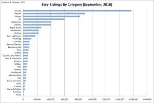
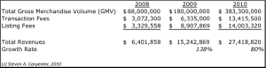

# TC 拆机:Etsy，很狡猾 

> 原文：<https://web.archive.org/web/https://techcrunch.com/2010/09/11/tc-teardown-etsy/>

***编者按**:工程师喜欢把东西拆开来了解它们是如何工作的。他们称之为拆卸。在他正在进行的 TC 拆卸系列中，客座作者[史蒂文·卡彭特](https://web.archive.org/web/20221210000422/http://www.crunchbase.com/person/steven-carpenter)剖析了流行的商业模式，看看它们是如何运作的。他已经用 Groupon、Chegg 和 Zynga 做到了这一点。这一次，他着眼于手工制品市场 Etsy。*

几周前，总部位于纽约的全球手工制品市场 Etsy 筹集了 2000 万美元的新资金，估值为 3 亿美元，是 2008 年 1 月上一轮融资的 3 倍。与 Groupon 和 Zynga 流星般的崛起形成对比的是，Etsy 自 2005 年成立以来收入持续增长，同时为各种商品的制造商建立了一个值得信赖的品牌和国际平台来销售他们的产品。根据我的分析，Etsy 今年将实现 3.8 亿美元的总商品量(GMV)和 3，000 万美元的收入，高于 2009 年在 GMV 的 1.8 亿美元和 1，500 万美元的收入。这意味着该公司最新估值的收入倍数为 10 倍，而 EBay 为 3.6 倍。

Etsy 的两个关键问题是:手工制品的市场有多大？它能继续从易贝的市场业务中分一杯羹吗？

我们来看看 Etsy 是怎么赚钱的，怎么能达到 1 亿美元的营收。

**什么是 Etsy？**

Etsy 提供了一个在线市场，工匠可以在这里向寻找独一无二的手工制品的人出售他们的产品。与易贝等网站不同，Etsy 不进行任何拍卖。所有商品都以固定价格出售。

根据来自 [Compete](https://web.archive.org/web/20221210000422/http://siteanalytics.compete.com/etsy.com/) 的数据，每月有 560 万人访问该网站，高于一年前的 440 万，这是在假期购物季后访问量迅速下降后出现的反弹。(点击图表放大)。好消息似乎是，Etsy 能够留住试用它的新买家和卖家，这大概是因为他们有很好的购物体验。

Etsy 有超过 670 万种产品上市销售，其中一半只属于三个类别:珠宝、艺术用品和古董。仅珠宝一项就有 150 万件商品上市，占 Etsy 所有产品的近 25%。

虽然这与易贝 1.17 亿件商品相比微不足道，但 Etsy 的 670 万件商品是易贝同类手工商品 320 万件商品的两倍多。Ebay 最大的手工艺品类别似乎更侧重于缝纫和剪贴簿等爱好，这表明 Etsy 正在吸引新的卖家进入市场。

在四年多一点的时间里，Etsy 已经牢牢地把自己确立为买卖艺术品、玻璃、珠宝和艺术用品等物品的*之地。这进一步表明，易贝在其他类别中仍然很脆弱，1)社区是买卖体验的核心部分，2)该公司无法吸引高端卖家。*

 *

对于同年龄的公司来说，Etsy 的国际化速度异常之快。它的卖家遍布 150 多个国家，支持 23 种货币。一家初创公司很少能如此迅速地获得国际需求，而且在运营上很难得到支持。这是一个巨大的竞争优势。

**Etsy 怎么样了？**

Etsy 通过两种方式赚钱:它向卖家收取 0.20 美元的费用，让他们在 4 个月内列出一个产品，不管该产品的价格如何，然后它从每笔完成的交易中收取 3.5%的固定佣金。这与易贝复杂的上市和佣金结构形成鲜明对比。

我整理和分析了 Etsy 从 2008 年开始在[【天气报告】](https://web.archive.org/web/20221210000422/http://www.etsy.com/storque/etsy-news/etsy-statistics-august-2010-weather-report-10440/)月刊上发布的数据。根据我对下一季度的预测，Etsy 今年的收入将接近 3，000 万美元，同比增长 80%。(这是 3000 万到 5000 万美元区间的低端，CEO 罗布·卡琳本人[项目](https://web.archive.org/web/20221210000422/https://beta.techcrunch.com/2010/08/26/etsy-300-million-valuation/))

当你看我对 Etsy 每月收入来源的估计时，会发现两件有趣的事情。第一，与其他零售商类似，Etsy 在第四季度产生的收入比例不成比例，这表明该公司在很大程度上被视为一个礼品网站。第二，虽然这项业务是由佣金驱动的，但 Etsy 通过保持较低的上市费用来增加收入，这样卖家可以在系统中保留产品更长时间(即“传统上市收入”)。

让我们更深入地看看 Etsy 的每个收入组成部分。商品总值(GMV)是商品销售的总价值。从 2008 年 1 月开始，每个月都观察这一指标，这一指标一直在稳步增长，12 月的销量最大。去年 12 月，Etsy 实现了 2560 万美元的最高总收入。在达到一个新的高峰后，该公司售出了价值 2560 万美元的商品。这个假期的销售额应该是去年的 2-2.5 倍。

Etsy 通过增加交易量和看到更高的平均价格点来实现这些收益。每月售出的商品数量从 2008 年 1 月的不到 40 万件稳步上升到 2010 年 8 月的 140 万件。与此同时，同期 Etsy 的平均售价从 12.25 美元升至 18.16 美元

Etsy 在吸引新公司上市方面也稳步增长。数据显示，新上市网站的增长速度远远快于新会员。这表明，传统卖家仍将 Etsy 视为一个销售平台，但它必须采取更多措施来吸引新手卖家和买家。一旦消费者与网站互动并找到可以买卖的东西，他们似乎就会成为忠实的顾客。

就团队和盈利能力而言，Etsy 不必在广告和营销上花费资源。Etsy 是一家工程和支持驱动的公司，90%的人要么在构建平台，要么在支持买家和卖家。更确切地说，Etsy 致力于其社区(12)的人比致力于营销(8)的人多。这表明，该公司应该能够扩大业务规模，实现盈利，而无需在获取客户方面进行巨额投资。

如果你看看 Etsy 的在线营销努力，你会发现它在获取客户方面几乎没有投入。

**Etsy 的增长机会**

虽然易贝的市场增长停滞在每季度略高于 10 亿美元，但我认为 Etsy 必须优化几个领域，才能实现每季度超过 1 亿美元的营业额:

1.  **借助本地化平台进行国际化扩张。Etsy 从一开始就经历了不同寻常的有机国际需求。虽然大部分用户仍在美国，但 Etsy 需要向 Groupon 学习，进入当地市场，迅速在当地建立强大的影响力。扩展和支持一个国际平台是困难的，因此如果它能在未来 12 个月内解决这个问题，它将提供强大的竞争优势**
2.  **吸引更多卖家和物品。**正如我上面讨论的，新用户跟不上新列表的步伐。该公司已经在运营本地 meetups，这是借鉴易贝剧本的明智策略。我不确定 Etsy 是否有一个年度颁奖典礼或类似的易贝现场直播，但该公司可以采用许多激励措施来鼓励现有的超级卖家带来新的卖家，或许可以从他们的销售额中提成。
3.  **增加商品价值。** Etsy 在为卖家提供值得信赖的平台方面做得很好，这自然会带来价格更高的商品。它需要继续朝这个方向发展，并探索与其品牌地位相符的其他类别。
4.  **更好地匹配本地供需，避免运输费用。**额外销售面临的最大挑战之一是昂贵的运费。Etsy 必须匹配当地的供应和需求，并按地理区域充当类似或相关产品的媒人。
5.  **改善网站发现和个性化。** Etsy 在市场上有一个共同的问题，那就是很难找到某些产品。我预计该公司将在这一领域以及个性化产品和工匠推荐方面继续改进。去年 12 月，该公司收购了一家名为 Adtuitive 的公司，可能是为了领导这些努力。
6.  **利用社区自我销售和卖家群体。** Etsy 的竞争优势在于，它现在已经到了一个工匠社区的拐点。该公司需要允许这些工匠组成集体销售小组，一起销售商品和宣传他们的产品。Etsy 越能将其营销努力分配给卖家本身，它就越能强化社区精神及其经济学。
7.  **解决季节性问题。**第四季度的销售额占总销售额的近 50 %, Etsy 需要围绕生日和节假日等其他送礼场合推销产品，并让其销售人员进行营销。
8.  **创造额外的价值和收入流。2008 年 5 月，Etsy 推出了一项名为 Alchemy 的引人注目的服务，允许客户为定制商品出价。我随机查看了过去两周的两天，分别统计了 193 次和 192 次商品投标。现在 Etsy 允许免费完成这项工作，但这是一个我可以看到很多希望的领域。此外，考虑到它的国际足迹，在不久的将来，创建自己的支付方式可能是有意义的。**

*布加迪拆解照片来源:Flickr/ [大卫·比利亚雷亚尔·费尔南德斯](https://web.archive.org/web/20221210000422/http://www.flickr.com/photos/davidvillarreal/4443367472/in/photostream/)**