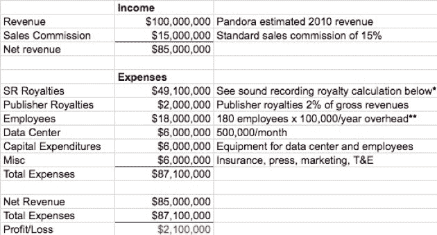

# 拆除 TC:潘多拉——网络直播的艰难生意 

> 原文：<https://web.archive.org/web/http://techcrunch.com/2010/06/16/tc-teardown-pandora-the-tough-business-of-webcasting/>

# 拆除 TC:潘多拉——网络直播的艰难生意

 *这是来自[迈克尔·罗伯逊的客座博文，](https://web.archive.org/web/20230203162145/http://www.crunchbase.com/person/michael-robertson)他是数字音乐行业 12 年的资深人士。他是数字音乐先驱 MP3.com[的创始人和前首席执行官。](https://web.archive.org/web/20230203162145/http://www.crunchbase.com/company/mp3-com-2)他目前是音乐锁公司 [MP3tunes 的 CEO。](https://web.archive.org/web/20230203162145/http://www.crunchbase.com/company/mp3tunes)直到最近，在[收购](https://web.archive.org/web/20230203162145/https://techcrunch.com/2009/11/09/exclusive-google-has-acquired-gizmo5/)gizmo 5 之后，他还是谷歌语音的顾问。*

Pandora 是广受欢迎的网络广播服务。他们公开表示，他们在 2009 年第四季度扭亏为盈。下面我预测了 2010 年潘多拉的数据，包括潘多拉的信息，所有网络广播公司必须支付的音乐版税，以及运营一家加州科技初创公司的标准费用。

### 潘多拉的 2010 年

随着对运营预算的严格管理，潘多拉将在 2010 年接近盈亏平衡。如果他们的收入能增加一倍以上，他们就能做到收支平衡，甚至略有盈利。对他们财务状况影响最大的是音乐版税，占了他们收入的大部分。2009 年，潘多拉支付了 3000 万美元的版税，约占其总收入的 60%。今年，版税负担将大幅提高，因为他们需要在每次向用户播放歌曲时支付费用。这不仅仅是他们收入的一个固定百分比或者一个预先设定的数额。随着用户群的增长，他们的版税义务也成比例增长，这就是为什么尽管他们的收入从 2009 年到 2010 年翻了一番，这对他们这样规模的公司来说是一个显著的成就，但他们并没有转向明确的盈利能力。

### 2010 年以后

潘多拉同意支付的每用户版税将在未来 4 年内每年上涨 10%。这是每首歌曲的价格，或者是每次为个人用户播放一首歌曲时他们必须支付的费用。无线电的一个非常不合逻辑的方面是存在“频谱偏差”。根据将歌曲传送给听众的无线电波的频谱，版税可以从零到一个巨大的数字不等。如果歌曲是通过 30-300 MHz(调频广播)传输的，则版税为零。对于通过 2，332.50-2，345.00 MHz(XM 之类的卫星广播)传输的歌曲，运营商需要支付总收入的 15%，但对于那些在 2.4 GHz 或 5 GHz (wifi)互联网频率或蜂窝电话上运营的歌曲，版税结构可能占总收入的 50-60%，这从 Pandora 的分析中可以明显看出。

令人惊讶的是，尽管目前存在巨大的不平等，SoundExchange(代表唱片公司)已经要求版权使用费委员会将 2011-2015 年网络广播员的费用增加一倍多。这不会立即影响潘多拉，因为他们已经锁定了在这段时间内每年上涨 10%的利率，但在此之后，他们将很容易受到未来利率上涨的影响。

大多数互联网公司在成长过程中运营效率更高。随着规模的扩大，他们利用了规模经济(购买力的提高)。此外，他们还受益于更便宜的计算、带宽和存储。潘多拉应该在他们的技术相关成本中体验这些好处。然而，这些成本不会对他们的业务经济产生重大影响，因为特许权使用费非常可观。

潘多拉有精明的管理。他们从事这项业务已经大约十年了，筹集了近 1 亿美元。我不相信他们会忽略经济现实。事实上，他们已经要求国会实施“利率平价”。这意味着老式广播、卫星广播和网络广播都必须支付相同的版税。这种重新评估过程的目的是消除频谱偏见，并在任何频谱上创建平价电台，支付相同的特许权使用费。

从商业角度来看，潘多拉有许多积极的属性。他们有 5000 万注册用户。他们的品牌得到了广泛的认可和重视。他们的服务被普遍称赞为易于使用，令人满意，并因大量使用而获得回报。他们将在 2010 年播放数十亿分钟的音乐。但是费用里程表每转一分钟。如果他们想建立一个长期盈利的公司，潘多拉必须想办法降低版税金额。

*版税计算:在 2010 年，每当播放一首歌曲的任何部分(即使你只听了歌曲的一小段)，潘多拉都必须支付 0.097 美分。参见:[michaelrobertson.com](https://web.archive.org/web/20230203162145/http://michaelrobertson.com/archive.php?minute_id=298)对费率结构的深入分析。潘多拉没有透露他们传输的歌曲数量。然而，在 2009 年，潘多拉声称他们支付了 2800 万美元的音乐版税。2009 年，他们每首歌的版税是 0.093 美分，这意味着潘多拉传播了 298 亿首歌曲。如果假设 2010 年的年增长率为 70%，潘多拉将播放 506.6 亿首歌曲，这将要求他们支付 4910 万美元的录音版税。

**员工计算:Pandora 有 12 个办公室和 180 名员工，其中 80 名是销售人员。每名员工 100，000 美元的估算旨在获得一家管理严格的技术公司典型的全负荷员工成本，包括医疗保健、休假、人力资源成本、办公空间等。在缺乏监督的情况下，很容易达到比这更高的水平。80%的员工是销售人员，他们可能基数较小，并通过销售佣金获得大量报酬。

我*如果你喜欢这篇文章，请看我们之前的 [TC 拆解:齐格网是一台赚钱机器](https://web.archive.org/web/20230203162145/https://techcrunch.com/2010/06/05/teardown-chegg/)。*